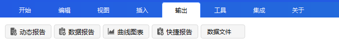
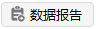
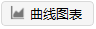
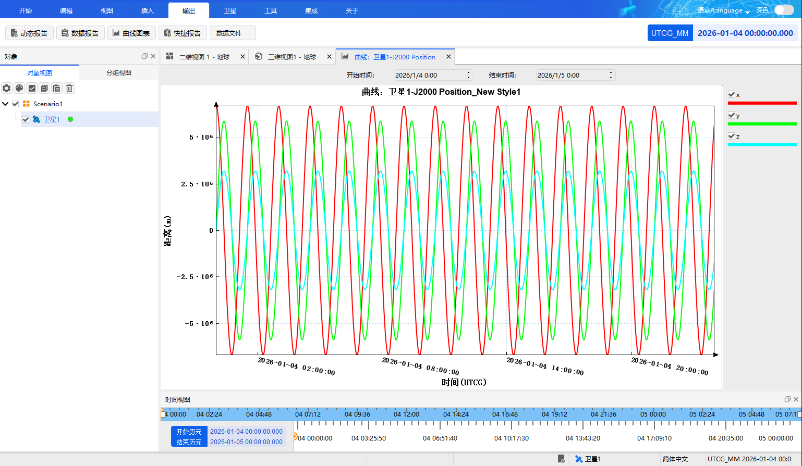
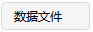

# 查看图文报告  

##  功能介绍

在工具栏的输出菜单下有五个子项：动态报告、数据报告、曲线图表、快捷报告、数据文件。

动态报告，是指场景运行过程中实时显示的所选择对象的报告信息的动态展示。用户可以查看到选定对象在场景运行过程中的状态变化。

数据报告，是指选定对象在当前选定时间的所有数据信息的静态汇总。用户能够查看到选定对象在一定时间内的更改。

曲线图表，是指选定对象在当前选定时间的仿真期间所有数据信息汇总所绘制出来的曲线图表。仿真期间更新的图形，这些图形称为条状图，使用户能够查看选定元素在一段时间内的变化。目前版本支持自定义图表坐标系。

快捷报告，是指选定对象在当前选定时间的所有数据信息的快捷显示方式。（快捷报告是特定文字报告的快速显示方式）

数据文件，是指相应对象在仿真过程中的星历数据输出功能，可以实现对星历类型、坐标系、数据周期、步长以及输出文件的名称和格式进行设置。

## 数据报告

（1）仿真运行完成，在对象栏里面选择任意对象，右键选择【数据报告】或者选择输出工具栏中的【数据报告】，即可弹出报告管理对话界面。

（2）当弹出实时数据框，左侧为对象选择区，右侧为报告类型选择区，【对象类型】下拉框选择某一对象类型再点击选中相应对象，【报告类型】下拉框选择【数据报告】并点击选中具体的报告内容。

（3）点击【显示】-【生成】按钮即可查看相应对象的报告信息。

## 曲线图表

（1）仿真运行完成，在对象栏里面选择任意对象，右键选择【曲线图标】或者选择输出工具栏中的【曲线图表】，即可弹出报告管理对话界面。

（2）当弹出实时数据框，左侧为对象选择区，右侧为报告类型选择区，可选择二维曲线或三维曲线，【对象类型】下拉框选择某一对象类型再点击选中相应对象，【报告类型】下拉框选择【曲线图表】并点击选中具体的报告内容。

（3）点击【显示】-【生成】按钮即可查看该样式的所有数据汇总所生成的曲线图表。

## 快捷报告

（1）仿真运行完成，在对象栏里面选择任意对象，右键选择【数据报告】，即可弹出报告管理对话界面。

（2）当弹出实时数据框，左侧为对象选择区，右侧为报告类型选择区，【对象类型】下拉框选择某一对象类型再点击选中相应对象，【报告类型】下拉框选择【数据报告】并点击选中具体的报告内容。

（3）在窗口底部选择加入快捷报告。

（4）当设定好快捷报告后，后面再进行仿真运行，可以在输出窗口直接找到快捷报告按钮，点击该按钮即可快速查看对象的特定样式的文字报告。

## 数据文件

（1）选择输出工具栏中的【数据文件】，即可弹出生成数据文件对话界面。

（2）点击界面上的【选择对象...】按钮，再点击选中相应对象，点击【确定】。

（3）【外部文件类型】下拉框选择【星历】，【星历类型】下拉框选择【STK星历】。

（4）【详情】-【坐标系】下拉框可选择地固系、J2000、ICRF。

（5）【周期】可选择是否使用场景区间，若不勾选则要设置【开始历元】和【结束历元】。

（6）【步长】可选择【使用星历步长】或使用自定义步长。

（7）点击【输出文件】-【导出...】按钮，设置好导出的文件名、保存类型和保存位置即可保存。
