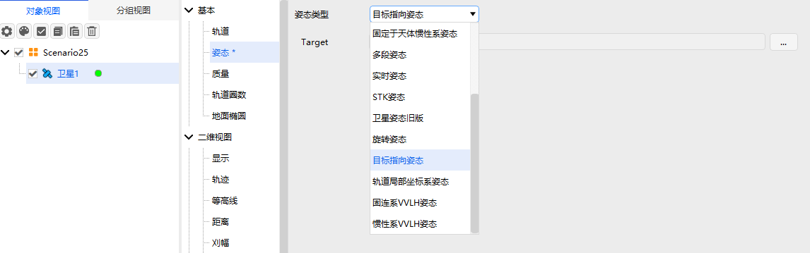

# 目标指向姿态

## 定义
姿态指向目标点。

## 介绍
姿态指向指定目标。

## 使用教程

###  选择姿态操作

点击卫星【属性】，选择【姿态】，选择【姿态类型】。

### 配置参数

Target：被指向的目标点。

### 使用案例

插入卫星1，卫星2，设置卫星1的位置不同于卫星2，选择卫星1属性姿态为目标指向姿态，设置指向卫星2，点击卫星1的属性向量，在坐标系中添加体坐标系，在向量中添加自定义向量：选择类型为位移向量，选择StartPoint为卫星1，选择EndPoint为卫星2。打开三维视图，切换为卫星视角，观察卫星姿态，卫星的位移向量在体坐标系中保持不变。