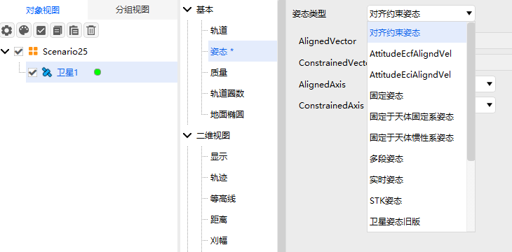

# 对齐约束姿态

## 定义
对齐约束下的姿态。

## 介绍
用于定义一种“主轴对齐+辅助轴约束”的姿态控制，允许用户指定一个机体轴对齐到目标方向（如指向地心），并指定第二个机体轴的约束方向（如尽量指向太阳），ATK会自动计算第三个轴，确保右手坐标系一致。

## 使用教程

###  选择姿态操作

点击卫星【属性】，选择【姿态】，选择【姿态类型】。

### 配置参数

1. AlignedVector：选择对齐的轴。

2. ConstrainedVector：选择约束的轴。

3. AlignedAxis：选择X,Y,Z,-X,-Y,-Z某一轴进行对齐。

4. ConstrainedAxis：选择X,Y,Z,-X,-Y,-Z某一轴进行约束。

### 使用案例
选择卫星属性姿态为对齐约束姿态，AlignedVector配置为XXX轴，ConstrainedVector配置为YYY轴，AlignedAxis选择 X，ConstrainedAxis选择 Z, 点击应用；点击卫星属性向量，在坐标系中添加体坐标轴，在向量中添加XXX,YYY两个向量。打开三维视图，切换为卫星视角，观察卫星姿态，发现X轴始终和XXX向量对齐，Z轴和YYY向量以及X或Y轴其中一个，始终在同一平面。