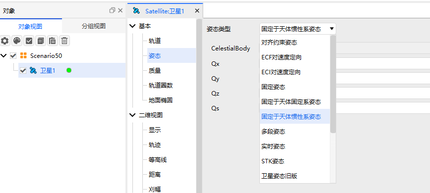
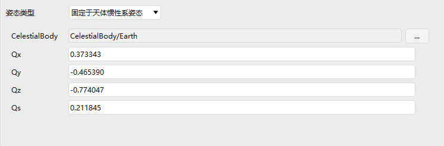

# 固定于惯性系姿态

## 定义
姿态固定在惯性坐标系中

## 介绍
姿态在惯性空间中固定不动，不随轨道或地球自转而改变。

## 使用方法

## 使用教程

###  选择姿态操作

点击卫星【属性】，选择【姿态】，选择姿态类型为【固定于天体惯性系姿态】

### 配置参数

1. 天体：参考系的中心天体

2. Qx,Qy,Qz,Qs：四元数分量，定义物体相对于参考坐标系的固定旋转关系

