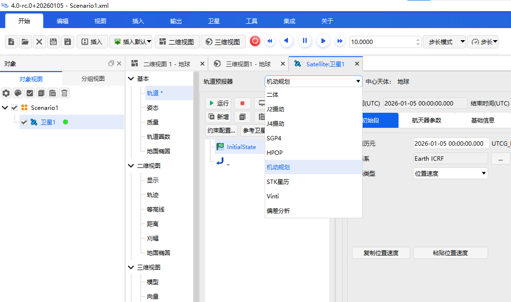
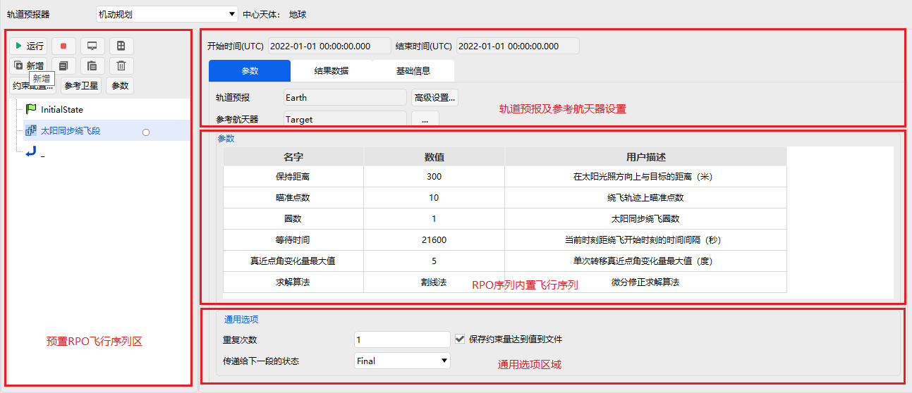

# RPO功能模块

## 功能介绍

ATK 软件针对典型的轨道规划算法进行了封装，按照自然相对轨道、受控相对运动轨道和交会和撤离进行分类管理。预置的 RPO 序列见表。

| 相对运动           | 预置 RPO 段    |
| ------------------ | -------------- |
| 伴飞              | 圆形受控绕飞段    |
| 伴飞              | 定点保持段         | 
| 伴飞              | 水滴绕飞段         | 
| 伴飞              | 太阳同步绕飞段     | 
| 伴飞              | 自然绕飞段         | 
| 撤离              | GEO 轨道撤离段     | 
| 接近              | 直线逼近段         |
| 接近              | 单次跳跃段         |
| 交会              | GEO 轨道交会段     | 
| 交会              | GEO 轨道漂移交会段  | 

### 功能位置

本功能入口在“卫星-属性-轨道预报器”下拉菜单“机动规划”中，如图所示。

### 界面介绍

本功能界面包括预置RPO飞行序列区、轨道预报及参考航天器设置区、RPO序列内置飞行序列区、通用选项设置四个区域，如图所示。

### 使用方法

创建场景后，插入一颗默认的卫星，命名为 “Target” 。复制第一颗卫星，插入第二颗卫星命名为 “Chaser” 。在 “Chaser” 的轨道预报器中，选择“机动规划”。使用默认的 “InitialState”（即初始段），初始条件设置如图所示。同时，点击按钮【参考卫星】，将 “Target” 设置为参考卫星。

依次点击【新增】-【插入 RPO 段】，选择“伴飞-水滴绕飞段”。在水滴绕飞段属性设置中，“参考航天器”选择“Target”，飞行序列如图所示。

点击【运行】，计算结束后运行场景，如图所示。

