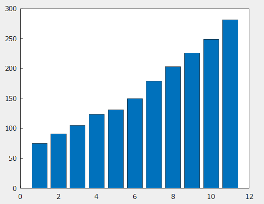
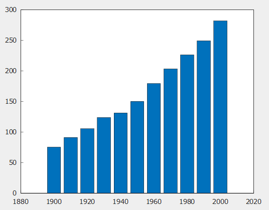

# bar

条形图

## 语法

```atks
    bar(y)
    bar(x,y)
```

## 说明
bar(y) 创建一个条形图，y 中的每个元素对应一个条形。

bar(x,y) 在 x 指定的位置绘制条形。
## 示例

### 创建条形图

```atks
    y = [75, 91, 105, 123.5, 131, 150, 179, 203, 226, 249, 281.5];
    bar(y)
```


### 指定条形位置

```atks
    x = [1900,1910,1920,1930,1940,1950,1960,1970,1980,1990,2000];
    y = [75, 91, 105, 123.5, 131, 150, 179, 203, 226, 249, 281.5];
    bar(x,y)

```

