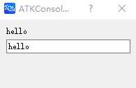

# InputField

创建一个输入框

## 语法

```atks
InputField()
```

## 示例


### 将输入框内容与响应式变量进行绑定

```atks
value = "hello"
valueRef =& @Reactive(value)

CreateDialog(
    Text(valueRef),
    InputField(valueRef)
)
```

在输入框输入内容后，点击回车，即会更改 `value`、`valueRef`还有文本框的内容





