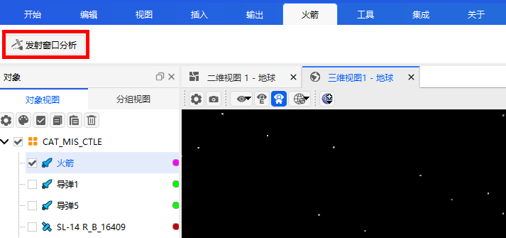
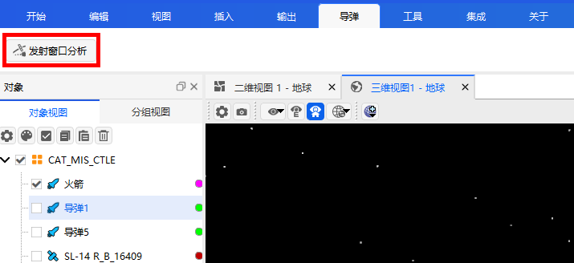
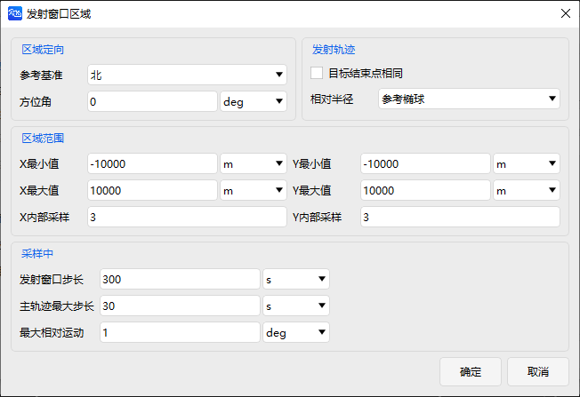

# 发射窗口接近分析工具

## 功能介绍

发射窗口接近分析工具可以对拟发射的火箭或导弹进行发射前碰撞风险评估，通过计算发射窗口期间发射目标与其他空间目标的危险时段，最接近时刻以及最接近时刻所对应的相对位置等信息，获取安全发射窗口。
### 功能位置

该功能位于ATK菜单-火箭或导弹栏目中，需要先在对象视图栏中选中火箭或导弹才能显示，具体打开位置如图所示。

### 界面介绍

**主界面**

主界面包含分析对象选择、发射窗口设置、距离约束设置、次要星历来源选择，并提供高级设置按钮、计算按钮和报告展示按钮，界面如图所示。

点击【选择对象】可以选择在场景中的火箭或卫星作为分析分析对象。

在【发射窗口】设置开始历元和结束历元，即分析的开始和结束时间，默认UTC时间。

在【距离约束】设置最大距离，分析对象与其余空间目标的相对距离小于该距离时，将被记录为接近事件，对应的分析对象发射时刻即为危险发射时刻。默认为 5000 m 。

在【次要星历来源】里，通过点击【…】选择对应的空间目标数据库，一般选择TLE文件，进而生成次目标进行分析。

点击【计算】，进行发射窗口接近分析。

**高级设置界面**

高级设置界面包含发射轨迹设置、采样设置、预滤波器设置和发射区域选择，界面如图所示。

发射轨迹设置，有两种设置方式：1）勾选【计算完整轨迹】；2）设置【飞行时段开始时间】和【飞行时段结束时间】。

**发射区域设置界面**

发射区域设置界面包含分析对象选择、发射窗口设置、距离约束设置、次要星历来源选择，并提供高级设置按钮、计算按钮和报告展示按钮，界面如图所示。

**报告**

[发射窗口接近分析案例](../3.案例教程/16-发射窗口接近分析案例.md)