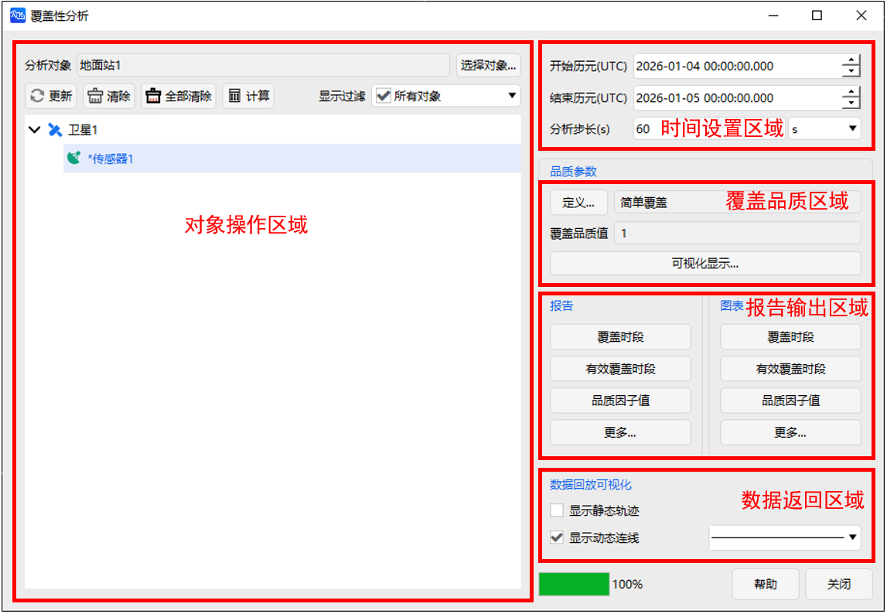
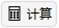
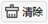
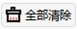

# 覆盖工具  

## 功能介绍

覆盖工具用于计算在当前属性和参数约束的条件下，两对象之间是否存在覆盖关系，可用于卫星对地覆盖等任务的分析。该工具可在不同的评估标准下对覆盖效果进行评价。

该工具可执行单个对象对单个对象的覆盖分析，还可以计算单个对象受多个对象的多重覆盖分析。可针对不同覆盖关系下的计算结果输出数据报告及图像报告，例如：输出覆盖时段数据信息，以及所定义的覆盖品质因子下的覆盖品质数据。绘制可视化图像报告，也可将计算结果在 2 维窗口进行可视化呈现。

### 功能位置

（1）在对象窗口选择任意对象，点击鼠标右键，即可找到覆盖性工具。

（2）在工具栏中找到可见性工具点击【覆盖性】即可调出可见性工具窗。

### 界面介绍

包括对象操作区域、时间设置区域、覆盖品质区域、报告输出区域以及数据返回区域。

（1）对象操作区域。用于选择分析对象，生成覆盖分析数据以及覆盖分析数据更新与清除。

（2）时间设置区域。用于覆盖性设定分析时间区间。

（3）覆盖品质区域。用于定义覆盖品质类型，显示覆盖品质取值。

（4）报告输出区域。用于生成覆盖性数据报告及可视化图像报告。

（5）数据返回区域。用于在二维视图内显示静态加粗的可覆盖弧段。

## 使用方法

### 覆盖计算时段

在时间设置区域，设定覆盖性分析的开始、结束历元。该区域默认取值为场景的时间区间（自场景开始历元起，至场景结束历元止），可根据用户自身计算需求进行修改。但需要确保所分析的时间段位于场景仿真时间段内。

### 对象选择

在“对象操作区域”，选择“分析对象”，即覆盖的目标，可支持对 “卫星”、“飞机”、“导弹”和“舰船”等多类对象进行覆盖分析。

在“分析对象”下方，选择对应计算对象，当需要进行多重覆盖分析时，可选择多个计算对象。当选择附属“传感器”对象以外的对象时，默认计算该对象在 45°半锥角的圆锥范围内的覆盖情况。

### 分析覆盖特性

选中计算对象后，点击【计算】，可计算对应目标的覆盖情况。当计算完成后，对应计算对象名称前将带有“*”标识。

### 覆盖品质定义

可对目标的覆盖品质进行分析，可定义覆盖品质类型以及需要满足的条件。

在“覆盖品质区域”，点击【定义…】，设置覆盖品质。可对下述 16 类覆盖品质进行计算分析：

| 覆盖品质类型   | 含义                                                         |
| -------------- | ------------------------------------------------------------ |
| 简单覆盖       | 该目标在计算时段内是否被覆盖。  （1 表示可覆盖，0 表示不可覆盖） |
| 访问时长       | 单个资源对分析对象的可用覆盖时间。                 |
| 访问间隔       | 不同覆盖资源的覆盖时段的间隔是否在设定的最大最小范围内。                 |
| 覆盖时间       | 分析对象被覆盖的时长。                 |
| 多重覆盖       | 对目标点的覆盖重数。                                         |
| 访问次数       | 分析对象被覆盖的次数。                 |
| 覆盖间隔次数       | 在分析时段内未被覆盖的时段数量。                 |
| 响应时间       | 当前时刻距离下一次覆盖开始时间的间隔。                 |
| 重访时间       | 两次可覆盖的时间间隔。                                       |
| 时间平均间隔       | 在任意时刻位于一个覆盖间隔内的概率。                 |
| 数据时龄       | 当前时刻距离上一次覆盖结束时刻的间隔。                 |
| 系统响应时间       | 从请求覆盖某个点到获取覆盖资源数据之间的时间。                 |
| 系统数据时龄       | 从最后一个满足数据下传等任务序列要求的数据采集时段结束到当前时间的间隔。                 |
| 精度衰减因子       | 衡量用户在进行全球导航卫星系统测量时所具备的几何条件的定量指标。                 |
| 导航精度       | 基于一组发射器测量的单向距离测量，测量导航解决方案的不确定性。                 |
| 可见性约束       | 计算对象与分析对象的可见性参数约束。                         |

### 覆盖性计算结果

在“报告输出区域”可查看覆盖性计算结果。提供数据报告和图表报告两类，分别对应于“报告”和“图表”两部分。可输出但不限于下述报告内容：

| 报告名称         | 含义                                                         |
| ---------------- | ------------------------------------------------------------ |
| 覆盖分析报告     | 每个计算对象对分析目标的覆盖开始、结束时间及时长信息。       |
| 品质参数值       | 覆盖品质参数在每个可覆盖时段的取值。                         |
| 有效覆盖报告     | 满足覆盖品质要求的覆盖时段的开始、结束时刻，以及时长、占比信息。 |
| 每日覆盖分析报告 | 每日可覆盖时段长度信息。                                     |
| 未覆盖分析报告   | 不可覆盖时段开始、结束时刻，以及对应时段时长及占比。         |

### 覆盖弧段查看

完成计算后，系统默认勾选“显示静态轨迹”选项，在二维视图中全部覆盖弧段将显示为静态加粗线条。

取消勾选后，覆盖弧段不再以静态加粗线条显示，而是在时间视图运行到对应可覆盖时刻后，才会显示覆盖弧段信息。

### 清除计算数据

在“对象操作区域”，点击【清除】，可清除当前选中对象的计算信息。点击【全部清除】可清除全部计算结果。

[覆盖工具案例](../3.案例教程/3-覆盖工具案例.md)