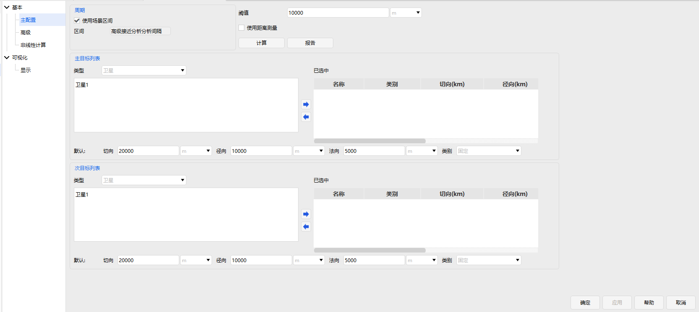
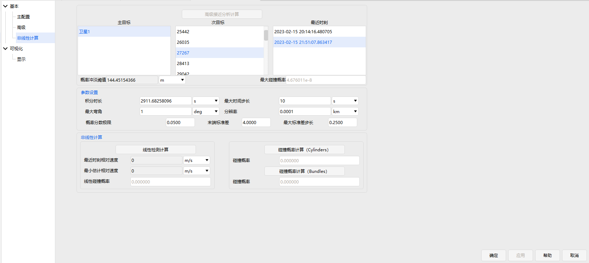

# 高级接近分析模块

## 功能介绍

高级接近分析模块是接近分析工具的进一步扩展，增添了考虑轨道偏差的椭球间距、碰撞概率等风险指标的计算，并且可以更灵活的选择主次目标，实现多对多的分析。

### 功能位置

高级接近分析作为一个对象集成于软件中，通过插入一个高级接近分析对象进行后续分析，具体打开位置如图所示。

## 界面介绍

### 主配置界面

主界面包含周期（分析区间）、主目标列表、次目标列表、阈值设置、是否使用距离测量设置、计算按钮和报告展示按钮，界面如图所示。

周期：即进行分析的时间区间，默认勾选使用场景区间，不勾选时，可自行设置开始历元和结束历元。

主目标列表：左侧是展示列表，当类型为卫星时，显示场景对象中的所有卫星对象；当类型为库目标时，显示已添加的库目标文件，一般为TLE文件，可点击添加按钮，选择文件进行添加。右侧为选中列表，即进行分析的主目标，包含误差椭球类别、三轴长和包络球半径信息。在下方则是

次目标列表：与主目标列表类似。

阈值：

计算：

报告：

### 高级界面

主界面包含预滤波器、高级椭球属性、SSC目标半径文件和采样设置，界面如图所示。

预滤波器：即筛选器设置，与接近分析的解析法筛选器一样。

高级椭球属性：从此处添加相应的误差椭球数据文件，以及设置相应的椭球比例因子。

SSC目标半径文件：在此处勾选

采样设置：对内部计算采样步长进行设置，并设置相应的求解类型。

### 非线性计算界面

主界面包含高级接近分析计算按钮、结果显示、参数设置和非线性计算，界面如图所示。

高级接近分析计算：可以选择在场景中的火箭或卫星作为分析分析对象。

结果显示：

参数设置：

非线性计算：

### 显示界面

界面如图所示，但目前**未启用**。

### 报告

报告可从以下两处获得：

- （1）在主配置界面，点击报告进行查看。

- （2）在菜单栏 → 输出 → 数据报告 进行自定义报告查看。

[高级接近分析案例](../3.案例教程/17-高级接近分析案例.md)