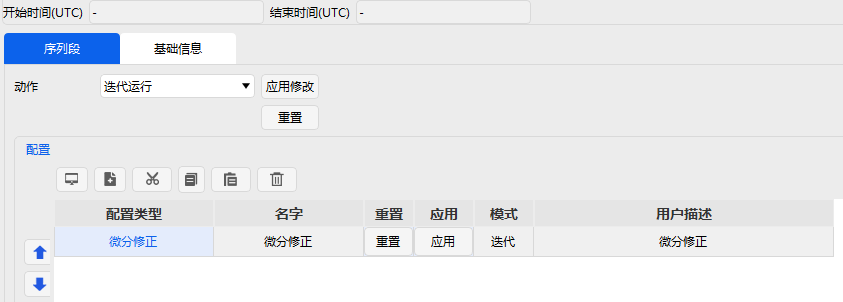
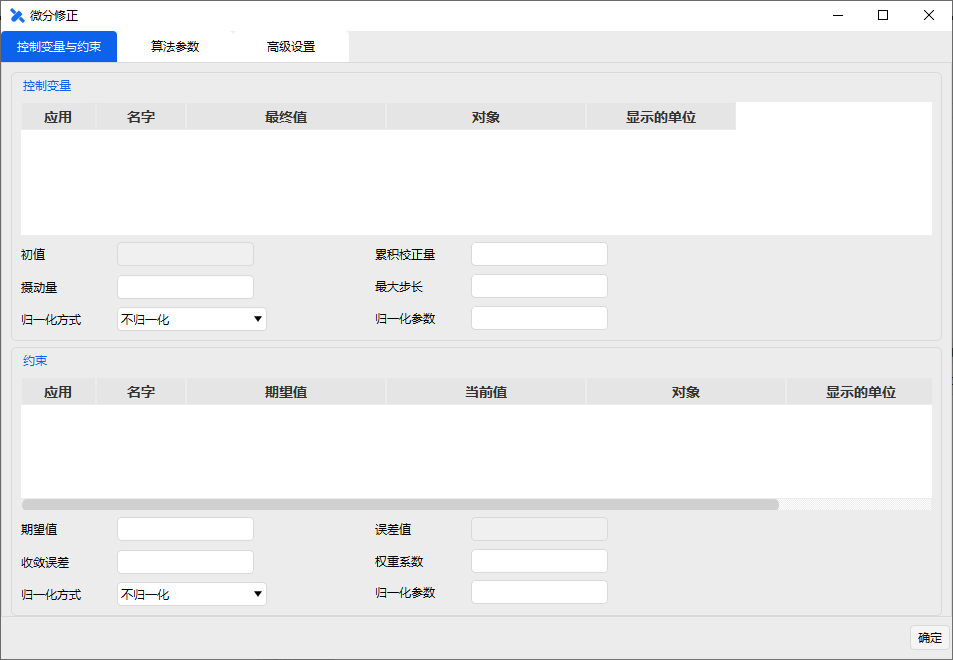

# 瞄准序列段

瞄准序列段是通过定义一系列机动段和预报段构成一个子任务序列段，以实现特定目标任务。实现一个目标序列通常可以分为 3 步完成。

1）新增基本段到目标序列。

2）定义瞄准目标序列的属性。

3）配置目标序列。

**（1）新增基本段到目标序列**

任何任务控制序列段都可以嵌套在目标序列里面，一个目标序列也可以嵌套在另一个目标序列中。用户可以根据自己的任务需求，增加自己需要的基本任务控制序列段。

**（2）定义瞄准序列段的属性**

瞄准序列段的属性主要在配置中通过新增【】按钮，进入算法配置页面进行设置。

当前软件版本的迭代算法包括三类微分修正算法、序列二次规划算法和智能优化算法。选定迭代算法后，即可进入设置界面定义控制变量和约束，如图所示界面。

**（3）定义瞄准目标序列的属性**

在完成控制变量和约束的设置后，即可再次进入到瞄准序列段设置界面，进行瞄准目标序列动作参数的配置。动作类型包括迭代运行、不迭代运行、应用迭代结果运行。

其中，迭代运行对应的动作为执行目标序列，直到达到最优化目标，运行过程中，目标序列不断重复迭代，选择的优化变量也会不断更新，不迭代运行动作则与之相反。应用迭代结果运行指的是，根据用户输入的变量值，执行瞄准目标序列，运行过程中通常不涉及优化解算。用户在使用过程中，可以根据自己的需要选择相应的动作类型。动作类型旁边的【应用修改】按钮的主要功能是将当前修改后的设置赋给瞄准目标序列，而【重置】按钮则是重置瞄准目标序列。

