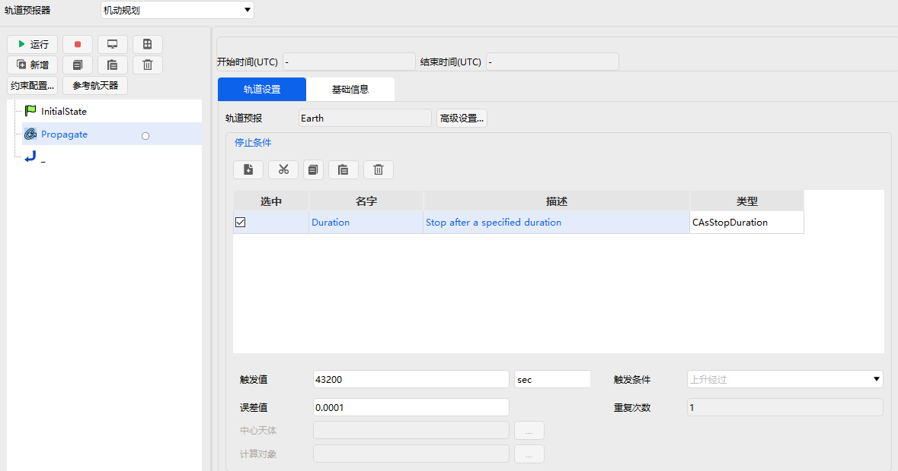
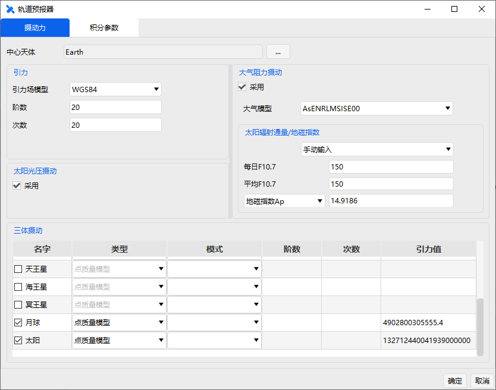

# 预报段

预报段主要功能是用来模拟和计算航天器在给定力场模型、初始条件等参数基础上、轨道在给定停止条件下的运动状态。

轨道机动规划工具预报段界面属性和参数如图所示，包括开始与结束时间、轨道预报器、停止条件等三个主要部分。轨道预报器的设置可以通过点击【高级配置...】按钮进入到参数配置界面，如图所示。

停止条件部分包括 5 个主要工具按钮，其名称和功能介绍如下表所示。

停止条件工具栏按钮

| 按钮                                               | 名称 | 功能                     |
| -------------------------------------------------- | ---- | ------------------------ |
|  | 新建 | 建立新的停止条件         |
|  | 剪切 | 将当前停止条件放到剪切板 |
|  | 复制 | 复制一份当前条件到剪切板 |
|  | 粘贴 | 插入一份复制的停止条件   |
|  | 删除 | 删除一份停止条件         |

选择停止条件后，即可在对应的参数界面设置用户期望的停止条件，如外推时间长度、误差容许值等触发条件。当前版本支持的停止组件如下表所示。

停止条件组件与描述

| 停止条件组件   | 描述                                           |
| -------------- | ---------------------------------------------- |
| Duaration      | 在特定的持续时间执行后停止                     |
| Epoch          | 在特定的历元时刻停止                           |
| Altitude       | 在目标运动到相对于参考中心天体的指定高度时停止 |
| Longitude      | 在对象达到特定经度时停止                       |
| Latitude       | 在对象达到特定纬度时停止                       |
| Apoapsis       | 在轨道远地点时停止                             |
| Periapsis      | 在轨道近地点时停止                             |
| AscendingNode  | 在升交点处停止                                 |
| DescendingNode | 在降交点处停止                                 |
| XYPlaneCross   | 在对象穿越 X—Y 平面时停止                      |
| YZPlaneCross   | 在对象穿越 Y—Z 平面时停止                      |
| ZXPlaneCross   | 在对象穿越 Z—X 平面时停止                      |
| AscToDesc      | 在北纬最高点停止                               |
| DescToAsc      | 在南纬最低点停止                               |
| Rmagnitude     | 在距离初始位置的特定距离处停止                 |
| TrueAnomaly    | 在特定真近点角处停止                           |
| MeanAnomaly    | 在特定平近点角处停止                           |
| ArgLat         | 在特定纬度幅角处停止                           |
| StateCal       | 在对象特定状态计算值处停止                     |

用户在使用预报段时，可根据任务需要定义相应的停止条件。选择停止条件后，在对应框内输入变量大小即可。
