# 接近分析工具

## 功能介绍

接近分析工具可以实现分析和评估太空中的目标与其他物体接近的可能性，得到目标与其他物体的最接近时刻以及最接近时刻所对应的相对位置、速度等信息。目前，接近分析已成为任务分析中的重要内容。

### 功能位置

ATK 的接近分析工具能够分析航天器与目标之间的接近参数，该功能位于ATK 工具栏目中，具体打开位置如图所示。

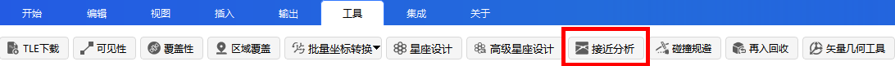

### 界面介绍

**（1）主界面**

接近分析对象选择、目标数据库选择、排除目标 SSC  编号列表设置、仿真历元设置、接近约束设置、并提供高级设置按钮、计算按钮和结果展示按钮，界面如表所示。

接近分析对象选择、目标数据库选择、排除目标 SSC  编号列表设置、仿真历元设置、接近约束设置、并提供高级设置按钮、计算按钮和结果展示按钮，界面如表所示。

表 - 接近分析页面

| 选择主目标        | 主目标分别来自仿真场景、TLE 数据库与星历文件：      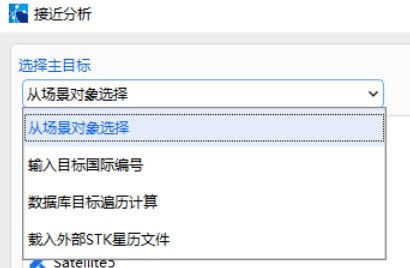 |
| ----------------- | ------------------------------------------------------------ |
| 目标TLE 数据库    | 用户或 ATK  已有的TLE  数据库文件，格式为：      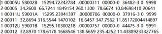 |
| 排除目标 SSC 编号 | 用于排除上述TLE  目标数据库中的国际目标卫星。                |
| 仿真分析时间      | 包含开始历元与结束历元，默认与仿真场景一致且为 UTCG： 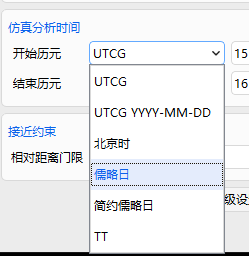 |
| 接近约束          | 目标航天器与跟踪航天器的等效距离约束                         |
| 高级设置          | 包含过滤器约束与等效距离告警门限                             |

**（2）主目标选择**

接近分析对象有多种方式选择，可通过主界面的接近分析对象区域下拉框进行切换，选择方式包括从场景对象选择界面效果如图所示。

1）从场景对象选择，支持航天器多选：

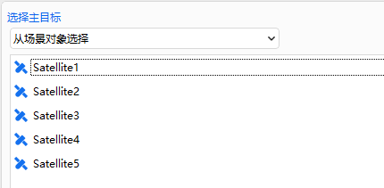

2）选择输入目标国际编号加入接近分析对象。只需要在输入框中输入目标国际编号，并点击【添加】按钮即可加入。删除列表中某个对象时，单机选中，点击【删除】按钮。

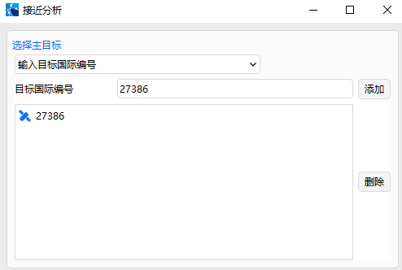

3）选择数据库目标遍历计算，无需做任何选择对象操作，因为计算时会遍历所有目标。

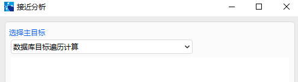

4）选择载入外部 STK 星历文件。需要先选择文件，然后点击添加，加入列表中，删除列表中某个对象时，请选中后，点击删除按钮。

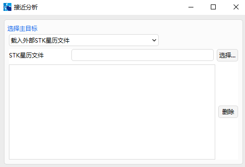

**（3）排除目标 SSC 编号列表界面**

在主界面中点击排除目标 SSC 编号列表的设置按钮，打开设置界面。

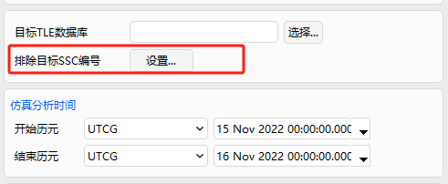

打开“排除目标”界面后，可进行【添加】、【删除】和查看操作。

**（4）高级设置界面**

在主界面中点击【高级设置】按钮，高级设置界面包含“过滤器”与“等效距离告警门限”，过滤器约束内容如表所示。

表 - 过滤器约束

|  |  |
| ---------------- | ------------------------------------------------------------ |
| 轨道历元过期门限 | 表示物体飞行数据的可信时间段，物体与目标接近事件的发生时间超过该门限后，将认为不可信。 |
| 远近地点门限     | 对于接近目标的物体，其轨道远近点差不能超过该门限。           |
| 仿真分析步长     | 接近分析的仿真计算步长。                                     |

**（5）结果界面**

点击【计算】按钮，输出计算结果。

表 - 结算结果说明

| 输出参数 | 参数说明              | 单位              |
| -------- | --------------------- | ----------------- |
| 主目标   | 目标航天器            |                   |
| 次目标   | 接近空间目标          | SSC               |
| 接近时刻 | 协调世界时（UTC）     | 年-月-日-时-分-秒 |
| 等效距离 | 最小接近距离          | km                |
| 相对距离 | 相对距离              | km                |
| 径向距离 | LVLH 系下的x 轴向距离 | km                |
| 横向距离 | LVLH 系下的y 轴向距离 | km                |
| 法向距离 | LVLH 系下的z 轴向距离 | km                |
| 接近夹角 | 轨道面夹角            | deg               |
| 相对速度 | ICS 系下的相对速度差  | km/s              |

在接近分析页面点击【结果】按钮可重新打开计算的数据。

## 使用方法

为了进行接近分析任务，操作将分多个步骤完成。

### 创建场景

点击【插入】按钮，创建航天器，并双击场景打开设置界面，设置场景仿真历元。

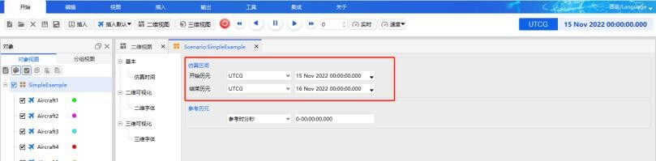

### 在三维视图查看航天器仿真轨迹

双击插入的航天器，单击【确定】，回到三维视图，拖动时间视图图标，查看仿真轨迹。

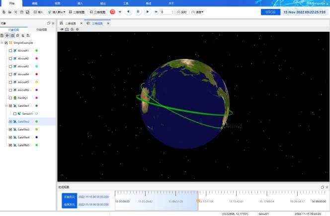

### 选择接近分析对象

由于上述目标航天器是从仿真场景中创建得到，点击“接近分析”打开功能界面，在此选择“从场景对象选择”，并单击选中。

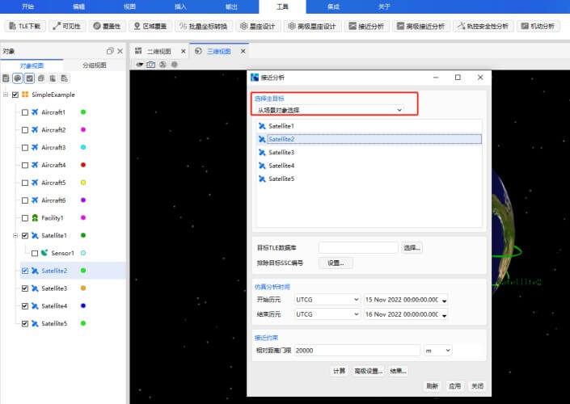

### 选择目标数据库。

（1）点击【选择…】按钮。

（2）选择已有的目标 TLE 数据库文件。

（3）单击【打开】按钮。

目标航天器将与目标 TLE 数据库中的空间目标进行接近分析。

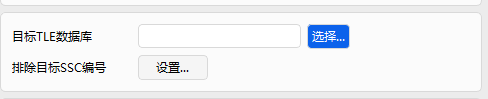

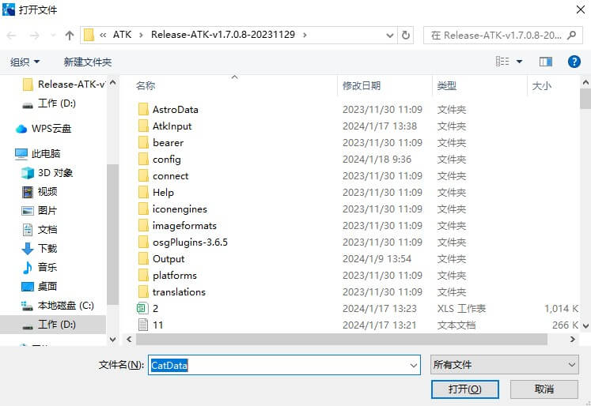

### 填充排除目标 SSC 编号列表

（1）单击【设置…】。

（2）在“排除目标 SSC 编号”栏中输入需要排除的目标编号。

（3）单击【添加】按钮。

（4）若需要删除，则选中该目标 SSC 编号，单击【删除】，选择完毕后点击【确定】按钮。

当 TLE 中对应的空间目标被排除后，目标航天器将不再与该目标进行接近分析。

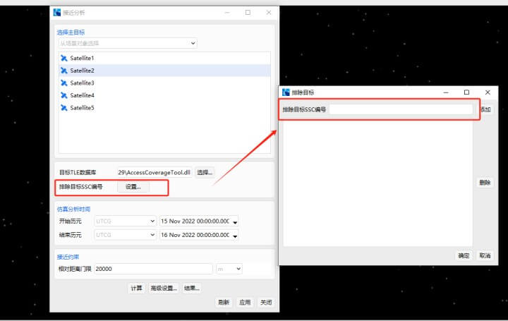

### 设置仿真历元

选择仿真分析时间时，用户需要确保“仿真分析时间”包含于“场景仿真时间”，若“仿真分析时间”超出“场景仿真时间”范围，则超出范围时间无法进行接近分析。

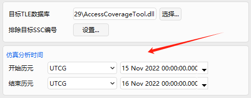

### 设置接近约束

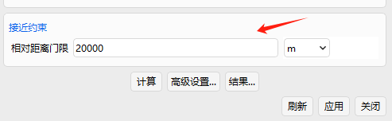

### 进行高级设置

点击【高级设置…】按钮，可对过滤器与等效距离告警门限进行设置。

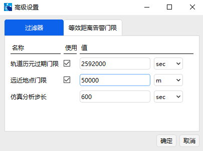

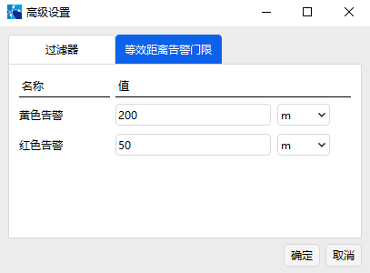

### 计算

点击计算按钮，开始运算。

### 数据查看

点击【计算】按钮，计算完成前，结果界面没有数据，计算完成后，会自动弹出结果查看界面，关闭结果界面，点击【结果】按钮，还可以再次打开查看。

[接近分析案例](../3.案例教程/3.6接近分析案例.md)