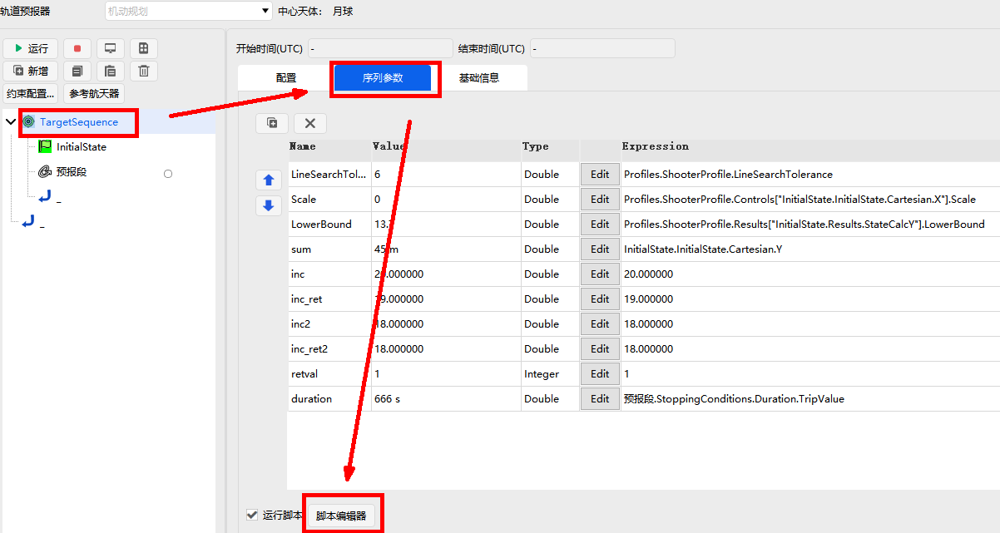
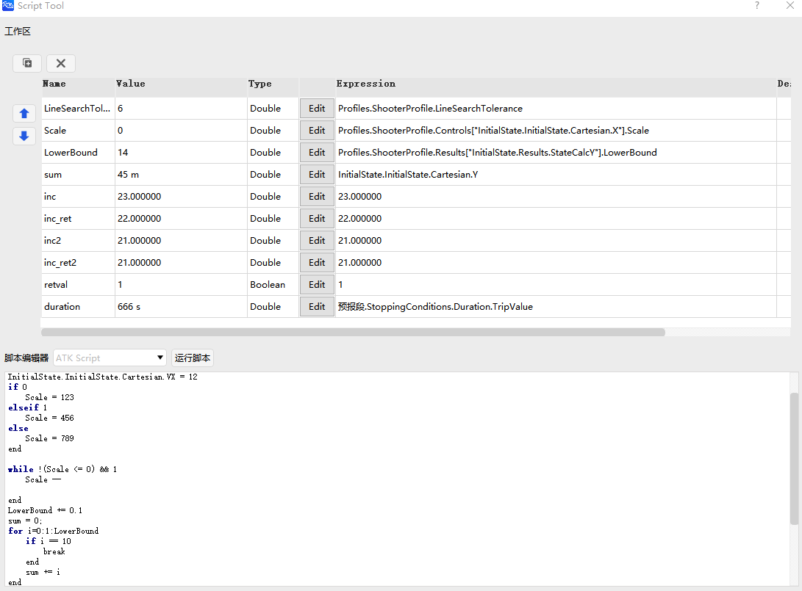

# 脚本工具

## 功能介绍

本功能模块可以实现调用内置的[ATK脚本语言解释器](#atk脚本简介)或外部脚本语言来扩展ATK软件的计算能力

ATK脚本支持基本运算符与流程控制语句，**能直接访问ATK算法组件的属性**，扩展了**绑定赋值运算符**`=&`来支持脚本变量与ATK算法组件属性的绑定

外部脚本语言的调用功能支持**动态加载计算机中已有的计算环境**，目前支持Python、Matlab

## 功能位置

可以在机动规划的序列段、瞄准序列段中访问该功能，具体位置如下图:




## 使用方法


### 绑定属性

在编程工作区的变量表中，新建一个变量后，点击变量行的`Edit`按钮，可以跳转到如下的变量绑定窗口


变量绑定窗口的左侧为ATK对象树，右侧为当前所选对象的属性树，在右侧选择变量后，即可将变量与ATK对象的属性相绑定


:::warning
对于ATK脚本，工作区里的变量是采用[绑定赋值](#基本运算符)定义的。所以在ATK脚本运行时，变量的值与所绑定的算法模型属性**是始终同步的**。

对于外部脚本，工作区里的变量不是在运行时同步的，而是运行结束后同步的。所以在外部脚本运行时，变量的值与所绑定的算法模型属性**不是始终同步的**。

:::

### 编写与执行脚本

点击`脚本编辑器`按钮，跳转到脚本编辑界面，在脚本编辑器中编写代码，并选择脚本执行器，目前的脚本执行器有`ATK脚本`、`Python`、`Matlab`



编写完成后，点击运行即可触发脚本执行，并会在脚本执行结束后更新工作区变量的值。

如果勾选了`运行脚本`，则在序列段、瞄准序列段每次执行时都会自动触发脚本执行。

## ATK脚本简介

ATK脚本定位为一种**领域专用语言**，目前支持基本运算符、流程控制语句等，**并原生支持绑定ATK对象与算法组件的属性**

ATK脚本扩展了一些专有功能，例如**支持直接访问ATK算法组件的属性，并新增了绑定赋值运算符`=&`与延迟赋值运算符`:=`来支持脚本变量与ATK算法组件属性的绑定**

ATK脚本的语法主要参考了julia语言

### 数据类型

支持的基础数据类型有：浮点数(`Double`)、整型(`Interger`)、布尔值(`Boolean`)


### 基本运算符

1. 赋值运算符


|运算符  |描述                                                                                  | 备注                       |
|:---:  |:---                                                                               |:---                        |
|`=`    |直接赋值运算符，将右侧表达式的计算结果赋给左侧操作数                                   |`c = a + b`                |
|`:=`   |延迟赋值运算符，将右侧表达式赋给左侧操作数<br>在每次访问左侧操作数时会重新进行一次求值   |`a = 1`，`b := a + 1`，此时获取`a`的值为`2` <br> 更改`a`的值`a = 3`，此时获取`b`的值为`4` <br> 如果对`b`重新赋值`b = 2`，变量`b`将不再具备延迟计算特性|
|`=&`   |绑定赋值运算符，将左侧操作数与右侧表达式绑定<br>变量的取值与直接赋值将与右侧表达式绑定| `a=1`，`b =& a`，此时获取`b`的值为`2`<br> 更改`a`的值`a = 3`，此时获取`b`的值为`3` <br> 更改`b`的值`b = 5`，此时获取`a`的值为`5`<br>绑定赋值运算符可以用于绑定ATK算法组件的属性 |
|`+=` | 加且赋值运算符 | `a += 2` |
|`-=` | 减且赋值运算符 | `a -= 2`|
|`*=` | 乘且赋值运算符 | `a *= 2`|
|`/=` | 除且赋值运算符 | `a /= 2`|


2. 算术运算符

|表达式  |描述                        | 备注                       |
|:---:  |:---                        |:---                        |
| `+x` | 取正运算符                   |                             |
| `-x` | 取负运算符                   |                             |
| `++x` | 先自增运算符                |                             |
| `x++` | 后自增运算符                |                             |
| `--x` | 先自减运算符                |                             |
| `x--` | 后自减运算符                |                             |
| `x + y` | 加法运算符                |                             |
| `x - y` | 减法运算符                |                             |
| `x * y` | 乘法运算符                |                             |
| `x / y` | 除法运算符                |                             |


3. 逻辑运算符

|表达式     |描述                        | 备注                        |
|:---:     |:---                        |:---                         |
| `!x`     | 取非运算符                  | 否定                            |
| `x && y` | 短路与运算符                | 在`x && y`中，子表达式`y`仅当`x`为`true`时才会被执行 |
| `x \|\| y` | 短语或运算符              | 在`x \|\| y`中，子表达式`y`仅当`x`为`false`时才会被执行 |


4. 比较运算符

|运算符     |描述              |
|:---:     |:---               |
| `==`     | 相等              |
| `!=`     | 不等              |
| `<`      | 小于              |
| `<=`      | 小于等于         |
| `>`      | 大于              |
| `>=`      | 大于等于          |

比较运算符支持链式比较，例如`1 < 2 == 2 <= 6`相当于`(1 < 2) && (2 == 2) && (2 <= 6)`

链式比较也具有短路特性

### 流程控制

1. 条件语句

```atks
if x < y

elseif x > y

else

end
```


2. 循环语句(for)

从`1`遍历到`9`(包含`1`和`9`)

```atks
for i=1:9

end
```

从`1`遍历到`9`，间隔步长为`2`

```atks
for i=1:2:9

end
```


3. 循环语句(while)

```
while i <= 5
   i += 1
end
```

`while`、`for`循环语句均支持`break`和`continue`


### 绑定ATK算法组件属性


如下图，在机动规划中插入序列段，序列段中插入初始段


按照[使用方法](#编写与执行脚本)进入脚本编辑器，编写ATK脚本

```atks
初始段.InitialState.Cartesian.Z = 100

VX =& 初始段.InitialState.Cartesian.VX
VX = 10
```

- 第1行：在ATK脚本中直接访问算法组件的属性

- 第3行：使用`=&`绑定赋值运算符将脚本变量与算法组件的属性相绑定

- 第4行：修改变量的值，与其绑定的ATK算法组件的属性也会被更改


点击执行脚本，然后返回初始段的配置界面，可以看到算法组件的相关属性已被ATK脚本更改


:::warning
在ATK脚本中，算法组件属性的更改将会同步更改与其相关的其他属性

例如更改位置速度属性，将会同步更改轨道根数属性

那么，如果两个脚本变量所绑定的算法组件属性具有联系，则更改其中一个变量的值将会同步影响另一个变量的值

```atks
VX =& 初始段.InitialState.Cartesian.VX
Ecc =& 初始段.InitialState.Keplerian.Ecc

VX = 10
```

例如，在上面的ATK脚本中，在更改`VX`变量的值后，将同步影响`Ecc`变量的值

:::


## 调用外部Python环境


### 选择Python动态库

在执行Python脚本时，会提示需要选择一个Python环境，可以选择电脑中已安装的Python动态库。

例如在windows下选择`python38.dll`、`python311.dll`，linux下选择`libpython.so`


### 脚本环境内置函数

`ATKExecuteCommand`函数可以执行[ATK Connect命令](/二次开发教程/1-二次开发CONNECT模式/1-Connect模式输入和输出.md)，例如

```
ATKExecuteCommand("Astrogator */Satellite/卫星1 ApplyCorrections MainSequence.SegmentList.瞄准序列段")
```

