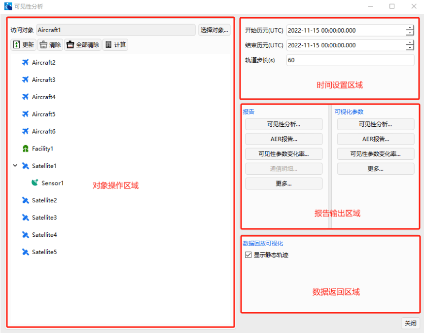
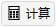

# 可见性工具

## 功能介绍

可见性工具是用于计算在对象当前属性和参数约束的条件下，两对象之间是否能够建立联系（是否可见），可用于卫星的星间通信等任务的可视性分析。该工具能够计算两对象的可见时间、被视对象在分析对象的方位角、俯仰角和两对象间的距离及其对应的变化率等。

该工具可以执行单个对单个对象的可见分析，还可以计算单个对象对多个对象。可针对每对计算对象可见时段内、不可见时段内的计算结果进行输出数据报告及图像报告。

### 功能位置

（1）在对象窗口选择任意对象点击鼠标右键，即可找到可见性工具。

（2）在工具栏中找到可见性工具点击【可见性】即可调出可见性工具窗。

### 界面介绍

包括对象操作区域、时间设置区域、报告输出区域、数据返回区域。

（1）对象操作区域。用于选择分析对象，进行可见性数据计算、数据清除及数据更新。

（2）时间设置区域。用于设定可见性分析时间区间。

（3）报告输出区域。用于生成可见性数据报告及可视化图像报告

（4）数据返回区域。用于在二维视图内显示静态加粗的可见弧段。

## 使用方法

### 可见性计算时段

在“时间设置区域”，设定可见性分析的开始、结束时刻。该区域默认取值为已仿真时间段（自场景开始时间起，至仿真结束时间止），可根据用户自身计算需求进行修改。但需要确保所分析的时间段位于场景已仿真时间段内。

### 对象选择

在“对象操作区域”，选择“访问对象”，即可见性计算基准对象，可支持对 “Aircraft”、“Facility”、“Satellite”、“Ship”、“GroundVehicle”进行可见性分析。

在“访问对象”下方，选择对应的被视对象，支持同时选择多个对象进行计算。

### 分析可见关系

选中计算对象后，点击【计算 】，可计算对应目标的覆盖情况。当计算完成后，对应计算对象名称前将带有“*”标识。

### 生成可见性报告

在“报告输出区域”可查看覆盖性计算结果。提供数据报告和曲线报告两类，分别对应于“报告”和“可视化参数”两部分。

数据报告可输出下述内容：

| 报告名称             | 含义                                                         |
| -------------------- | ------------------------------------------------------------ |
| 可见性报告           | 访问对象对目标对象的可见时段开始时间、结束时间、可见时长及统计信息。 |
| AER 报告             | 访问对象对目标对象在每个可见时段内，方位角、俯仰角、视线距及统计信息。 |
| 可见性参数变化率报告 | 访问对象对目标对象在每个可见时段内，视线角速率、视线方位角速率、视线俯仰角速率、视线距变化率及统计信息。 |
| 不可见报告           | 访问对象对目标对象的不可见时段开始时间、结束时间、可见时长及统计信息。 |
| 不可见 AER 报告      | 访问对象对目标对象在每个不可见时段内，方位角、俯仰角、视线距及统计信息。 |

图表报告可输出下述内容：

| 报告名称                   | 含义                                                         |
| -------------------------- | ------------------------------------------------------------ |
| 可见性曲线                 | 访问对象对选定目标对象的可见时段时间区间。                   |
| AER 曲线                   | 访问对象对目标对象在可见时段内，方位角、俯仰角、距离随时间的变化曲线。 |
| 可见性参数变化率曲线       | 访问对象对目标对象在可见时段内，视线角速率、视线方位角速率、视线俯仰角速率、视线距变化率随时间的变化曲线。 |
| 不可见时段曲线             | 访问对象对选定目标对象的不可见时段时间轴。                   |
| 不可见 AER 曲线            | 访问对象对目标对象在不可见时段内，方位角、俯仰角、距离随时间的变化曲线。 |
| 可见俯仰角曲线             | 访问对象对目标对象在可见时段内，俯仰角随时间的变化曲线。     |
| 可见方位角曲线             | 访问对象对目标对象在可见时段内，方位角随时间的变化曲线。     |
| 可见视线距曲线             | 访问对象对目标对象在可见时段内，视线距随时间的变化曲线。     |
| 可见角度变化率曲线         | 访问对象对目标对象在可见时段内，视线角速率随时间的变化曲线。 |
| 可见俯仰角方位角极坐标曲线 | 访问对象对目标对象在可见时段内，方位角、俯仰角的极坐标曲线。 |
| 可见时段百分比饼图         | 访问对象对目标对象的可见时间段占总可见时段的百分比饼图。     |
| 全任务周期可见百分比饼图   | 访问对象对目标对象的总可见时间段占计算时间段的百分比饼图。   |

### 可见弧段查看

系统默认勾选“显示静态轨迹”选项，在二维视图中全部可见轨迹弧段将显示维静态加粗线条。

取消勾选后，可见弧段不再以静态加粗线条显示，而是在时间视图运行到对应可覆盖时刻后，以卫星间的连线展示可见弧段信息。

### 清除计算数据

在“对象操作区域”，点击【清除】，可清除当前选中对象的计算信息。点击【全部清除】可清除全部计算结果。

当关闭可见性分析窗口时，计算结果自动清除，下一次打开该窗口时需重新计算运行。