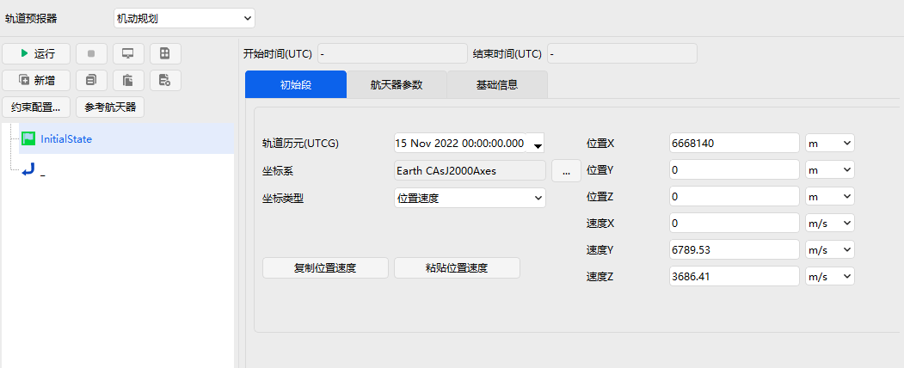
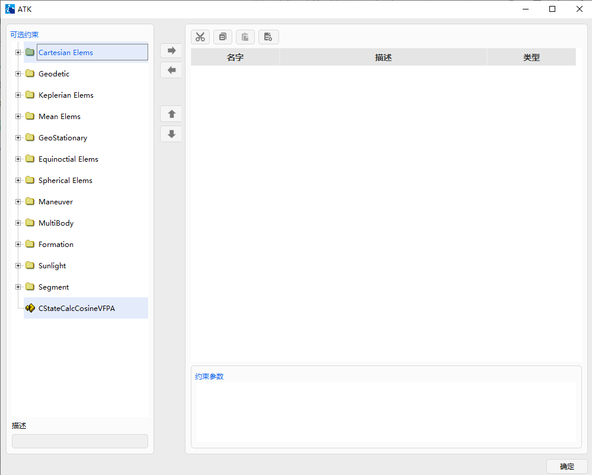
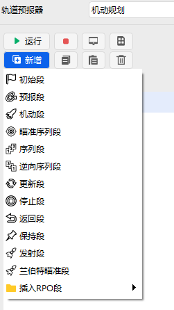
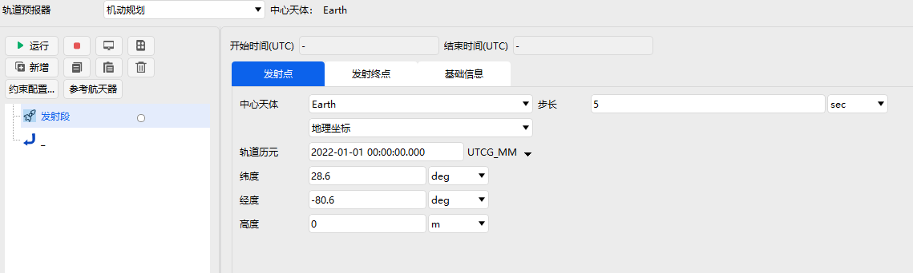
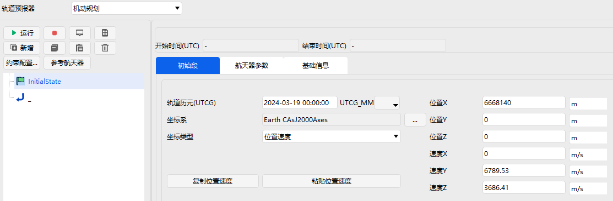
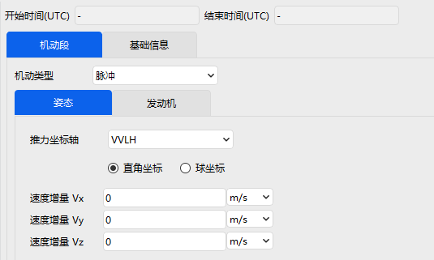
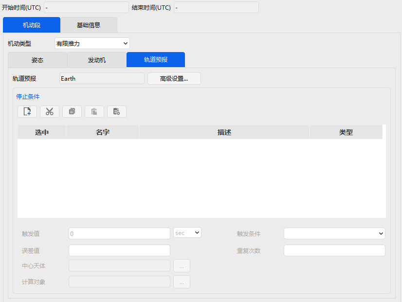
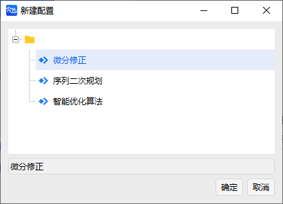

# 轨道机动规划工具  

## 功能介绍

机动规划是为空间任务分析与航天器轨道设计而开发的功能模块。轨道机动规划工具将航天器轨迹划分成不同的任务段，以不同图形模块标识特定的任务阶段。使用者可以根据需要选取不同模块构造自己的任务序列，完成轨道规划与计算的任务，并生成卫星的星历。轨道机动规划工具提供了脉冲推力和有限推力两种机动模式，并且支持高精度轨道外推计算模型。为了实现任务规划功能，机动规划模块提供了微分修正器和序列二次规划优化器，可以满足发射窗口、交会对接、轨道转移等任务的规划与分析。

当用户将轨道预报器选择为机动规划后，即可进入轨道机动规划界面

轨道机动规划模块界面左侧是任务控制序列（Mission Control Sequence，MCS）的树状结构，描述了任务的各个任务序列段之间的关系。树状结构的上侧为工具栏，相应的功能说明如表 5-1 所示。

表 5-1 机动规划工具栏按钮

| 按钮                                      | 功能说明       |
| ---------------------------------------- | -------------- |
|  | 运行任务序列   |
|  | 停止计算任务   |
|  | 运行结果显示   |
|  | 任务概要说明   |
|  | 新增任务序列段 |
|  | 复制任务序列段 |
|  | 粘贴任务序列段 |
|  | 删除任务序列段 |
|  | 约束配置选择   |
|  | 选择参考航天器 |

树状结构右侧窗口为各个序列任务段参数设置界面。如初始段可设置轨道历元、坐标系、坐标类型、初始状态等参数。对于约束配置，则需要通过点击工具栏中的【约束配置...】按钮进入约束配置界面。

构造任务控制序列的过程主要是通过插入和调整不同的任务段的过程，对各个阶段的特性进行定义，设置特定约束和停止条件等因素，选择适应的优化器完成轨道机动规划任务。

## 机动规划任务序列段

轨道机动规划工具允许用户自由选择和组织任务序列段，生成期望的轨迹。用户可以根据自己的任务需要，选择不同任务控制序列段，规划相应的轨道。当前 ATK 版本软件主要支持如图所示的 13 个序列段，分别是发射段、初始段、预报段、机动段、瞄准序列段、序列段、逆向序列段、更新段、停止段、返回段、保持段、兰伯特瞄准段和插入 RPO 段，每个阶段中都可以自由配置相应的约束和设计变量等参数。

### 发射段
发射段用于定义具有发射阶段的航天器的初始状态。

### 初始段

初始段全称为初始状态段，用来定义整个任务控制序列及其子序列的初始状态。除了时间信息之外，初始段的设置主要包括初始轨道要素或初始位置速度、航天器参数、基础信息三个部分，详细页面展示如图所示。

顾名思义，初始段的主要功能是定义航天器的初始条件和航天器本身的特征参数。初始状态通常以初始轨道要素、初始历元、以及轨道坐标系等参数给出。航天器参数则包括净质量、推进剂质量、大气阻力系数、阻力面积、太阳光压系数、太阳光压面积等参数。基础信息主要是用来描述初始段基本参数，包括名称和用户定义的其他描述信息。

### 预报段

预报段主要功能是用来模拟和计算航天器在给定力场模型、初始条件等参数基础上、轨道在给定停止条件下的运动状态。

轨道机动规划工具预报段界面属性和参数如图所示，包括开始与结束时间、轨道预报器、停止条件等三个主要部分。轨道预报器的设置可以通过点击【高级配置...】按钮进入到参数配置界面，如图所示。

停止条件部分包括 5 个主要工具按钮，其名称和功能介绍如表所示。

表 - 停止条件工具栏按钮

| 按钮                                               | 名称 | 功能                     |
| -------------------------------------------------- | ---- | ------------------------ |
|  | 新建 | 建立新的停止条件         |
|  | 剪切 | 将当前停止条件放到剪切板 |
|  | 复制 | 复制一份当前条件到剪切板 |
|  | 粘贴 | 插入一份复制的停止条件   |
|  | 删除 | 删除一份停止条件         |

选择停止条件后，即可在对应的参数界面设置用户期望的停止条件，如外推时间长度、误差容许值等触发条件。当前版本支持的停止组件如表所示。

表 - 停止条件组件与描述

| 停止条件组件   | 描述                                           |
| -------------- | ---------------------------------------------- |
| Duaration      | 在特定的持续时间执行后停止                     |
| Epoch          | 在特定的历元时刻停止                           |
| Altitude       | 在目标运动到相对于参考中心天体的指定高度时停止 |
| Longitude      | 在对象达到特定经度时停止                       |
| Latitude       | 在对象达到特定纬度时停止                       |
| Apoapsis       | 在轨道远地点时停止                             |
| Periapsis      | 在轨道近地点时停止                             |
| AscendingNode  | 在升交点处停止                                 |
| DescendingNode | 在降交点处停止                                 |
| XYPlaneCross   | 在对象穿越 X—Y 平面时停止                      |
| YZPlaneCross   | 在对象穿越 Y—Z 平面时停止                      |
| ZXPlaneCross   | 在对象穿越 Z—X 平面时停止                      |
| AscToDesc      | 在北纬最高点停止                               |
| DescToAsc      | 在南纬最低点停止                               |
| Rmagnitude     | 在距离初始位置的特定距离处停止                 |
| TrueAnomaly    | 在特定真近点角处停止                           |
| MeanAnomaly    | 在特定平近点角处停止                           |
| ArgLat         | 在特定纬度幅角处停止                           |
| StateCal       | 在对象特定状态计算值处停止                     |

用户在使用预报段时，可根据任务需要定义相应的停止条件。选择停止条件后，在对应框内输入变量大小即可。

### 机动段

机动段主要功能是对航天器在轨道上的机动过程进行建模，当前软件提供了脉冲机动和有限推力机动两种工况模式。

**（1）脉冲机动模式**

脉冲机动模式通过对前一任务序列段的最终速度增加一个速度增量，然后更新飞行器的状态。脉冲机动的设置分为姿态和发动机两个部分。脉冲机动段参数设置界面如图所示。

脉冲机动类型模式下，推力坐标轴可选择 VVLH、J2000、VNC 三类不同坐标系，坐标类型包括直角坐标系、球坐标两类。以 VVLH  推力坐标轴模式下设置为例，在对应速度增量输入框内输入数据即可，其中正值代表沿着坐标轴的正方向，反之则为负方向。发动机需要设置的参数有推力、比冲、以及选择是否根据推进剂消耗更新质量。用户在使用时直接在相应输入框内输入变量大小即可。

**（2）有限推力机动模式**

有限推力机动模式是根据设定的推力加速度，利用定义的轨道预报器来预报状态参数。推力的量级取决于用户定义的发动机模型，推力的方向由姿态控制来决定。有限推力模式下，用户需要设置三个部分：姿态、发动机、轨道预报，界面分布情况如图所示。

姿态部分同脉冲模式下的姿态设置基本一致，不同的是有限推力的坐标设置不再是速度增量，而是不同方向的单位矢量，用户在使用时仅需在对应方向输入即可。发动机部分的设置同样与脉冲机动模式下的选项一致。轨道预报部分同预报段的设置一致，即新增停止条件，输入相应参数大小即可。

### 瞄准序列段

瞄准序列段是通过定义一系列机动段和预报段构成一个子任务序列段，以实现特定目标任务。实现一个目标序列通常可以分为 3 步完成。

1）新增基本段到目标序列。

2）定义瞄准目标序列的属性。

3）配置目标序列。

**（1）新增基本段到目标序列**

任何任务控制序列段都可以嵌套在目标序列里面，一个目标序列也可以嵌套在另一个目标序列中。用户可以根据自己的任务需求，增加自己需要的基本任务控制序列段。

**（2）定义瞄准序列段的属性**

瞄准序列段的属性主要在配置中通过新增【】按钮，进入算法配置页面进行设置。

当前软件版本的迭代算法包括三类微分修正算法、序列二次规划算法和智能优化算法。选定迭代算法后，即可进入设置界面定义控制变量和约束，如图所示界面。

**（3）定义瞄准目标序列的属性**

在完成控制变量和约束的设置后，即可再次进入到瞄准序列段设置界面，进行瞄准目标序列动作参数的配置。动作类型包括迭代运行、不迭代运行、应用迭代结果运行。

其中，迭代运行对应的动作为执行目标序列，直到达到最优化目标，运行过程中，目标序列不断重复迭代，选择的优化变量也会不断更新，不迭代运行动作则与之相反。应用迭代结果运行指的是，根据用户输入的变量值，执行瞄准目标序列，运行过程中通常不涉及优化解算。用户在使用过程中，可以根据自己的需要选择相应的动作类型。动作类型旁边的【应用修改】按钮的主要功能是将当前修改后的设置赋给瞄准目标序列，而【重置】按钮则是重置瞄准目标序列。

### 序列段

序列段是一个组合体，可以用来将多个段进行组合，并可以定义将结果的属性传递到下一任务序列段或下一序列。序列段的参数设置主要是状态传递方式的设置，共有两种传递方式，分别是将序列段的初始状态传递给下一段和将序列段的终端状态传递给下一段。

### 逆向序列段

逆向序列段是一个组合体，可以用来将多个段进行组合，并可以定义为将结果的属性传递到下一任务序列段或下一序列。与序列段不同的是，该序列段中的基本段是逆向运行的。逆向序列段的参数设置主要是状态传递方式的设置，共有两种传递方式，分别是将逆向序列段的初始状态传递给下一段和将逆向序列段的终端状态传递给下一段。

### 更新段

更新段用来更新航天器配置参数，包括六种参数，分别是干重、推进剂质量、太阳光压面积、大气阻力面积、太阳光压系数和大气阻力系数。对于每一个参数，更新段可以提供如下表所示的选项进行操作。

|      |                      |
| -------- | ---------------------------------------- |
| 不变     | 保持该参数现有值不变                     |
| 增加     | 在该参数现有值的基础上增加数值栏输入的值 |
| 减少     | 在该参数现有值的基础上减少数值栏输入的值 |
| 设为新值 | 将该参数现有值替换为数值栏输入的值       |

### 停止段

停止段用来停止整个任务控制序列。在使用该段时，通过勾选开启前的方框，实现该段的运行，使得整个任务控制序列运行停止，无法继续向下进行。

### 返回段

返回段用来将控制变量返回到他的父级段，从而控制整个任务控制序列的运行。如果任务控制序列段的运行状态为迭代运行，则在该段后，任务控制序列段不会运行任何段。返回段有两种状态设置选项，分别是和，可以通过点击圆形按钮进行选择。当选择开启的状态时，该段是运行的。当选择关闭的状态时，运行整个任务控制序列段，该段是不发挥作用的。
