# 区域覆盖模块

## 功能介绍

主要用于考虑对象可见约束的情况下，实现一个或多个覆盖资源（如卫星、传感器）对全球或特定区域的覆盖分析。本分析模块包含的分析功能如下表所示。

表 - 区域覆盖品质参数

| 序号   | 覆盖品质         | 约束条件                                 | 有效条件                         |
| :---: | ---------------- | ---------------------------------------- | -------------------------------- |
| 1     | 简单覆盖         | 无                                       | 无                               |
| 2     | 覆盖时间约束     | 总值/每天最大/每天最小/每天平均/总覆盖率 | 无                               |
| 3     | 访问时长约束     | 总值/每天最大/每天最小/每天平均/总覆盖率 | 大于/大于等于/等于/小于等于/小于 |
| 4     | 重访时间约束     | 总值/最大值/最小值/平均值                | 大于/大于等于/等于/小于等于/小于 |
| 5     | 时间平均间隔约束 | 无                                       | 无                               |
| 6     | 响应时长约束     | 总值/最大值/最小值/平均值                | 大于/大于等于/等于/小于等于/小于 |

### 功能位置

该功能位于 ATK 工具栏目中，具体打开位置如图所示。

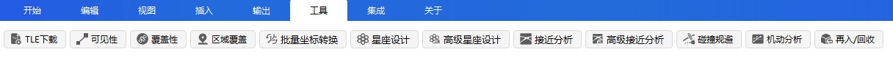

### 界面介绍

本功能界面包括分析对象选择、分析时间设置、覆盖品质参数设置、分析结果生成四个区域，如图所示

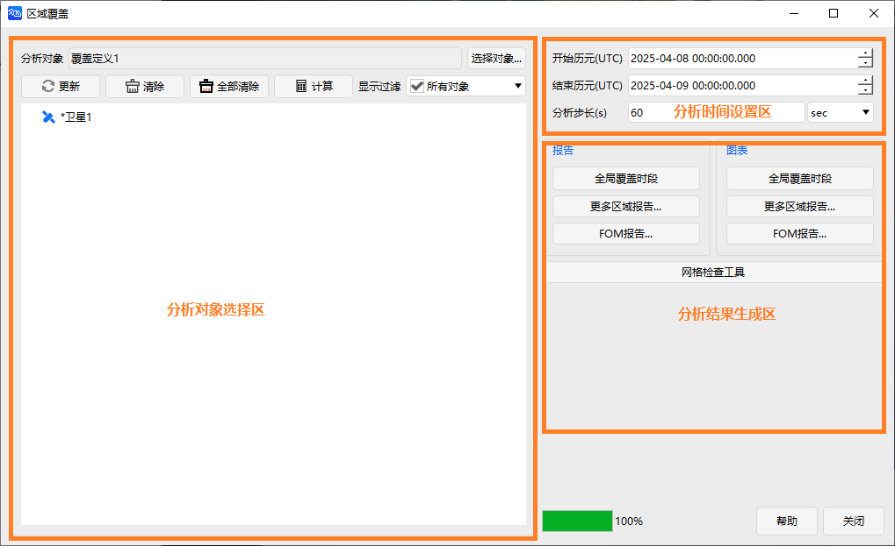

## 使用方法

### 创建场景

首先在“开始”中点击“新建”，创建场景，如图所示。

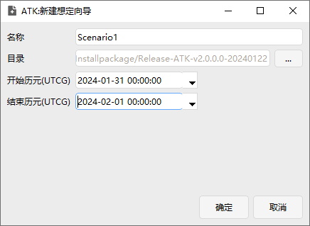

### 场景中添加各类对象

首先添加一颗卫星，在“开始”栏点击“插入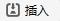”，如图所示，选择“卫星-插入默认类型”，插入卫星后，修改卫星轨道倾角属性为 65°，如图所示。

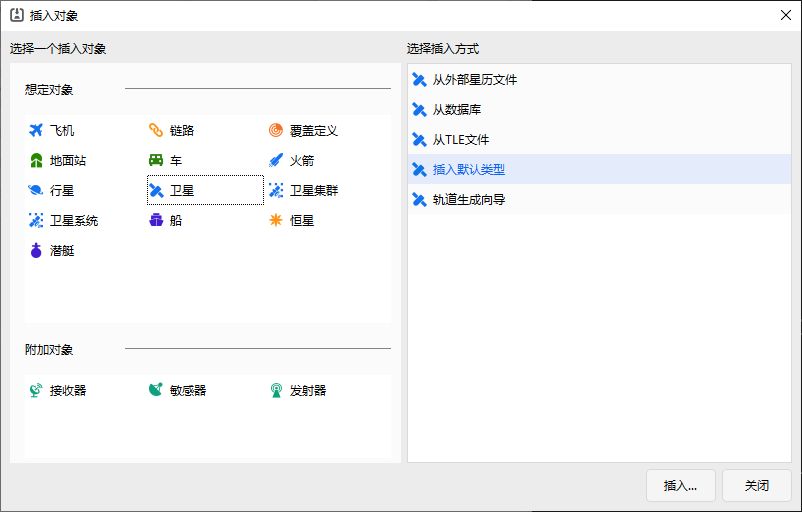

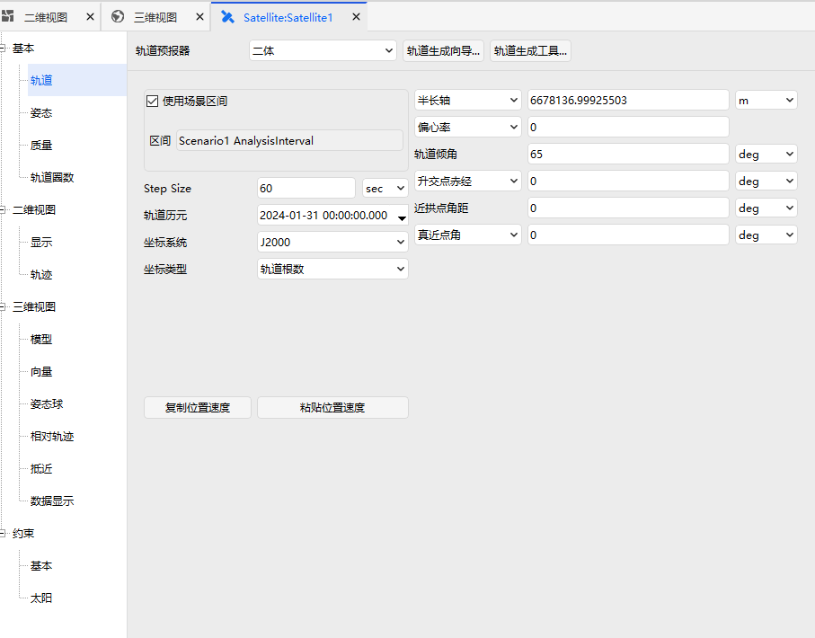

在“开始”栏点击“插入”，选择“敏感器-插入默认类型”，如图所示。

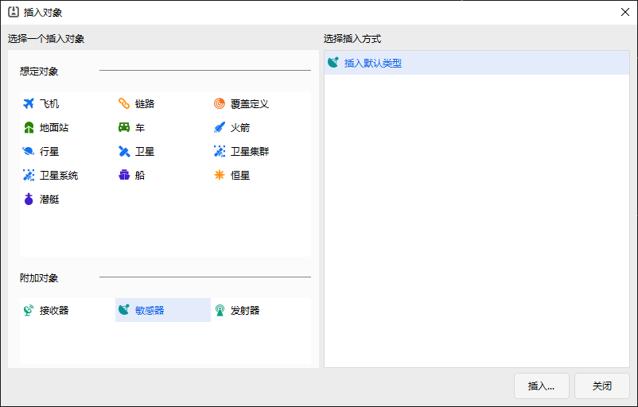

在弹出的窗口中选择“Satellite1”，点击确定，如图所示

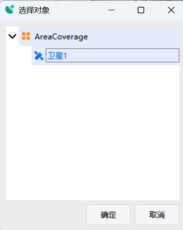

使用创建星座功能，选择 Satellite 为“种子”卫星，创建一个 Walker 星座。

点击“插入”，选择“覆盖定义-插入默认类型”，场景最终展示如图所示。

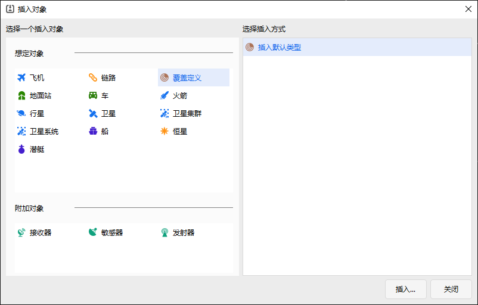

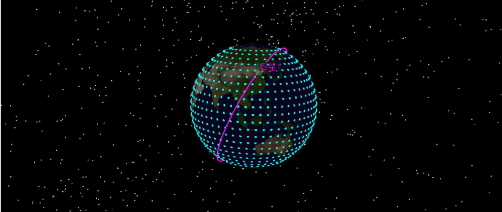

### 进行区域覆盖计算

在“工具”页面，点击“区域覆盖”，窗口如图所示。分析对象选择`CoverageDefinition1`，列表中选择所有卫星下挂的 Sensor，点击“计算”。这一步时长由计算复杂度决定。计算结束后，在“报告”/“图表”功能区即可生成覆盖报告，各类报告见图。

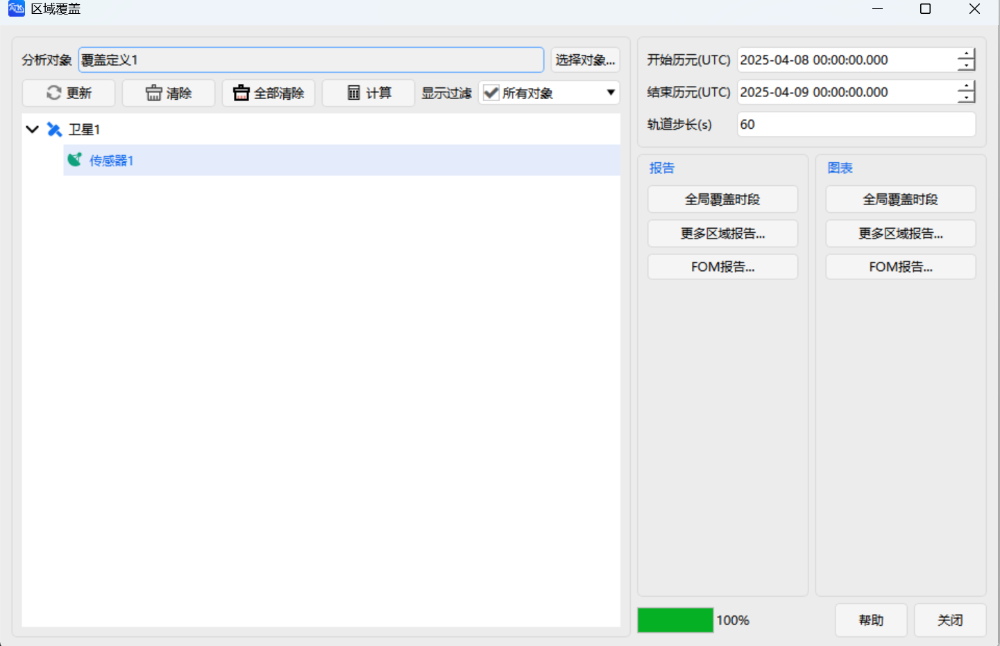

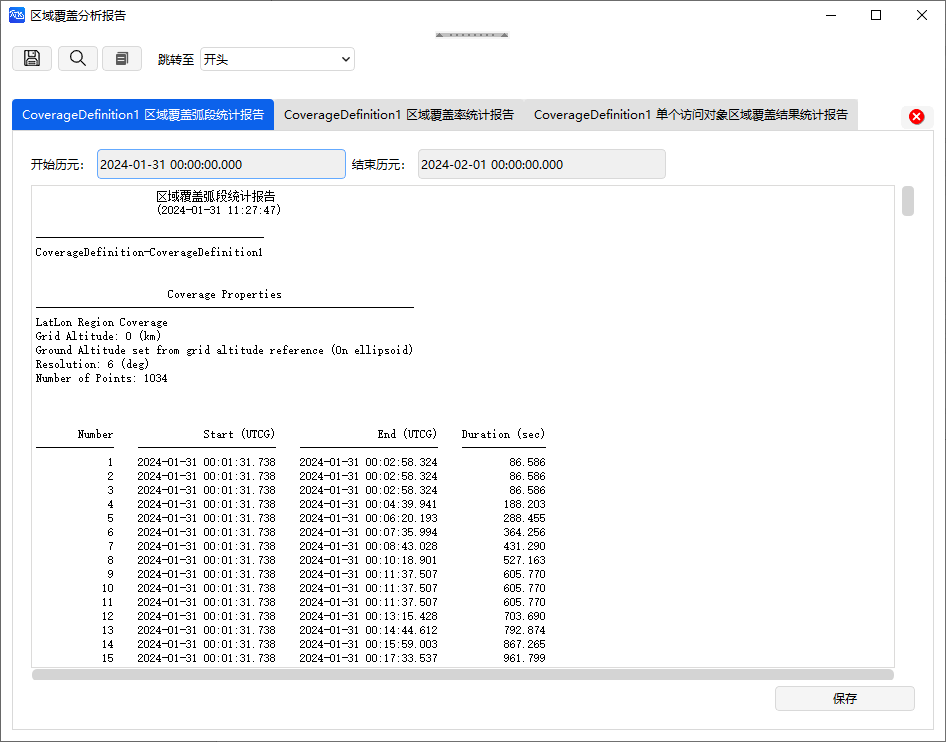

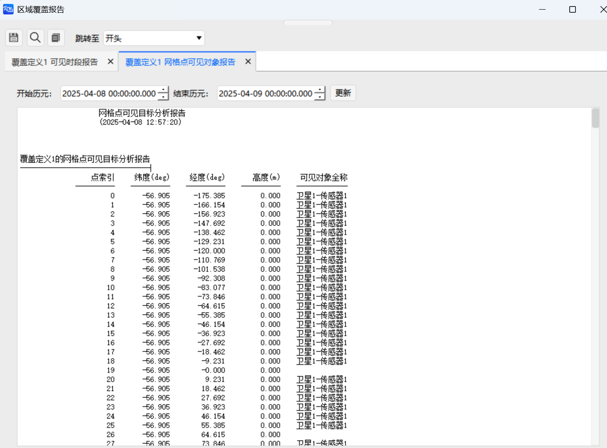

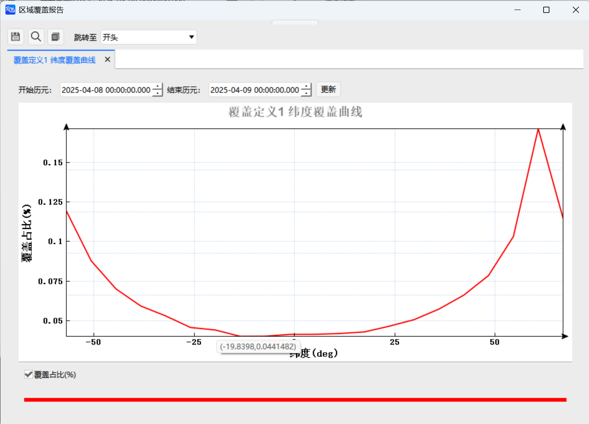

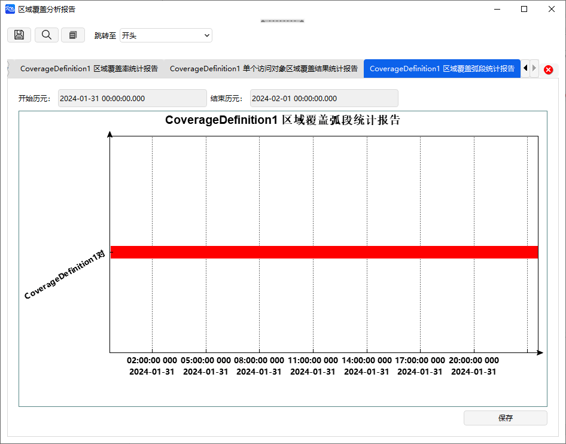

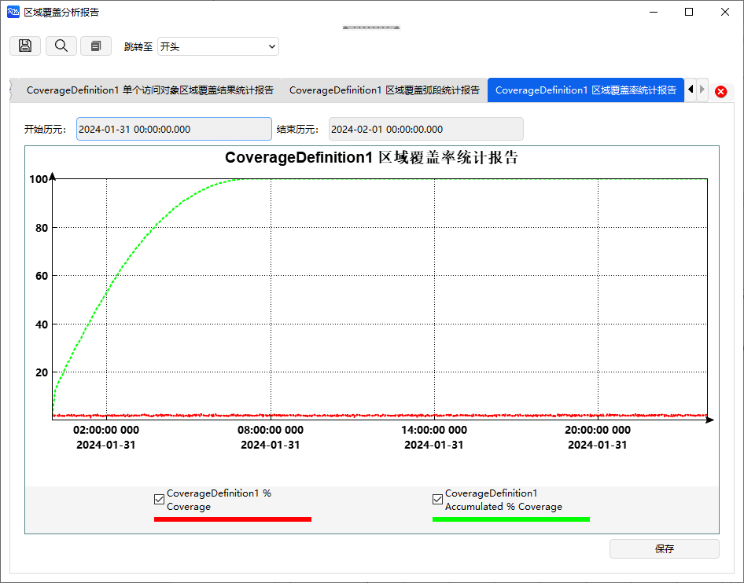

[区域覆盖案例](../3.案例教程/3.11区域覆盖案例.md)