# 碰撞规避工具

在完成航天器与空间目标或其他目标库的碰撞规避数据设定之后，选择自然交会条件的功能界面，计算主目标与次目标在交会分析门限约束下的所有数据结果。而后可根据自然交会条件分析的所有数据结果和航天跟踪测控计划，进行机动规划分析，本功能提供了遍历和优化两种分析算法。最后可基于机动规划分析的结果，利用机动复核界面检验数据结果的正确性，保证碰撞规避机动安全可靠。

## 功能介绍

### 功能位置

该功能位于 ATK 菜单-工具栏目中，具体打开位置如图所示。

### 界面介绍

**（1）主界面**

主界面包含各种基础设置（卫星星历、目标星历、目标数据库等）、高级设置、交会数据表格显示、自然交会模块、避撞机动规划模块、机动复核模块、偏差机动复核模块和计算结果区域，界面效果如图显示。

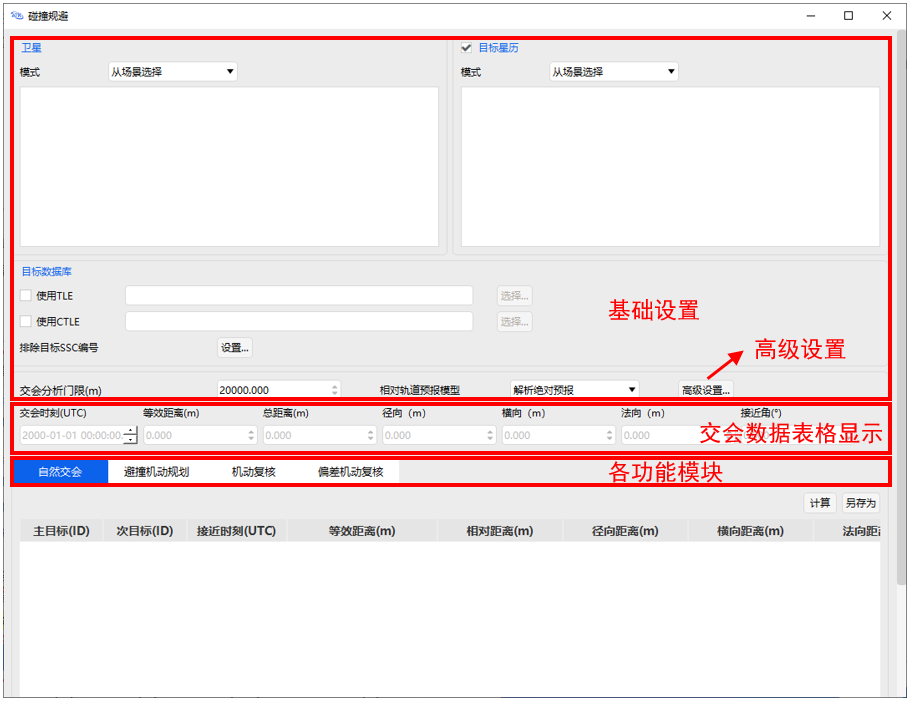

模块界面中表头的各参数及其定义如下：

接近时刻：显示所有在自然交会分析界面计算出的且小于设定交会分析门限值数据中。

等效距离：由于轨道预报误差在切向较大，在径向较小，因此碰撞风险和规避效果评估需要综合考虑接近的最近距离 $d_k$ 和径向距离 $R_k$ ，定义等效距离指标如下式：

$$ s_{k}=\max \left(\frac{d_{k}}{10},\left|R_{k}\right|\right) \label{eq:distance}$$

其中 $s_k$ 越小，碰撞风险越高，$s_k$ 越大，规避效果越好。

最小等效距离：分析历次接近的等效距离 $s_k$ ，确定最小等效距离 $s^*$，即：

$$s^{*}=\min \left(s_{k}\right), \quad k=1,2,3, \ldots $$

相对距离：两个空间目标相对位置矢量的模。

径向距离：指自然交会分析时，最小等效距离对应的航天器与空间目标的径向距离。

横向距离：指自然交会分析时，最小等效距离对应的航天器与空间目标的横向距离。

法向距离：指自然交会分析时，最小等效距离对应的航天器与空间目标的法向距离。

接近夹角：指自然交会分析时，最小等效距离对应的航天器与空间目标的接近夹角。

接近速度：指自然交会分析时，最小等效距离对应的航天器与空间目标的接近速度。

**（2）自然交会条件模块界面**

点击主界面自然交会条件按钮，进入自然交会条件模块界面。

在主界面上完成各航天器和空间目标数据配置和规避条件筛选后，选择自然交会分析功能界面，单击右下方【计算】，得出主目标与次目标的历次接近时刻对应的时间距离信息：

1）黄色标识行对应的数据是等效距离小于软件设置值 200 m 时，对应的接近时刻、等效距离、相对距离、径向距离、横向距离、法向距离、接近夹角、接近速度。

2）红色标识行对应的数据是等效距离小于软件设置值 50 m 时，对应的接近时刻、等效距离、相对距离、径向距离、横向距离、法向距离、接近夹角、接近速度。

3）在【交会分析门限】中输入需要规避的分析门限值，则计算后结果仅显示小于此次输入值分析门限值的数据。单击数据框内的列名称，可将数据依据此列大小顺序重新排序。

**（3）避撞机动规划模块界面**

点击主界面避撞机动规划按钮，进入避撞机动规划模块界面。

根据航天测控跟踪计划和最近等效距离时的自然交会分析时刻，输入可控制时刻的前后门限（UTC）。根据航天器平台机动能力限制和轨道维持约束，确定半长轴控制量门限，基于以上信息进行避撞机动规划。

**（4）机动复核模块界面**

点击主界面机动复核按钮，进入机动复核模块界面。

在机动规划分析功能界面中，将上一步遍历分析或优化算法计算出的数值结果，通过【载入到机动复核】按键直接载入到机动复核功能界面中，检验核输入的控制时刻和半长轴控制量是否是可行的规避控制策略：

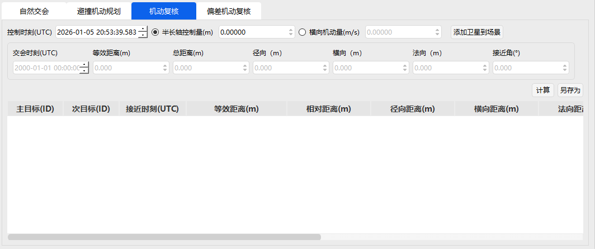

如果没有黄色标识或红色标识，则该策略在多圈交会内满足规避机动要求，能有效提升机动规避效果。

**（5）偏差机动复核模块界面**

点击主界面偏差机动复核按钮，进入偏差机动复核模块界面。

在进行轨道预报时，初始偏差会随着轨道模型的外推而发散，其传播特性和趋势因轨道类型不同而有差异。本步骤利用非线性偏差方法，通过轨道均值和协方差的预报，可以得到相应的偏差管道。考虑偏差的机动复核，使得碰撞规避的范围更精细化，有效提升轨道安全性评估效果。

在机动规划分析功能界面中，将上一步遍历分析或优化算法计算出的数值结果，通过【载入到机动复核】按键直接载入到偏差机动复核功能界面中，检验输入的控制时刻、半长轴控制量、半长轴标准差是否是可行的规避控制策略：

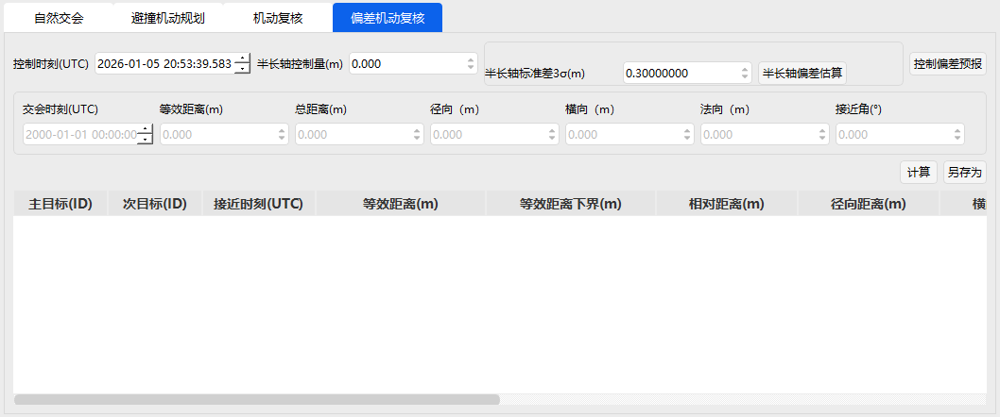

如果没有黄色标识或红色标识，则该策略在多圈交会内满足规避机动要求，能有效提升机动规避效果。

**（6）排除目标 SSC 编码列表界面**

在主界面点击排除目标 SSC  编号列表的设置按钮，可以打开编辑界面。单击【设置】，输入需排除目标编号后选择【添加】，将目标编号加入列表中，点击【确定】保存，其中 SSC  为五位数的空间目标国际编号。当不需要该空间目标时，也可在列表中选中之前保存的 SSC 编号，点击【删除】后，单击【确定】保存退出。

**（ 7）高级设置界面**  

点击主界面高级设置按钮进入高级设置界面。

1）轨道历元过期门限：

当软件仿真分析的自然交会分析时间和空间目标星历初始数据的差值，大于设定的轨道历元过期门限值时，软件判定没有继续计算的必要，系统停止分析，默认 2592000 sec，即 30 天。

2）远近地点门限：

在自然交会分析之前需要进行筛选，从大量目标中快速排除与所关心航天器轨道不可能接近的目标，再进行进一步自然交会分析，远近地点门限是筛选常用的方法，默认 50000 m。

3）仿真分析步长：

设定软件仿真分析的单位时间分析计算数据，默认值为 600 s

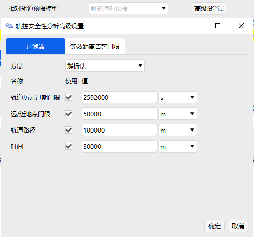

**（ 8）遍历分析结果界面**  

点击遍历分析区域中的结果按钮查看分析结果。

遍历计算是指沿着某条搜索路线，依次对树（或图）中每个节点均做一次访问。访问结点所做的操作依赖于具体的应用问题， 具体的访问操作可能是检查节点的值、更新节点的值等。

可根据需求，设定在分析规划时间步长和控制量步长，点击【计算】按钮，软件每隔单位时间步长或单位控制量遍历计算，选取规避机动的控制时间。

计算完毕后，单击【结果】按键查看机动遍历结果：

1）表格最左侧列依次为以控制时刻前后限为区间，对应的单位步长时刻。

2）表格最上侧行是根据半长轴上下限为范围，顺序增加单位步长控制量。

3）表格里的内容是每个时刻和半长轴控制量所对应的碰撞规避的距离。

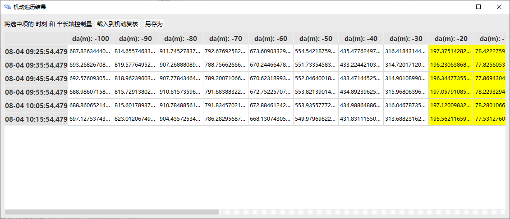

计算完毕后，用户可选择合适的距离结果值对应的时刻和半长轴控制量，载入到机动复核，保证碰撞规避的安全性。

**（9）优化分析结果界面**

点击优化分析区域中的结果按钮查看分析结果。

通过优化控制时刻和半长轴控制量，寻找能将航天规避到与潜在碰撞目标大于给定等效距离门限（如 200 m）的规定，采用序列二次规划算法优化求解。可根据用户需求，输入规避门限值，点击【计算】按钮，调用优化算法规划最优规避机动策略：

计算完毕后，单击【结果】按键查看优化分析结果，表格依次为航天器和空间目标优化分析后的控制时刻，对应交会时刻的等效距离、总距离、径向距离、横向距离、法向距离的数值。通过单击数据框内的列名称，可将数据依据此列大小顺序重新排序。

计算完毕后，用户可选择合适的距离结果值对应的时刻和半长轴控制量，载入到机动复核，保证碰撞规避的安全性。

**（10）控制偏差预报界面**  

点击偏差机动复核区域中的控制偏差预报按钮。  

软件控制偏差预报有三部分构成，分别为预报值设定、坐标图和表格。计算结束后，可通过单击【控制偏差预报】按键，查看偏差预报的详细情况：  

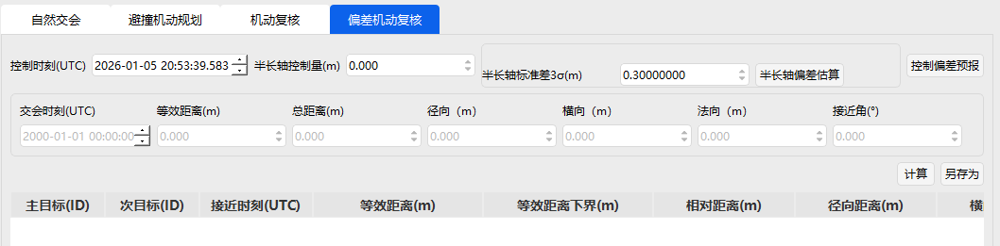

预报值：在此功能界面中，可设定预报时长和步长，默认为 86400s 和 60s。依据需求或默认值设定后点击【计算】，直接生成相应的坐标图和表格，若需改变则再次输入数值，即可重新生成坐标图和表格数据。

坐标图：可根据需求，选择合适的坐标轴查看偏差预报坐标图。横纵坐标可选择项分别为 UTC 时间、偏差均值 R、偏差均值 T、偏差均值 N、偏差标准差 R、偏差标准差 T、偏差标准差 N。

横坐标默认为 UTC 时间，范围从控制时刻前 40min 开始计算，到 16h 后结束。纵坐标默认为偏差均值 R。

表格数据：自控制时刻开始，每预报步长的时刻，所对应的偏差均值 R、偏差均值 T、偏差均值 N、 sigma R、 sigma T、 sigma N、偏差标准差 R、偏差标准差 T、偏差标准差 N 数据。  

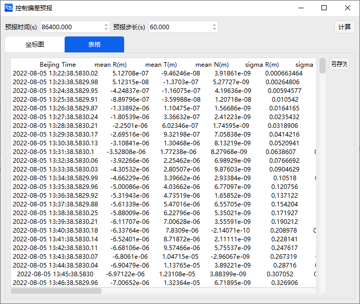

**（11）半长轴偏差估算界面**

点击偏差机动复核区域中的半长轴偏差估算按钮。

考虑偏差的机动复核，其半长轴偏差的估算并不直接。可通过半长轴控制偏差估算功能计算半长轴标准差。点击【半长轴偏差估算】按钮，根据具体航天器的性能，输入发动机推力、质量、控制开机时长、推力方位角俯仰角的均值和标准差。

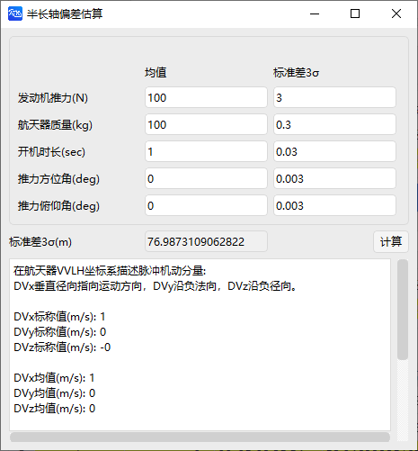

## 使用方法

### 选择卫星星历文件

### 选择目标星历文件

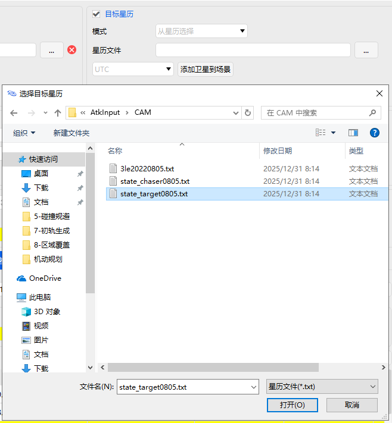

### 设置排除目标

选择目标数据库，设置排除目标（在本示例中无需修改）。

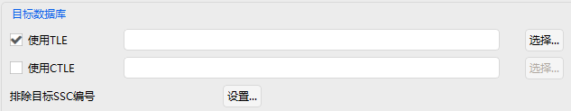

### 设置交会分析门限与相对轨道预报模型

按照程序默认设置，不用修改。

### 高级设置

按照程序默认值进行设置。

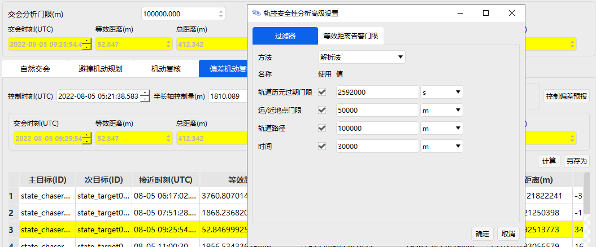

### 计算

进入自然交会条件界面，并点击计算，查看计算结果。

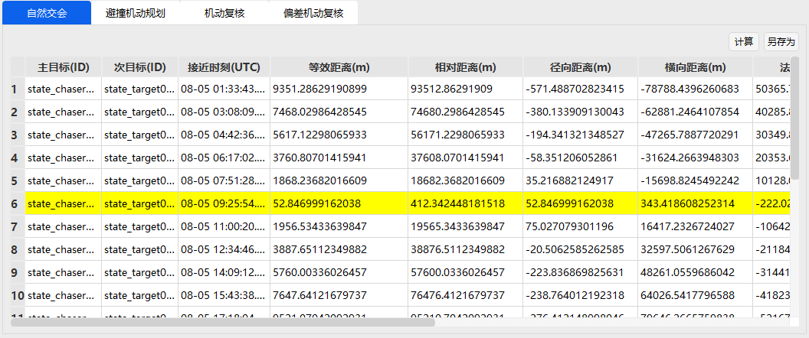

### 遍历分析  

进入机动规划分析界面，进行遍历分析，点击计算，查看分析结果。

可以将选中的结果对应的时刻和半长轴控制变量赋值到机动复核和偏差机动复核。

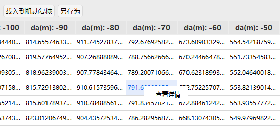

可以选中结果查看详情。

### 优化分析

进行优化分析，点击计算，查看分析结果。

可以将结果对应的时刻和半长轴控制变量赋值到机动复核和偏差机动复核。

### 机动复核

进入机动复核界面，设置控制时刻和半长轴控制量，点击计算按钮，查看结果。

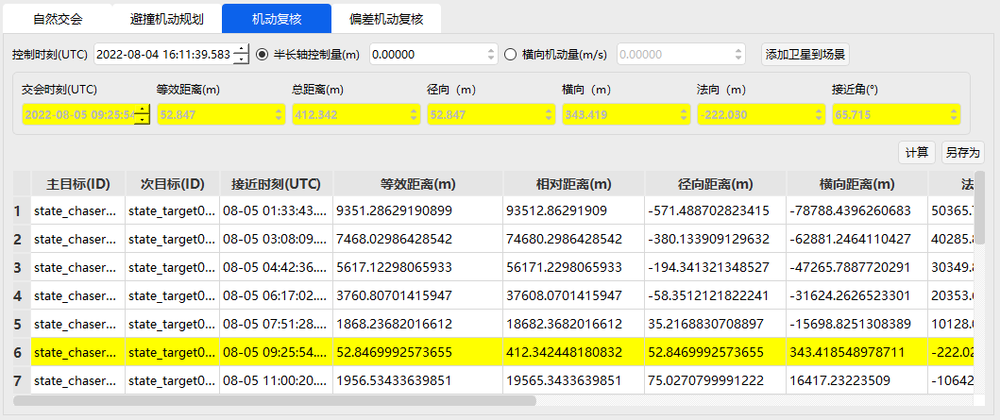

### 偏差机动复核

进入偏差机动复核界面，设置控制时刻、半长轴控制量、半长轴标准差，并点击计算，查看偏差机动复核计算结果。

半长轴偏差可以手动输入或者调用估算方法获取。

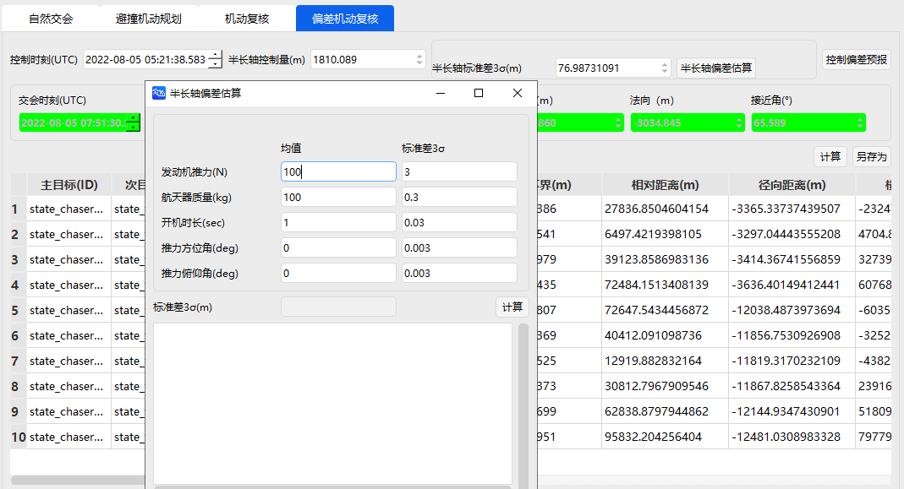

### 控制偏差预报

点击控制偏差预报按钮，进行控制偏差预报操作。

[碰撞规避案例](../3.案例教程/7-碰撞规避案例.md)