# 初轨生成模块

## 功能介绍

初轨生成模块可以通过选择不同的轨道类型并设置相关参数，生成不同的卫星轨道。

卫星轨道类型见下表

| 序号 | 轨道类型               | 说明                                                         |
|:---: | ---------------------- | ------------------------------------------------------------ |
| 1    | 圆轨道                 | 圆形轨道的半径保持恒定。                                     |
| 2    | 临界倾角轨道           | 临界倾角轨道的近地点始终处于固定纬度。其拱线不会随时间发生变化。 |
| 3    | 临界倾角、太阳同步轨道 | 该轨道融合了基础临界倾角轨道与太阳同步轨道的特性。轨道采用 116.565 度的逆行倾角，卫星每绕轨一周，都会在同一地方平太阳时经过目标上空，且近地点始终处于固定纬度。 |
| 4    | 地球静止轨道           | 处于地球同步轨道的卫星，会在指定的固定经度上空保持相对静止。     |
| 5    | 闪电轨道               | 闪电轨道的偏心率极高，这意味着其远地点高度与近地点高度差异显著。该轨道同时属于临界倾角轨道，能将轨道近地点固定在南半球。此外，闪电轨道在北半球高纬度地区的驻留时间较长。 |
| 6    | 回归轨道               | 卫星的星下点轨迹在经过一个特定的整数周期后，能够重复覆盖之前相同路径的轨道。 |
| 7    | 太阳同步回归轨道       | 太阳同步回归轨道在以下场景中十分实用：当需要在不同时间通过相同的观测与光照条件来检测变化时。其星下点轨迹可设置为每日重复，也可设置为在多日交错后再实现重复。该轨道会重复地面覆盖周期，且卫星每绕轨一周，都会在大致相同的地方平太阳时经过目标上空。 |
| 8    | 太阳同步轨道           | 这类轨道的设计旨在利用地球扁率效应，使轨道平面的进动速率与地球绕太阳的平均公转速率保持一致。太阳同步轨道具有一个关键特性：其轨道交点始终保持固定的地方平太阳时。 |
| 9    | 自定义轨道             | 使用传统的轨道根数，用户可以创建任何一个想要的轨道。           |
| 10   | 星下点定义轨道         | 根据星下点轨迹定义轨道参数。                                   |
| 11   | 星下点定义回归轨道     | 根据星下点轨迹定义回归轨道参数。                               |

### 功能位置

本功能有两个入口位置，一个在`插入对象`窗口的`卫星-轨道生成向导`，如图所示。另一个入口在`卫星-属性`-`轨道生成向导`功能，如图所示。

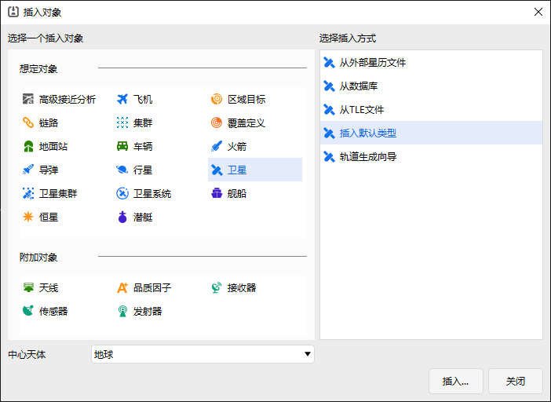

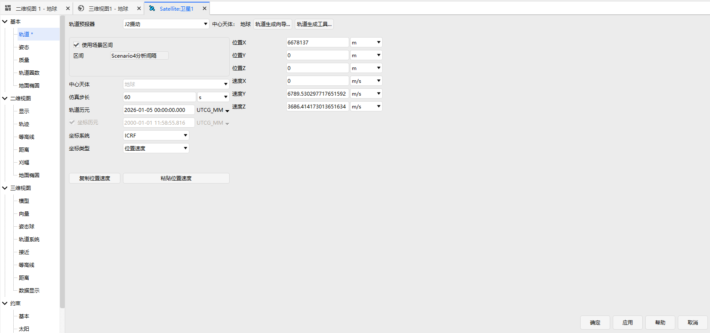

### 界面介绍

包括轨道类型选择、轨道参数设置、分析时间设置、卫星可视化设置、轨道生成预览五个区域，如图所示。

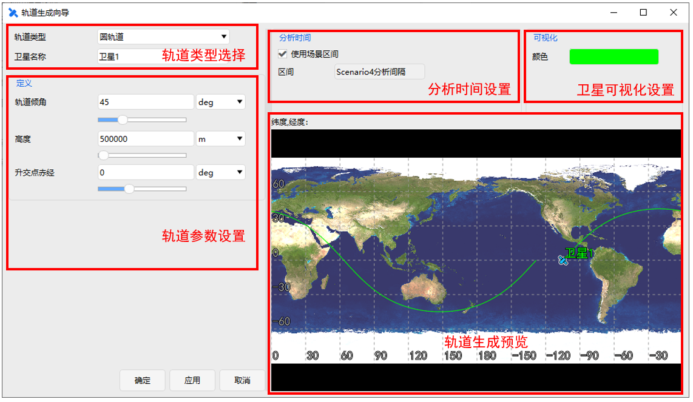

## 使用方法

创建场景后，在“开始”页面点击“插入”，出现“插入对象”窗口，选择“卫星”，在右侧“选择插入方式”中选择“轨道生成向导”，点击“插入”。或者从卫星属性窗口调用“轨道生成向导”功能，出现“轨道生成向导”窗口，如图所示。选择“轨道类型”列表中的轨道，进行初轨生成。所有轨道历元均采用场景默认设置。

### 圆轨道

圆轨道需要设置轨道倾角、高度、升交点赤经 3 个参数，点击“确定”在场景中生成卫星，如图所示。

### 临界倾角轨道

临界倾角轨道需要设置方向、远地点高度、近地点高度、升交点地理经度 4 个参数，点击“确定”在场景中生成卫星，如图所示。

### 临界倾角、太阳同步轨道

临界倾角太阳同步轨道需要设置近地点高度、升交点地理经度 2 个参数，点击“确定”在场景中生成卫星，如图所示。

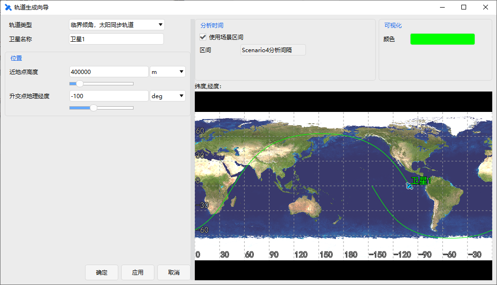

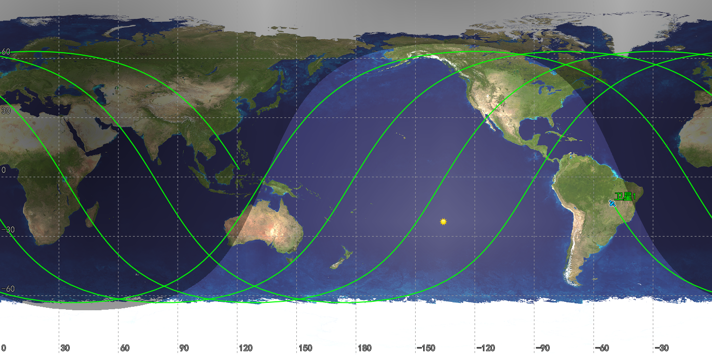

### 地球静止轨道

地球静止轨道需要设置星下点经度、轨道倾角 2 个参数，点击“确定”在场景中生成卫星，如图所示。

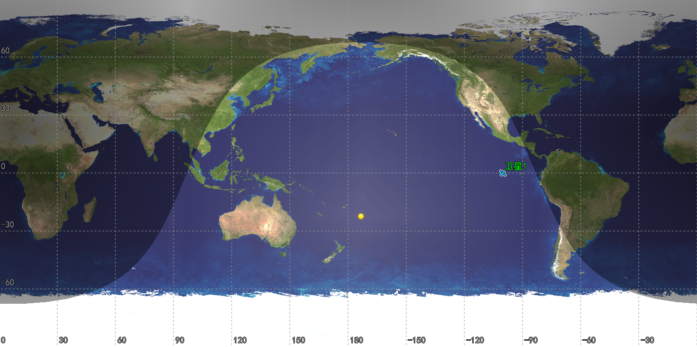

### 闪电轨道

闪电轨道需要设置远地点经度、近地点高度、近拱点角距 3 个参数，点击“确定”在场景中生成卫星，如图所示。

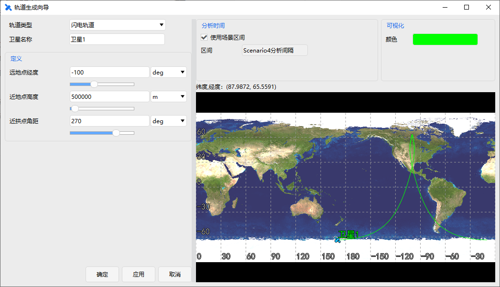

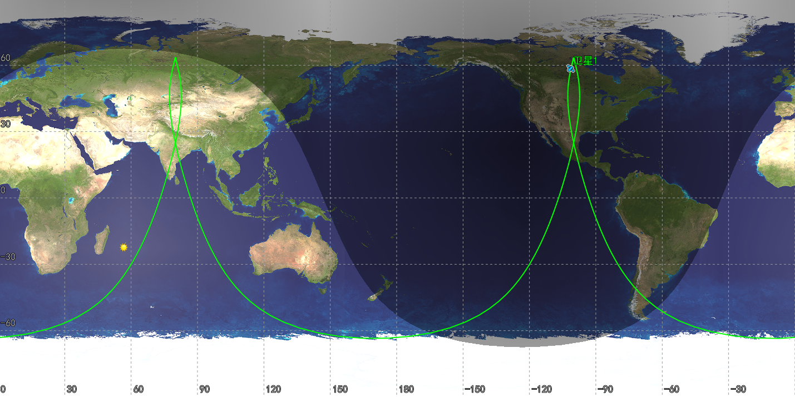

### 回归轨道

回归轨道需要设置位置（大致高度/每天大致圈数）、轨道倾角、回归圈数、首个升交点经度 4 个参数，点击“确定”在场景中生成卫星，如图所示。

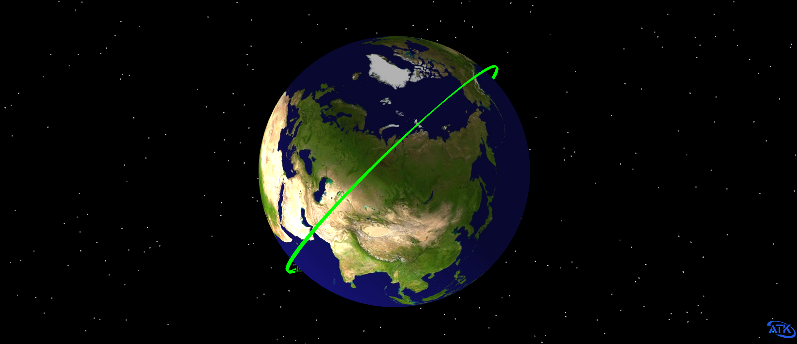

### 太阳同步回归轨道

太阳同步回归轨道需要设置位置（大致高度/每天大致圈数）、回归圈数、首个升交点经度、升交点地方时或降交点地方时 4 个参数，点击“确定”在场景中生成卫星，如图所示。

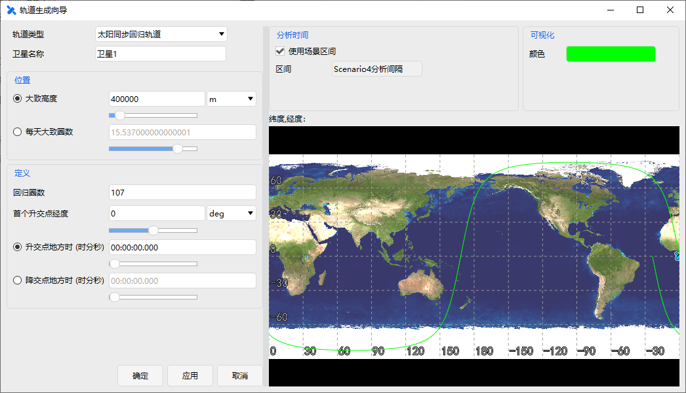

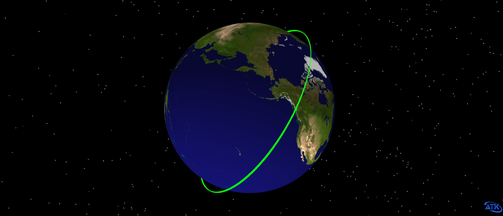

### 太阳同步轨道

太阳同步轨道需要设置轨道倾角/高度、升/降交点地方时 2 个参数，点击“确定”在场景中生成卫星，如图所示。

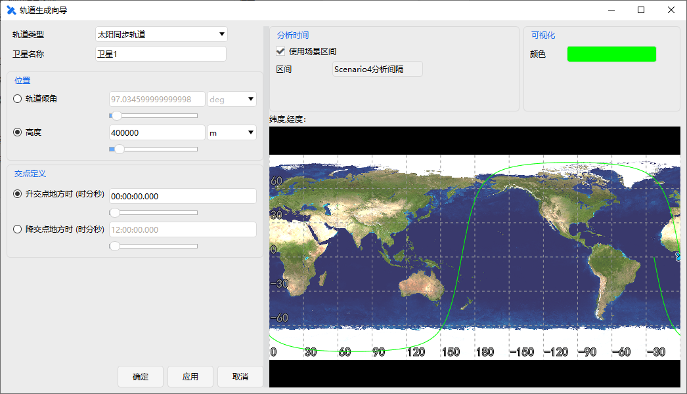

### 自定义轨道

自定义轨道需要设置轨道六根数，包括半长轴、偏心率、轨道倾角、近拱点角距、升交点赤经和真近点角，点击“确定”在场景中生成卫星，如图所示。

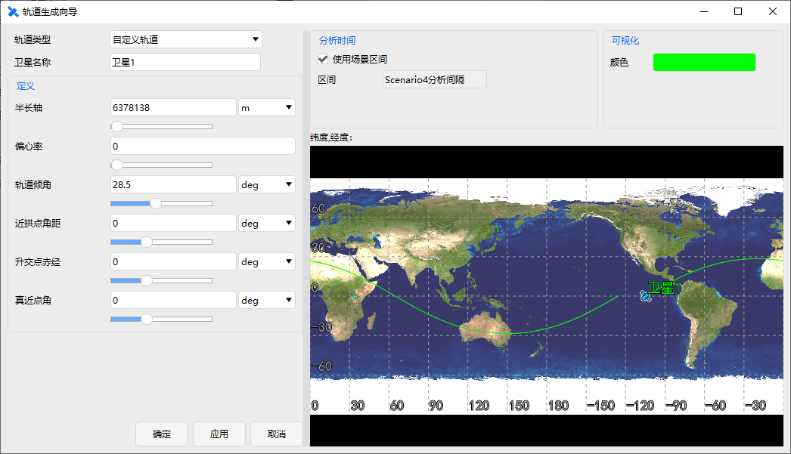

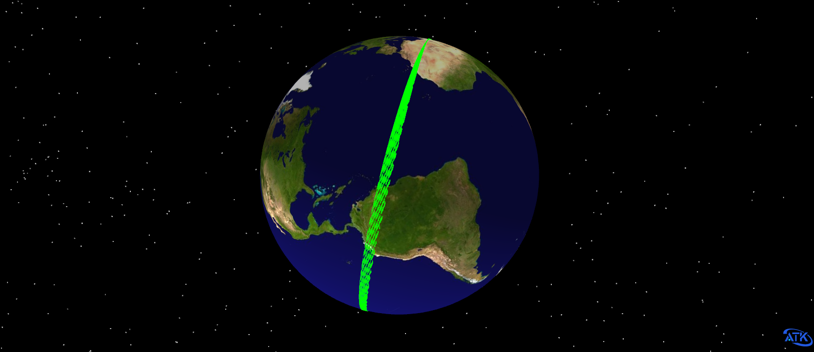

### 星下点定义轨道

星下点定义轨道需要设置纬度、经度、升轨或降轨、轨道高度、轨道倾角 5个参数，点击“确定”在场景中生成卫星，如图所示。

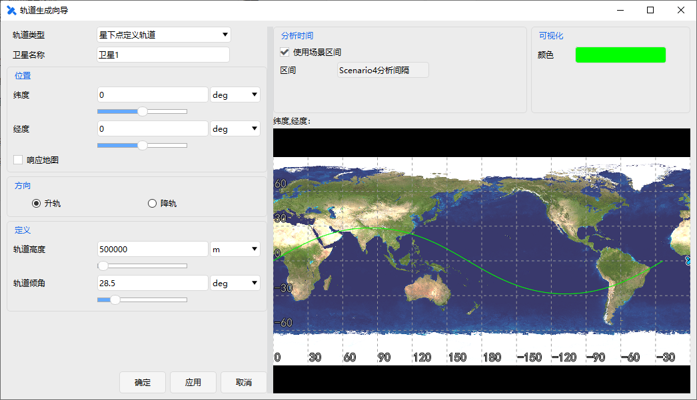

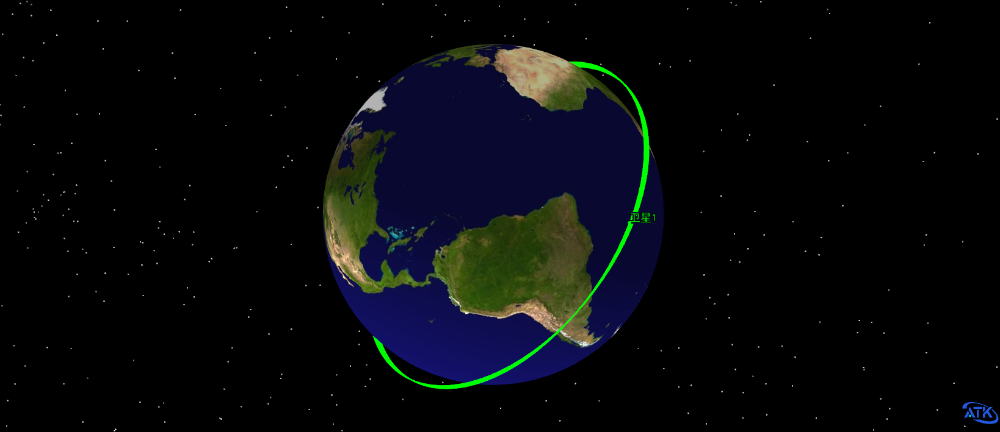

### 星下点定义回归轨道

星下点定义回归轨道需要设置大致高度或每天大致圈数、纬度、经度、升轨或降轨、轨道倾角、回归圈数 6 个参数，点击“确定”在场景中生成卫星，如图所示。

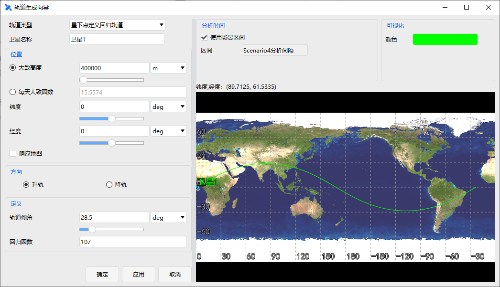

