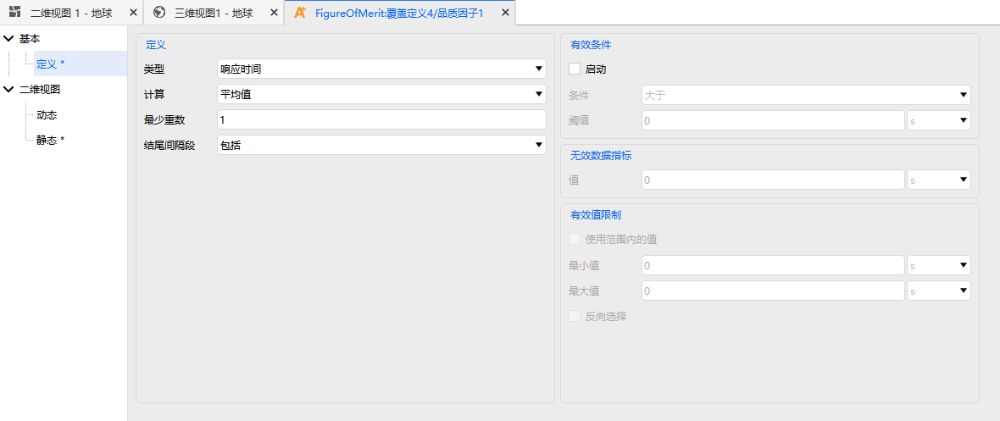

# Basic Definitions

The definition configuration of a Figure of Merit consists of four parts:

- [**Definition**](#definition): Selects the Figure of Merit type, the statistical parameter type, and type-specific parameters.
- [**Satisfaction Condition**](#satisfaction-condition): Further filters valid coverage windows on top of visibility constraints.
- [**Invalid Data Indicator**](#invalid-data-indicator): Assigns a specified invalid value when certain conditions are not met.
- [**Valid Value Limits**](#valid-value-limits): Applies additional upper and lower limits to the computation results.

## Definition

The Definition tab is used to select the Figure of Merit type and specify computation parameters. The main configuration items are:

- **Type**: Selects from the 16 Figure of Merit types.
- **Statistical Parameter Type**: Selects the statistic to compute; different Figure of Merit types offer different statistic options.
- **Type-Specific Parameters**: Some types require additional settings, for example:
  - Revisit Time: sets the minimum multiplicity.
  - Dilution of Precision: selects the sub-method and computation type.

## Satisfaction Condition

The Satisfaction Condition is used to further filter coverage windows on top of visibility constraints.

For example, if you need to analyze periods when the analysis object is "simultaneously covered by at least 2 resources", set the **Type** to "N Asset Coverage", enable the Satisfaction Condition, and set it to "Greater Than" a valid value of "2".

## Invalid Data Indicator

Some Figures of Merit require specific conditions to be computable. When these conditions are not met, the system assigns a specified invalid value to distinguish "invalid" from "zero coverage".

For example, computing the Geometric Dilution of Precision requires at least 3-fold coverage. For periods with fewer than 3-fold coverage, the Figure of Merit always displays the set invalid value.

## Valid Value Limits

Valid Value Limits provide constraints beyond those of the computation model. When the coverage satisfies the Figure of Merit computation model but the result falls outside the range defined by **Valid Value Limits**, the value is treated as an invalid value.

::: tip How Figure of Merit Results Are Output
After the analysis is complete, Figure of Merit results can be output through **Data Reports** and **Chart Reports**. Some types also support display in the 2D/3D views as **Contours** or **Dynamic Data**.
:::
