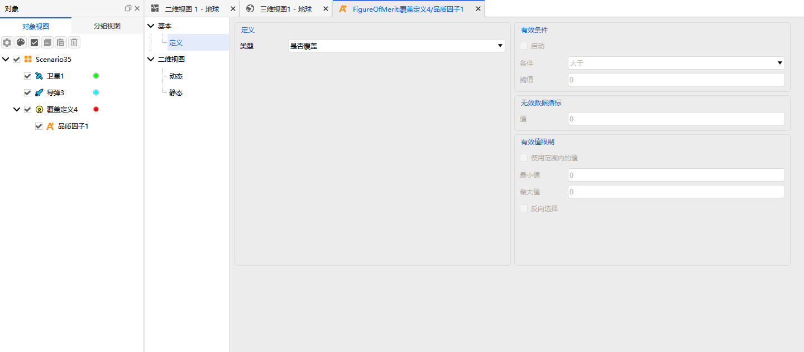

# Figure of Merit

The Figure of Merit (FOM) is the core mechanism of coverage analysis. It is used to quantitatively evaluate the effectiveness of coverage, access, navigation, communication, and other mission aspects. ATK supports 16 types of Figures of Merit, covering coverage time, system response, navigation and positioning, access constraints, and other aspects, all configured through a unified property interface.

Figures of Merit are applicable to the [Coverage Tool](../../../../5.专业使用指南/01-可见性与覆盖分析/02-覆盖性工具.md) and the [Regional Coverage Tool](../../../../5.专业使用指南/01-可见性与覆盖分析/03-区域覆盖工具.md).
