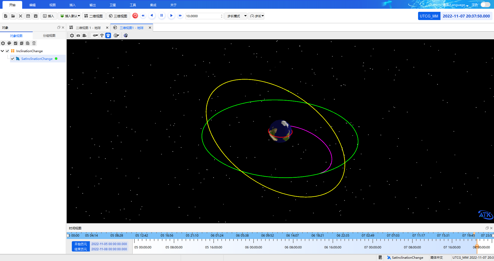
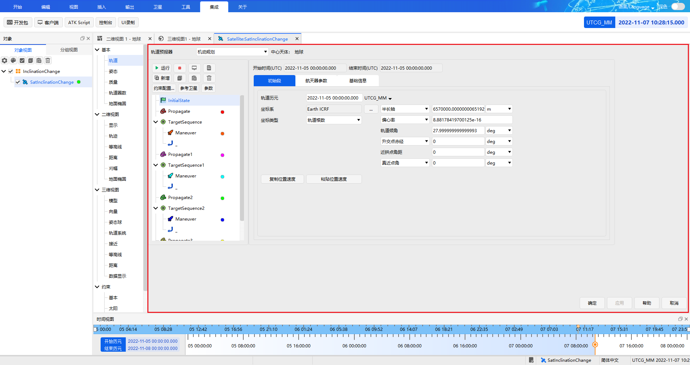

# Complete Example

## Description

The following uses the **fast orbit transfer scenario** as an example to demonstrate the complete workflow of controlling ATK with the Java SDK: the satellite is quickly transferred from a low Earth parking orbit (LEO) with a radius of 6700 km to a geostationary orbit (GEO) with a radius of 42164.197 km.

::: tip Example Walkthrough
This example focuses on demonstrating the usage workflow of the Java SDK. For more on the case principles, parameter meanings and step-by-step screenshots, refer to the [Secondary Development Case Tutorial](../../../../../02-案例教程/8-二次开发案例/).
:::

## Complete Code

The complete code is shipped with the installation package and is located under `Help\Examples\08-二次开发案例\` in the ATK installation directory:

<PathViewer :relative-paths="exampleFiles" />

The code is organized around the main flow of **connect → create a scenario → set the initial orbit → build the maneuver-planning sequence → set the parameters and targeting conditions of each segment → run the maneuver planning → view the report → save and disconnect**. Each step is separated by comments so you can understand and reuse the code section by section. The 4th parameter of `atkConnect` is a reserved parameter, and the empty string `""` is passed uniformly.

## How to Run

::: warning Prerequisites
- Before you start, make sure you have completed [Environment Configuration](./1-简介与配置.md#configuration-steps): copy `ATKConnectJava.jar`, `ATKConnectJava.dll` and `ATKConnectorDll.dll` to the working directory, and place the source code according to the package name
- Open the ATK software before running
- This example creates a new scenario with the `New` command, and ATK Connect mode supports loading only one scenario, so **do not open any existing scenario**; close it first if one is already open
:::

1. Copy the example file <PathCopy :entry="example" /> into the `com\atk\test` subdirectory of the working directory

2. Compile the source code in the working directory:

```bash
javac -cp ATKConnectJava.jar -encoding utf-8 com/atk/test/ATKConnectJavaTest.java
```

3. Run the compiled class file:

```bash
java -cp ".;ATKConnectJava.jar" com.atk.test.ATKConnectJavaTest
```

During the run, the ATK interface will progressively execute operations such as creating the scenario, creating the satellite, setting the orbit parameters and running the maneuver planning.

## Run Results

After a successful run, the ATK 3D window shows the complete trajectory of the satellite starting from its initial low Earth orbit and reaching a geostationary orbit after two orbital maneuvers:



You can right-click the satellite object in ATK and select **Properties** to check whether the parameters set by the code take effect correctly:



<script setup>
import PathViewer from "@components/PathViewer/PathViewer.vue";
import PathCopy from "@components/PathCopy/PathCopy.vue";

const exampleFiles = [
  { path: 'Help\\Examples\\08-二次开发案例\\ATKConnectJavaTest.java', name: 'ATKConnectJavaTest.java', description: 'Official example source code (fast orbit transfer case)' },
];
const example = exampleFiles[0];
</script>
