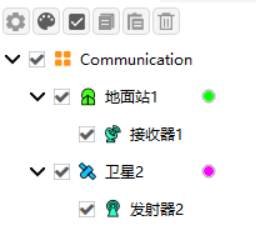
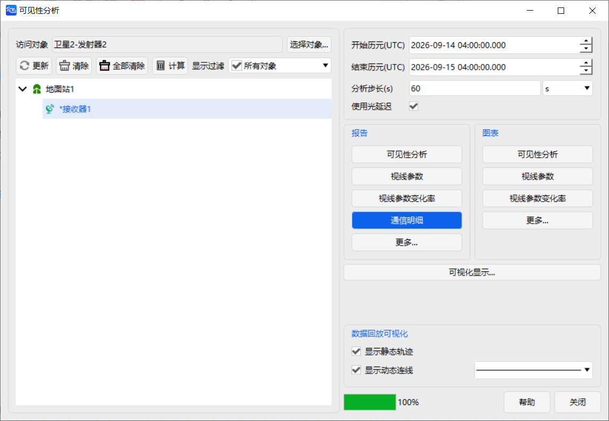
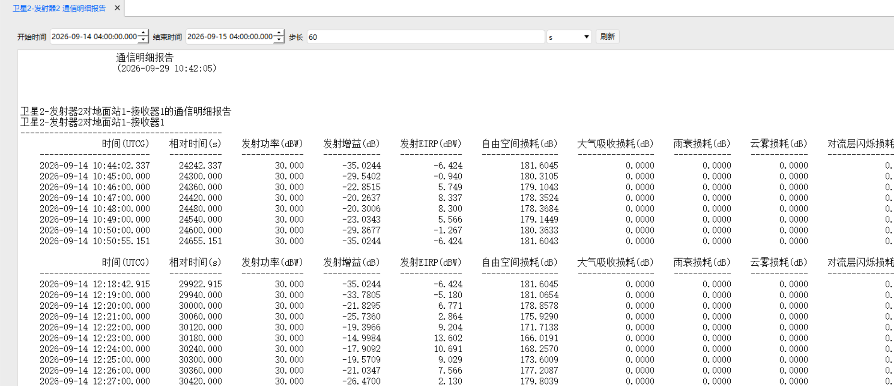
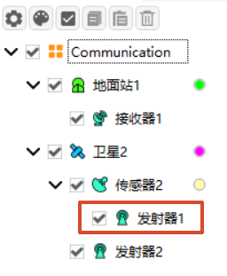
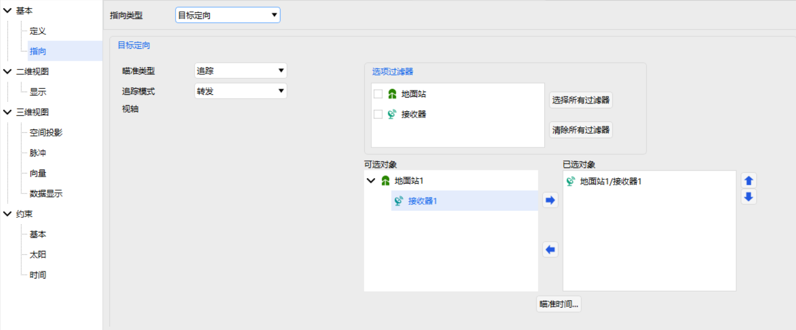
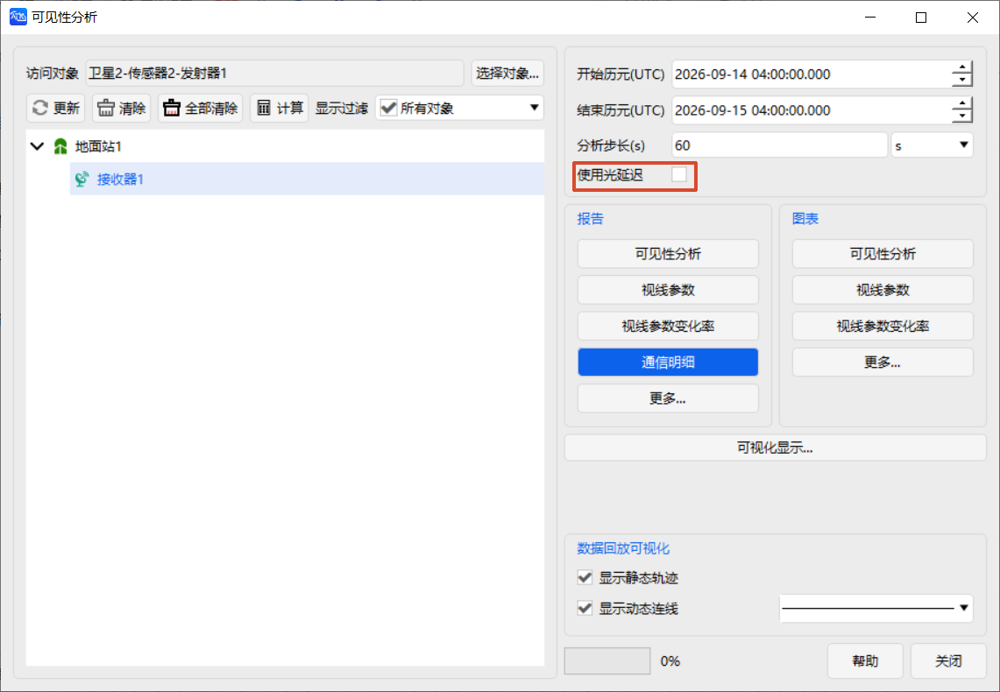
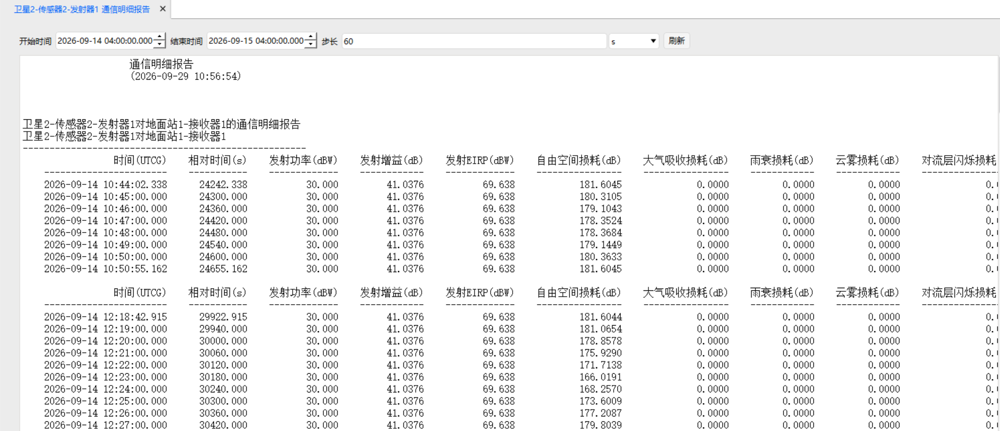

# 通信链路预算使用案例

本案例介绍如何在 ATK 中建立地面站与卫星之间的通信链路，设置发射器的天线、调制器和滤波器，并通过可见性工具生成通信明细报告，查看链路预算相关参数。

## 创建任务场景

1. 运行 ATK.exe，点击 <kbd>新建一个想定文件</kbd>；

2. 在【新建想定向导】对话框中设置场景 **名称** 为 Communication；

3. 设置场景时段

| 开始历元(UTCG)          | 结束历元(UTCG)          |
| ----------------------- | ----------------------- |
| 2026-09-14 04:00:00.000 | 2026-09-15 04:00:00.000 |

4. 点击 <kbd>确定</kbd> 完成场景建立。

## 创建通信对象

1. 以默认方式在新建场景中插入一个 **地面站** 和一颗 **卫星**；

> **注意：** 地面站的位置需保证与卫星之间可见。可通过观察二维视图将地面站位置设置为卫星某星下点轨迹处。

2. 在 **地面站** 对象下插入一个 **接收器**，在 **卫星** 对象下插入一个 **发射器**。

## 设置发射器属性

1. 打开 **发射器** 属性，在 **类型** 中选择 **复杂发射机模型**；
   
2. **模型规格** 页面，选择默认参数；

3. 在 **天线** 页面中可选择不同的天线类型。天线参数会影响 EIRP 的计算结果。 **模型规格** 处参数设置如下：

    | 参数 | 数值 |
    | --- | --- |
    | 类型 | 抛物面天线 |
    | 设计频率(GHz) | 14.5 |
    | 效率(%) | 0.55 |
    | 后波瓣增益(dB) | -30 |
    | 直径(m) | 1 |

    其余设置保持默认。

4. 切换至 **调制器** 页面，可根据需要选择不同类型的调制方式，调制方式主要影响误码率计算结果。
本案例设置如下：
   - **类型** 选择 **BPSK**；
   - 取消勾选【信号PSD】；
   - 在 **信号带宽** 中勾选【自动调整带宽】。

> **注意：** 接收器端的解调器类型须与发射器端的调制器类型保持一致，否则误码率结果会返回异常值。

1. 切换至 **滤波器** 页面，勾选 **使用** 启用滤波器。滤波器设置会影响 EIRP 值。滤波器参数设置为：

    | 参数 | 数值 |
    | --- | --- |
    | 类型 | 贝塞尔 |
    | 高频段截止频率(GHz) | 0.02 |
    | 低频段截止频率(GHz) | -0.02 |
    | 带宽(GHz) | 0.04 |
    | 插入损耗(dB) | 0 |
    | 次数 | 4 |
    | 截止频率(GHz) | 0.01 |
    | 脉冲因子(dB) | 3 |

接收器同样可以启用滤波器参与链路计算。

## 查看通信明细报告

1. 完成发射器属性设置后，点击 <kbd>应用</kbd> 保存设置；

2. 右键单击 **发射器**，选择 <kbd>可见性</kbd>；

3. 在【可见性分析】页面中选择对应的 **接收器** 对象；

4. 点击 <kbd>通信明细报告</kbd>，查看通信链路计算得到的各项参数指标。

## 高斯天线使用说明

当发射器的天线类型选择 **高斯天线** 时（本案例中发射器其余参数保持不变），由于高斯天线波束宽度较窄，对指向误差较为敏感，因此需要将发射器挂载到 **传感器** 上，并设置传感器始终指向地面站，以保证通信方向位于天线主波束范围内。

1. 在卫星对象下创建 **传感器**，并将 **发射器** 挂载到传感器下；

2. 设置传感器指向，使发射器朝向地面站。相关设置如图：

其余参数保持默认。

3. 进行可见性分析，此时取消勾选【使用光延迟】。开启光延迟后，链路计算方向与传感器当前指向方向可能产生偏差。由于高斯天线波束宽度较窄，对指向偏差较为敏感，可能导致天线增益及 EIRP 计算结果出现异常；

4. 点击 <kbd>通信明细报告</kbd>，查看采用高斯天线后的链路预算计算结果。

