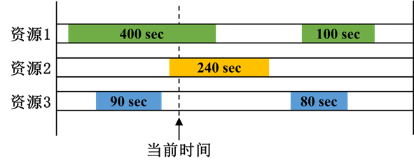

# 访问时长

## 定义

统计在分析时段内，单个资源对分析对象形成的连续访问时段长度。

对于每个时刻而言，访问时长表示**包含当前时刻的所有单资源访问时段中，持续时间最长的一个访问时段长度**。如下图所示，若包含当前时刻的两个访问时段分别为 400 s 和 240 s，则当前时刻的访问时长取 400 s。

当该值为 0 时，表示当前时刻分析对象未被任何覆盖资源覆盖。

::: tip 说明
计算访问时长时，不会把不同资源产生的覆盖时段拼接成一个更长的访问时段。即使多个资源的访问在时间上发生重叠，也分别按照各自的连续访问时段计算。
:::

## 参数说明

### 计算

【访问时长】支持以下计算方式：

| 计算方式 | 含义 | 设置参数 |
|---|---|---|
| **平均值** | 分析时段内所有独立访问时段持续时间的平均值。 | 无 |
| **最大值** | 分析时段内所有独立访问时段中的最大持续时间。 | 无 |
| **最小值** | 分析时段内所有独立访问时段中的最小持续时间。 | 无 |
| **百分比高于** | 计算访问时长阈值 $D$，使分析对象有指定百分比的时间处于持续时间不小于 $D$ 的访问时段中。 | **百分比** |
| **标准差** | 分析时段内所有独立访问时段持续时间的标准差。 | 无 |
| **总值** | 分析时段内所有独立访问时段持续时间的累加值。 | 无 |

#### 百分比

仅当【计算】选择【百分比高于】时设置**百分比**。

输入百分比水平 $X$ 后，计算得到访问时长 $D$，其含义为：

> 分析对象有 $X\%$ 的时间处于持续时间不小于 $D$ 的访问时段中。

### 热力图

点击【显示热力图】后，可点击【热力图...】进入热力图设置界面，通过分级方式将品质因子数值映射为不同颜色，并显示在分析对象或运动目标轨迹上。

- **显示图标高亮标记**：启用后，根据品质因子热力图的分级结果对对象图标进行高亮显示。
- **显示品质因子热力图在运动目标轨迹上**：启用后，在运动目标轨迹上按照品质因子数值及对应分级显示热力图。
- **忽略未覆盖时段**：启用后，未被覆盖的时段不参与热力图显示。
- **忽略超出最大级别的品质因子值**：启用后，大于当前最大分级值的品质因子结果不按热力图分级显示。

#### 添加分级

热力图按照品质因子的数值范围建立若干显示级别。可在【添加方式】中选择分级方式，并设置相应参数。

选择【起始、结束、步长】时，需要设置：

- **起始**：分级的起始值；
- **结束**：分级的结束值；
- **步长**：相邻分级之间的数值间隔。

选择【指定】，可在【级别】中直接输入需要添加的品质因子分级值，点击【添加】后将该级别加入分级列表。

点击【添加】后，软件按照设置自动生成相应级别。例如，起始值为 300、结束值为 1200、步长为 300 时，可生成 300、600、900 和 1200 等分级。

#### 分级属性

已建立的分级显示在【级别】列表中。可选择相应级别进行查看和设置，也可通过【删除】删除当前分级，或通过【删除全部】清空已有分级。

【取色方法】用于设置不同级别的颜色生成方式。

- 选择【色阶】时，通过【起始颜色】和【结束颜色】定义颜色范围，软件按照各级别在数值范围中的位置生成相应颜色；

- 选择【指定】时，可分别为每个分级设置颜色。选中相应级别后，通过【颜色】设置该级别的显示颜色。该方式适用于需要对不同品质因子范围采用固定颜色进行区分的情况。

在【所有分级】区域还可统一设置热力图的【线型】和【线宽】。

#### 图例

点击【图例...】可设置品质因子热力图图例的显示方式。

可分别设置图例在【2D视图窗口】和【3D视图窗口】中的显示位置，并通过 `x`、`y` 参数调整图例位置；【背景】区域可设置背景颜色和透明度。

【文字选项】用于设置图例标题、小数位数、浮点数格式和文字颜色；【颜色范围选项】用于设置色阶顺序、每行或每列显示的色块数量，以及色块宽度和高度。勾选【自动计算】后，相应色块尺寸由软件自动确定。

> **说明**：热力图仅改变品质因子结果的可视化方式，不改变品质因子的计算结果。不同品质因子的分级值应结合其物理含义和单位进行设置。

### 有效条件

启用【有效条件】后，可对最终品质因子值设置比较条件和阈值。

例如设置：

- 条件：【大于】；
- 阈值：300 s；

表示仅当访问时长结果大于 300 s 时，才判定为满足设定的品质要求。

## 结果说明

【访问时长】具有动态值和统计值：

- **动态值**：当前时刻所在的最长单资源访问时段长度；
- **统计值**：按照所选【计算】方式，对整个分析时段内的访问时段进行汇总得到的结果。
