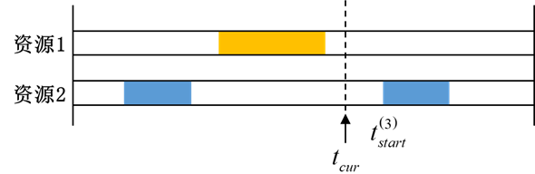

# 响应时间

## 定义

响应时间表示从当前时刻开始，到下一次满足覆盖要求的覆盖时段开始时刻之间需要等待的时间。

设当前时刻为 $t_{\mathrm{cur}}$，下一次满足覆盖要求的覆盖时段开始时刻为 $t_{\mathrm{start}}^{(3)}$，则：

$$
V_{\mathrm{rsp}}
=
t_{\mathrm{start}}^{(3)}
-
t_{\mathrm{cur}}.
$$

若当前时刻已经处于满足要求的覆盖时段内，则响应时间为 0。

## 参数说明

### 计算

【响应时间】支持以下计算方式：

| 计算方式 | 含义 | 设置参数 |
|---|---|---|
| **平均值** | 整个分析时段内响应时间的平均值。 | **最少重数、结尾间隔段** |
| **最大值** | 整个分析时段内响应时间的最大值，可用于表征最不利等待时间。 | **最少重数、结尾间隔段** |
| **最小值** | 整个分析时段内响应时间的最小值；只要存在满足覆盖要求的时刻，最小值通常为 0。 | **最少重数、结尾间隔段** |
| **百分比低于** | 计算响应时间阈值 $R$，使响应时间有指定百分比的时间不大于 $R$。 | **百分比、最少重数、结尾间隔段** |
| **间隔时间百分比低于** | 仅在覆盖间隙内统计，计算响应时间阈值 $R$，使间隙内有指定百分比的时间响应时间不大于 $R$。 | **百分比、最少重数、结尾间隔段** |

### 百分比

仅当【计算】选择【百分比低于】或【间隔时间百分比低于】时显示。

设输入百分比为 $X$，计算结果为 $R$：

- 【百分比低于】：表示整个分析时段内有 $X\%$ 的时间满足
  $$
  V_{\mathrm{rsp}}\le R;
  $$
- 【间隔时间百分比低于】：只在无覆盖间隙内进行同样的百分位统计，不把已覆盖时刻的 $V_{\mathrm{rsp}}=0$ 纳入百分比计算。

### 最少重数

设置将一个时刻判定为“已经获得覆盖”所需的最少同时覆盖资源数量。

设最少重数为 $N$，则只有满足：$
n(t)\ge N
$

的时段才作为有效覆盖时段参与响应时间计算。

例如：

- 最少重数为 1：等待下一次至少一个资源覆盖；
- 最少重数为 2：等待下一次至少两个资源同时覆盖。

### 结尾间隔段

用于设置是否将分析时段末端、最后一次有效覆盖之后形成的边界间隔纳入响应时间统计：

- 【包括】：将结尾间隔段纳入计算；
- 【忽略】：不使用结尾间隔段参与统计。

对于平均值、最大值以及百分位统计，是否包含结尾间隔段可能影响最终结果，应根据任务对分析时段边界的处理要求选择。

### 热力图

可见[访问时长](./02-访问时长.md)

### 有效条件

当界面允许启用时，可根据响应时间结果设置比较条件和阈值。

例如希望响应时间不超过 600 s，可选择适当的小于类条件并将阈值设置为 600 s。

::: tip 注意
【百分比低于】和【间隔时间百分比低于】的区别在于是否把已经处于覆盖状态的时刻纳入百分位统计。后者只统计覆盖间隙中的响应时间，更适合评价“发生无覆盖时需要等待多久”。
:::
