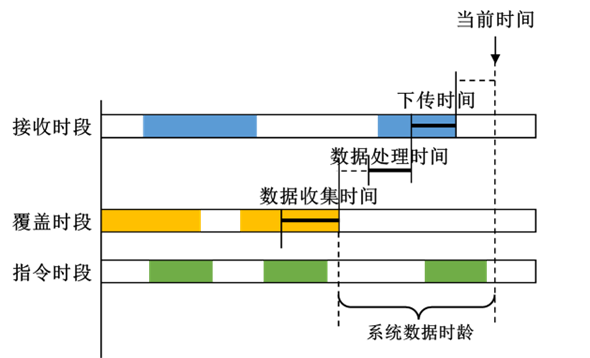

# 系统数据时龄

## 定义

系统数据时龄表示从最后一个满足数据下传等任务序列要求的数据采集时段的终端时刻到当前时间的间隔。

::: tip 注意
系统数据时龄计算时需要一个完整的数据采集流程，但该指标仅表示从数据采集时段的终端时刻到当前时刻之间的间隔。
:::

## 设置参数

- **计算**：设置系统响应时间的统计方式
- **指令**：设置发送指令的场景对象
- **接收**：设置接收数据的场景对象
- **指令准备时间**
- **指令传输时间**
- **数据准备时间**
- **数据收集时间**
- **数据处理时间**
- **下传时间**
- **允许交叉传输**
- **步长**

### “计算”参数可选项

|  名称  |                                                                                    含义                                                                                    |
|:------:|:--------------------------------------------------------------------------------------------------------------------------------------------------------------------------:|
| 平均值 | 在整个分析时段内的平均系统数据时龄。该值通过计算特定步长下的采样点统计得到，采样点步长与分析步长保持一致。如果当前时间无法向前找到一个完整的数据周期时，将不再进一步采样。 |
| 最大值 |                                                                    在整个分析时段内的最大系统数据时龄。                                                                    |
| 最小值 |                                  在整个分析时段内的最小系统数据时龄。当所有的延迟时间都设为0，且存在各环节时段无缝衔接的情况时，该值为0。                                  |
