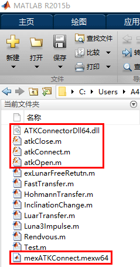

# Matlab接口

::: info
设置属性后需重新打开对象属性界面属性数据才会更新。
:::


ATK 二次开发模块支持 Connect 模式。以下使用介绍均基于 Connect 模式。

目前 Matlab 与 ATK使用 atkOpen 命令进行连接；使用 atkConnect 命令进行属性设置；使用atkClose 命令与 ATK 断开连接。

连接函数需将使用库与使用函数添加到Matlab搜索路径或者当前目录中，如下图：



其中`ATKConnectorDll64.dll` 为基于 Connect 模式提供的 C++动态库，用于和 ATK 建立网络连接，传递命令数据和解析返回结果；

`mexATKConnect.mexw64` 是一个可执行的 Mex 文件，提供用于 Matlab 环境的 MEX 函数，方便 Matlab 和 ATKConnectorDll64.dll 之间传递数据

`atkOpen.m`、`atkConnect.m`、`atkClose.m` 是 Matlab 函数式 M 文件，通过使用MEX 函数完成 Matlab 和 ATK 之间的连接建立和数据传递。

## atkOpen

用法：
```matlab
conID = atkOpen('hostPortStr')
```
说明：
- `conID` - 连接句柄
- `hostPortStr` - 进行连接的网络地址端口号

## atkConnect

用法：
```matlab
rtnData = atkConnect(conID, 'command', 'objPath', 'cmdParamString')
```
说明：
- `conID` - 来自 atkOpen 的句柄
- `Command` - 具体请查看 Connect 命令库
- `objPath` - 接受命令的对象路径
- `cmdParamString` - 命令属性字符串
- `rtnData` - 从 atk 返回的响应的字符串
举例：
```matlab
atkConnect(conID, 'Graphics', '*/Satellite/Satellite1 SetColor 12')
```

## atkClose

用法：
```matlab
atkClose(conID)
```
说明：
- `conID` - 来自 `atkOpen` 的连接句柄


<Catalog />
