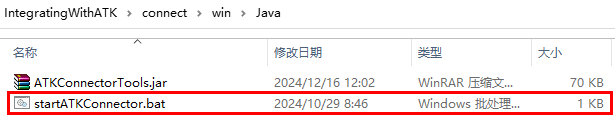

::: info
设置属性后需重新打开对象属性界面属性数据才会更新。
:::

Java客户端是ATK软件向用户提供的一种可以输入脚本命令的窗口，Java客户端由ATK提供，在ATK软件安装包中，点击“IntegratingWithATK”文件夹--“Connect”文件夹--“win”文件夹--“Java”文件夹-“startATKConnector.bat”，即可弹出客户端窗口。目前界面属性窗口不具备实时更新功能，故而设置属性后需重新打开对象属性界面属性数据才会更新。以下为Java客户端提供的接口函数介绍。目前Java客户端与ATK使用atkOpen命令进行连接，使用atkConnect命令进行属性设置，使用atkClose命令与ATK断开连接。

客户端使用Java1.8.0版本，打开Java客户端与ATK进行连接，如下图：




客户端提供Java可执行程序；提供`ATKConnectorTools.jar`，用来完成ATK与Java客户端的数据传输与解析，其中包含atkOpen、atkConnect、atkClose函数用以完成ATK与Java客户端的链接与参数设置，使用atkOpen进行连接，使用atkConnect进行属性设置。使用atkClose与ATK断开连接；提供`startATKConnector.bat`文件用来实现客户端命令的输入输出。

## atkOpen

用法：

```
conID = atkOpen('hostStr', PortStr)
```

说明：
- `conID` - 连接句柄
- `hostStr` - 进行连接的网络地址
- `PortStr` - 进行连接的端口号

## atkConnect

用法：

```
rtnData = atkConnect(conID, 'command', 'objPath', 'cmdParamString')
```

说明：
- `conID` - 来自 `atkOpen` 的句柄
- `Command` - 具体请查看 `Connect` 命令库
- `objPath` - 接受命令的对象路径
- `cmdParamString` - 命令属性字符串
- `rtnData` - 从 atk 返回的响应的字符串

举例：

```
atkConnect(conID, 'Graphics', '*/Satellite/Satellite1 SetColor 12');
```

## atkClose

用法：
```
atkClose(conID)
```

说明：

`conID` - 来自 `atkOpen` 的连接句柄


<Catalog />
