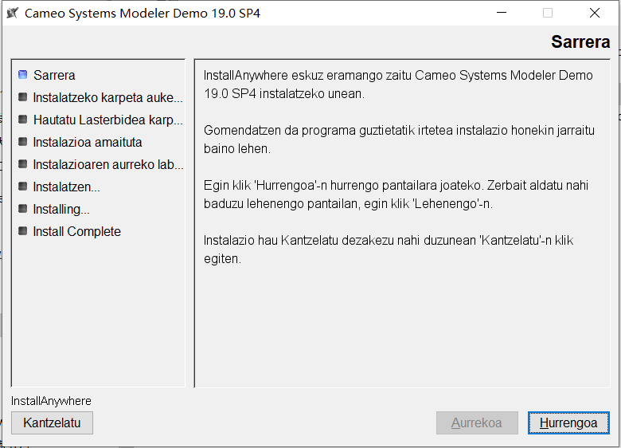
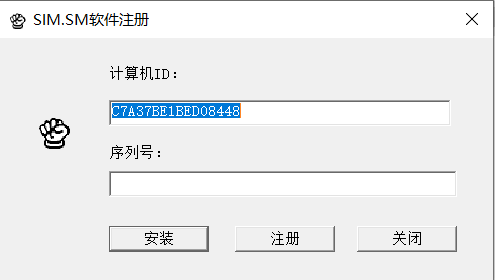
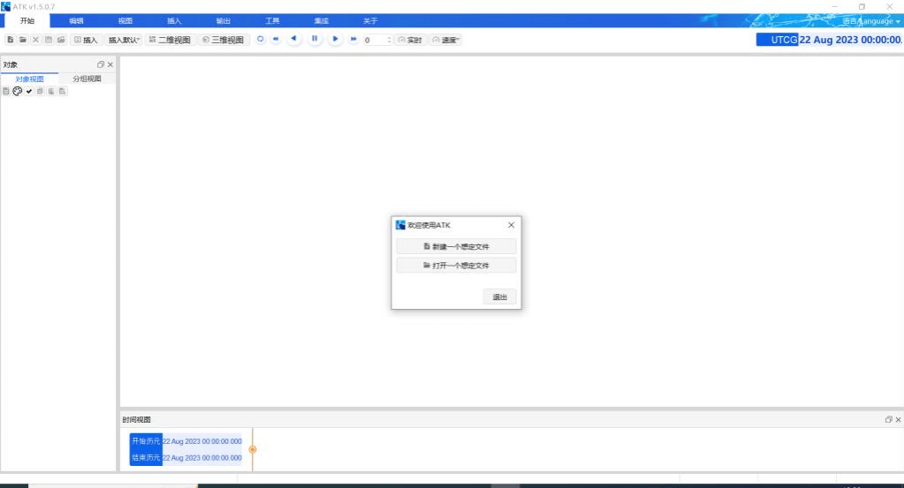
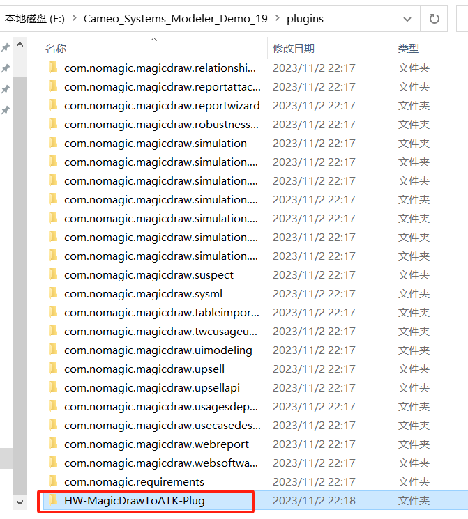
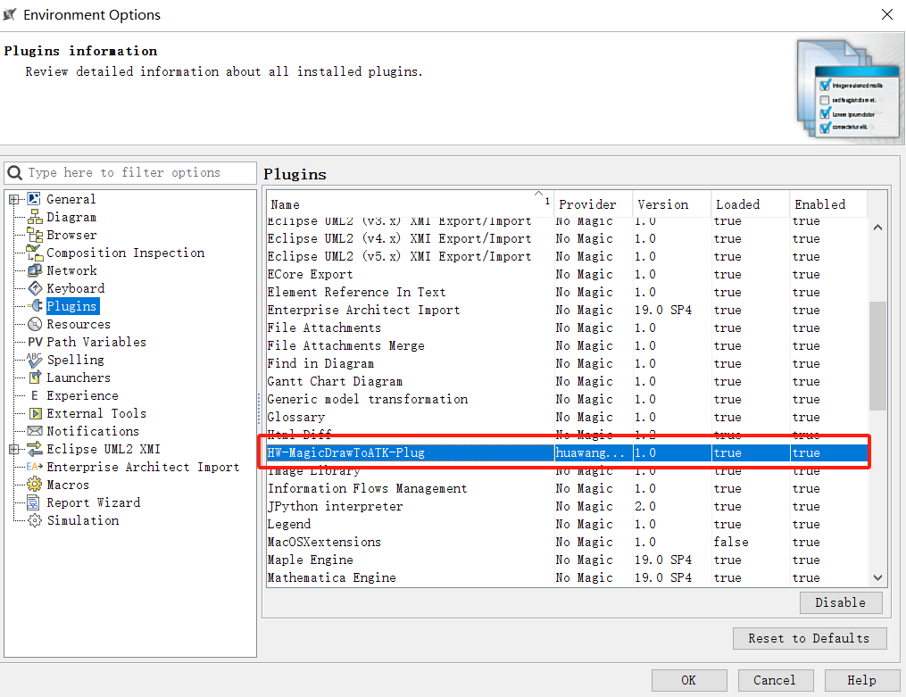

> [!info]
> 本操作指南使用 `ATK v1.5.0.7` 版本、`Cameo Systems Modeler 19.0` 版本进行以下章节内容演示。

## MagicDraw安装

打开 MagicDraw 安装包，按照提示进行安装，如下图所示：

## ATK安装

将 ATK 安装包解压，如下图所示：

打开 `AtkInput/Register_2015.exe` 进行注册激活，如下图所示：

激活完成后就可以打开根目录下 ATK.exe 进行使用，如下图所示：

## MagicDraw与ATK联合仿真插件安装

将` HW-MagicDrawToATK-Plug `文件夹复制到 `Cameo Systems Modele Demo\plugins` 目录下，如下图所示。

在菜单栏选中 `Options-Environment-Plugins`，可以在 `CATIA Magic` 软件上确认工具安装成功，如下图所示。

##  MagicDraw与ATK联合仿真插件升级

将原先版本 HW-MagicDrawToATK-Plug 文件夹删除，将最新版 HWMagicDrawToATK-Plug 文件夹复制到 Cameo Systems Modele Demo\plugins 目录下，如下图所示。

