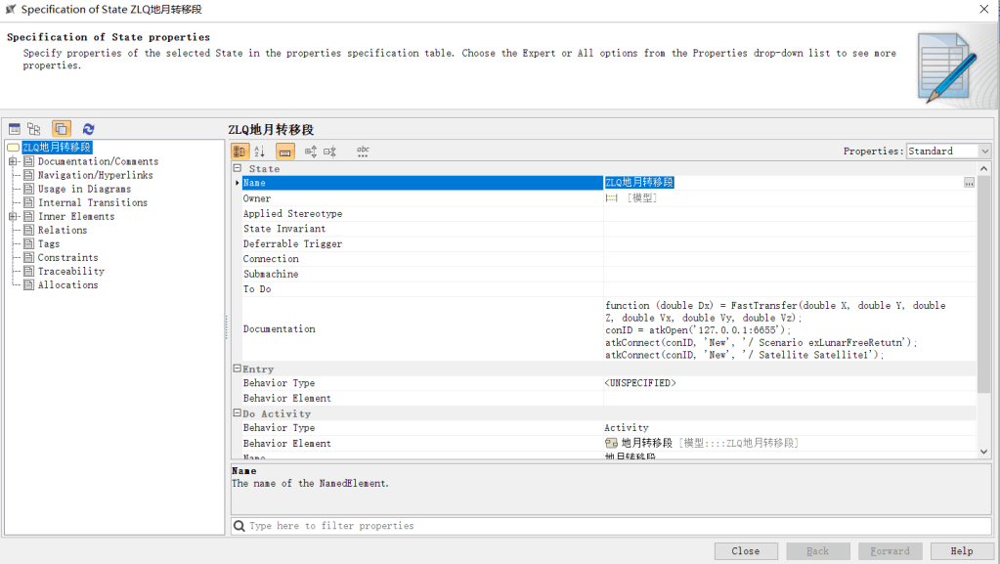
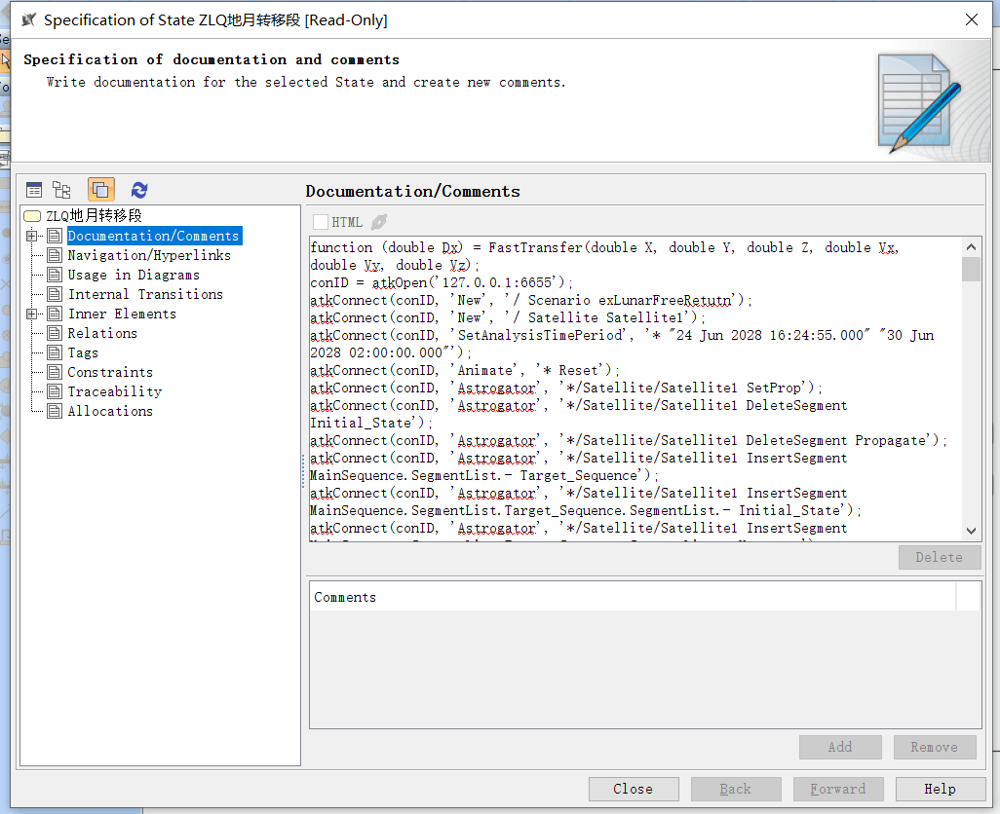
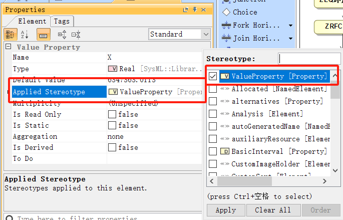
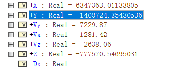
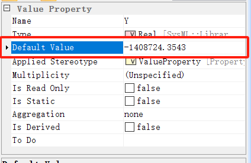

# 脚本编辑过程

在完成 MagicDraw 端系统建模以及启动 ATK 软件后，编辑脚本。右键State 模型元素，选中 Specification，打开属性面板，如下图所示：





在 `Documentation/Comments` 属性内填下 ATK 脚本，实现联合仿真，如下图所示：




::: details 示例脚本（点击展开）
```
function(double  Dx) = FastTransfer(double  X, double  Y, double  Z, double  Vx, double Vy, double Vz); //定义输入输出

conlD=atkOpen( 127.0.0.1:6655');//   输入ATK 所在地址以及端口，与ATK 进行通信连接

atkConnect(conID,New','/ Scenario exLunarFreeRetutn');//通过命令新建场景
atkConnect(conID,'New','/ Satellite Satellite1');//通过命令新建卫星

atkConnect(conID,'SetAnalysisTimePeriod','* "24 Jun 2028 16:24:55.000" "30 Jun 2028 02:00:00.000");//使用 UTCG 格式设置场景分析时间段

atkConnect(conID,'Animate','* Reset);//重置界面

atkConnect(conID,'Astrogator','*/Satellite/Satellitel SetProp');//设置卫星轨道预报器类型为机动规划；第一级目录默认存在一个初始段
atkConnect(conID,'Astrogator,'*/Satellite/Satellitel DeleteSegment Initial_State');

atkConnect(conID, 'Astrogator', '*/Satellite/Satellite1 InsertSegment MainSequence.SegmentList.- Target_Sequence'); //在第一级目录下添加一个瞄准序列段，默认段名为 Target_Sequence

atkConnect(conID, 'Astrogator', '*/Satellite/Satellite1 InsertSegment MainSequence.SegmentList.Target_Sequence.SegmentList.- Initial_State');

atkConnect(conID, 'Astrogator', '*/Satellite/Satellite1 InsertSegment MainSequence.SegmentList.Target_Sequence.SegmentList.- Maneuver'); //在瞄准序列 段内添加一个机动段，默认段名为 Maneuver

atkConnect(conID, 'Astrogator', '*/Satellite/Satellite1 InsertSegment MainSequence.SegmentList.Target_Sequence.SegmentList.- Propagate');

atkConnect(conID, 'Astrogator', '*/Satellite/Satellite1 SetValue MainSequence.SegmentList.Target_Sequence.SegmentList.Propagate.SegmentColor -16776961');

atkConnect(conID, 'Astrogator', '*/Satellite/Satellite1 SetValue MainSequence.SegmentList.Target_Sequence.SegmentList.Initial_State.InitialState.Epoch 24 Jun 2028 16:24:55.000 UtCG');

atkConnect(conID, 'Astrogator', '*/Satellite/Satellite1 SetValue MainSequence.SegmentList.Target_Sequence.SegmentList.Initial_State.CoordinateType Cartesian');

atkConnect(conID, 'Astrogator', '*/Satellite/Satellite1 SetValue MainSequence.SegmentList.Target_Sequence.SegmentList.Initial_State.InitialState.Cartesian.X @X m');

atkConnect(conID, 'Astrogator', '*/Satellite/Satellite1 SetValue MainSequence.SegmentList.Target_Sequence.SegmentList.Initial_State.InitialState.Cartesian.Y @Ym');

atkConnect(conID, 'Astrogator', '*/Satellite/Satellite1 SetValue MainSequence.SegmentList.Target_Sequence.SegmentList.Initial_State.InitialState.Cartesian.Z @Z m');

atkConnect(conID, 'Astrogator', '*/Satellite/Satellite1 SetValue MainSequence.SegmentList.Target_Sequence.SegmentList.Initial_State.InitialState.Cartesian.Vx @Vx');

atkConnect(conID, 'Astrogator', '*/Satellite/Satellite1 SetValue MainSequence.SegmentList.Target_Sequence.SegmentList.Initial_State.InitialState.Cartesian.Vy @Vy');

atkConnect(conID, 'Astrogator', '*/Satellite/Satellite1 SetValue MainSequence.SegmentList.Target_Sequence.SegmentList.Initial_State.InitialState.Cartesian.Vz @Vz');

atkConnect(conID, 'Astrogator', '*/Satellite/Satellite1 SetValue MainSequence.SegmentList.Target_Sequence.SegmentList.Initial_State.InitialState.drymass 100');

atkConnect(conID, 'Astrogator', '*/Satellite/Satellite1 SetValue MainSequence.SegmentList.Target_Sequence.SegmentList.Initial_State.InitialState.fuelmass 100');

atkConnect(conID, 'Astrogator', '*/Satellite/Satellite1 SetValue MainSequence.SegmentList.Target_Sequence.SegmentList.Initial_State.InitialState.Cd 1');

atkConnect(conID, 'Astrogator', '*/Satellite/Satellite1 SetValue MainSequence.SegmentList.Target_Sequence.SegmentList.Initial_State.InitialState.dragarea 1');

atkConnect(conID, 'Astrogator', '*/Satellite/Satellite1 SetValue MainSequence.SegmentList.Target_Sequence.SegmentList.Initial_State.InitialState.Cr 1');

atkConnect(conID, 'Astrogator', '*/Satellite/Satellite1 SetValue MainSequence.SegmentList.Target_Sequence.SegmentList.Initial_State.InitialState.srparea 2.2');

atkConnect(conID, 'Astrogator', '*/Satellite/Satellite1 SetValue MainSequence.SegmentList.Target_Sequence.SegmentList.Maneuver.ImpulsiveMnvr.ThrustAxes "Satellite/Satellite1 VNC(Earth)"');

atkConnect(conID, 'Astrogator', '*/Satellite/Satellite1 SetValue MainSequence.SegmentList.Target_Sequence.SegmentList.Maneuver.ImpulsiveMnvr.coordtype Cartesian');

atkConnect(conID, 'Astrogator', '*/Satellite/Satellite1 SetValue MainSequence.SegmentList.Target_Sequence.SegmentList.Maneuver.ImpulsiveMnvr.Cartesian.X 3160');

atkConnect(conID, 'Astrogator', '*/Satellite/Satellite1 SetValue MainSequence.SegmentList.Target_Sequence.SegmentList.Propagate.StoppingConditions Epoch');

atkConnect(conID, 'Astrogator', '*/Satellite/Satellite1 SetValue MainSequence.SegmentList.Target_Sequence.SegmentList.Propagate.StoppingConditions.Epoch.TripValue 30 Jun 2028 02:00:00.000 UtCG');

atkConnect(conID, 'Astrogator', '*/Satellite/Satellite1 SetValue MainSequence.SegmentList.Target_Sequence.SegmentList.Propagate.StoppingConditions.Epoch.Tolerance 0.0001');
 
atkConnect(conID, 'Astrogator', '*/Satellite/Satellite1 SetValue MainSequence.SegmentList.Target_Sequence.Profiles Differential_Corrector');

atkConnect(conID, 'Astrogator', '*/Satellite/Satellite1 AddMCSSegmentControl MainSequence.SegmentList.Target_Sequence.SegmentList.Initial_State InitialState.Epoch');

atkConnect(conID, 'Astrogator', '*/Satellite/Satellite1 SetMCSControlValue MainSequence.SegmentList.Target_Sequence.Profiles.Differential_Corrector Initial_State InitialState.Epoch Active true');

atkConnect(conID, 'Astrogator', '*/Satellite/Satellite1 SetMCSControlValue MainSequence.SegmentList.Target_Sequence.Profiles.Differential_Corrector Initial_State InitialState.Epoch MaxStep 60 sec');

atkConnect(conID, 'Astrogator', '*/Satellite/Satellite1 SetMCSControlValue MainSequence.SegmentList.Target_Sequence.Profiles.Differential_Corrector Initial_State InitialState.Epoch Correction 1001.71404699199 sec');

atkConnect(conID, 'Astrogator', '*/Satellite/Satellite1 SetMCSControlValue MainSequence.SegmentList.Target_Sequence.Profiles.Differential_Corrector Initial_State InitialState.Epoch Perturbation 0.1 sec');

atkConnect(conID, 'Astrogator', '*/Satellite/Satellite1 SetMCSControlValue MainSequence.SegmentList.Target_Sequence.Profiles.Differential_Corrector Initial_State InitialState.Epoch Scale 1 sec');

atkConnect(conID, 'Astrogator', '*/Satellite/Satellite1 AddMCSSegmentControl MainSequence.SegmentList.Target_Sequence.SegmentList.Maneuver ImpulsiveMnvr.Cartesian.X');

atkConnect(conID, 'Astrogator', '*/Satellite/Satellite1 SetMCSControlValue MainSequence.SegmentList.Target_Sequence.Profiles.Differential_Corrector Maneuver ImpulsiveMnvr.Cartesian.X Active true');

atkConnect(conID, 'Astrogator', '*/Satellite/Satellite1 SetMCSControlValue MainSequence.SegmentList.Target_Sequence.Profiles.Differential_Corrector Maneuver ImpulsiveMnvr.Cartesian.X MaxStep 10 m/s');

atkConnect(conID, 'Astrogator', '*/Satellite/Satellite1 SetMCSControlValue MainSequence.SegmentList.Target_Sequence.Profiles.Differential_Corrector Maneuver ImpulsiveMnvr.Cartesian.X Correction 2.39263205821203 m/s');

atkConnect(conID, 'Astrogator', '*/Satellite/Satellite1 SetMCSControlValue MainSequence.SegmentList.Target_Sequence.Profiles.Differential_Corrector Maneuver ImpulsiveMnvr.Cartesian.X Perturbation 0.1 m/s');

atkConnect(conID, 'Astrogator', '*/Satellite/Satellite1 SetMCSControlValue MainSequence.SegmentList.Target_Sequence.Profiles.Differential_Corrector Maneuver ImpulsiveMnvr.Cartesian.X Scale 1 m/s');

atkConnect(conID, 'Astrogator', '*/Satellite/Satellite1 AddMCSSegmentControl MainSequence.SegmentList.Target_Sequence.SegmentList.Propagate StoppingConditions.Epoch.TripValue');

atkConnect(conID, 'Astrogator', '*/Satellite/Satellite1 SetMCSControlValue   MainSequence.SegmentList.Target_Sequence.Profiles.Differential_Corrector Propagate StoppingConditions.Epoch.TripValue Active true');

atkConnect(conID, 'Astrogator', '*/Satellite/Satellite1 SetMCSControlValue   MainSequence.SegmentList.Target_Sequence.Profiles.Differential_Corrector Propagate StoppingConditions.Epoch.TripValue MaxStep 300 sec');

atkConnect(conID, 'Astrogator', '*/Satellite/Satellite1 SetMCSControlValue   MainSequence.SegmentList.Target_Sequence.Profiles.Differential_Corrector Propagate StoppingConditions.Epoch.TripValue Correction 0.00989449023243827 sec');

atkConnect(conID, 'Astrogator', '*/Satellite/Satellite1 SetMCSControlValue   MainSequence.SegmentList.Target_Sequence.Profiles.Differential_Corrector Propagate StoppingConditions.Epoch.TripValue Perturbation 0.1 sec');

atkConnect(conID, 'Astrogator', '*/Satellite/Satellite1 SetMCSControlValue    MainSequence.SegmentList.Target_Sequence.Profiles.Differential_Corrector Propagate StoppingConditions.Epoch.TripValue Scale 1 sec');

atkConnect(conID, 'Astrogator', '*/Satellite/Satellite1 SetValue MainSequence.SegmentList.Target_Sequence.SegmentList.Propagate.Results Inclination AltitudeOfPeriapsis');

atkConnect(conID, 'Astrogator', '*/Satellite/Satellite1 SetMCSConstraintValue MainSequence.SegmentList.Target_Sequence.Profiles.Differential_Corrector Propagate Inclination Active true');

atkConnect(conID, 'Astrogator', '*/Satellite/Satellite1 SetMCSConstraintValue MainSequence.SegmentList.Target_Sequence.Profiles.Differential_Corrector Propagate Inclination Desired 0.750491578357562 rad');

atkConnect(conID, 'Astrogator', '*/Satellite/Satellite1 SetMCSConstraintValue MainSequence.SegmentList.Target_Sequence.Profiles.Differential_Corrector Propagate Inclination Scale 1 rad');

atkConnect(conID, 'Astrogator', '*/Satellite/Satellite1 SetMCSConstraintValue MainSequence.SegmentList.Target_Sequence.Profiles.Differential_Corrector Propagate Inclination tolerance 0.00872664625997165 rad');

atkConnect(conID, 'Astrogator', '*/Satellite/Satellite1 SetMCSConstraintValue MainSequence.SegmentList.Target_Sequence.Profiles.Differential_Corrector Propagate Inclination Weight 1');

atkConnect(conID, 'Astrogator', '*/Satellite/Satellite1 SetMCSConstraintValue MainSequence.SegmentList.Target_Sequence.Profiles.Differential_Corrector Propagate AltitudeOfPeriapsis Active true');

atkConnect(conID, 'Astrogator', '*/Satellite/Satellite1 SetMCSConstraintValue MainSequence.SegmentList.Target_Sequence.Profiles.Differential_Corrector Propagate AltitudeOfPeriapsis Desired 50000 m');


atkConnect(conID,'Astrogator','*/Satellite/Satellitel SetMCSConstraintValue MainSequence.SegmentList.Target_Sequence.Profiles.Differential_Corrector Propagate 

atkConnect(conID,'Astrogator,'*/Satellite/Satellitel SetMCSConstraintValue MainSequence.SegmentList.Target_Sequence.Profiles.Differential_Corrector Propagate AltitudeOfPeriapsis tolerance 100 m');

atkConnect(conID,'Astrogator','*/Satellite/Satellitel SetMCSConstraintValue MainSequence.SegmentList.Target_Sequence.Profiles.Differential_Corrector Propagate AltitudeOfPeriapsis Weight 0.0001');//设置第四个预报段停止条件Duration的误差值为0.00001 秒

atkConnect(conID,'Save','/*);//保存此场景

atkConnect(conID,'Astrogator,'*/Satellite/Satellitel RunMCS');

@Dx=atkConnect(conID,'Astrogator_RM','*/Satellite/Satellite1 GetMCSControlValue MainSequence.SegmentList.Target_Sequence.Profiles.Diferential_Corrector Maneuver ImpulsiveMnvr.Cartesian.X finalvalue');

atkClose(conID);//与 ATK 断开连接
```
:::

脚本中定义了输入输出，在模型中也需要同时的定义这些输入输出。右键状态机选择 Create Element-Property，新建属性，如下图所示：


将属性的 Stereotype 修改为 ValueProperty，如下图所示：



依据脚本中的输入输出创建属性，输入属性包含 X、Y、Z、Vx、Vy、Vz，输出属性包含 Dx，并将这些属性的 Type 修改为 Real，如下图所示：



同时给输入属性赋初值，如下图所示：



