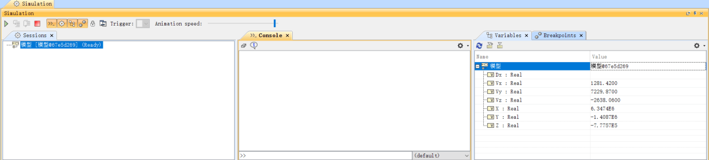
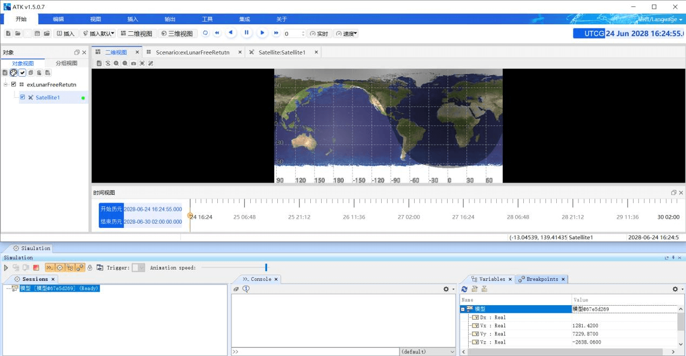
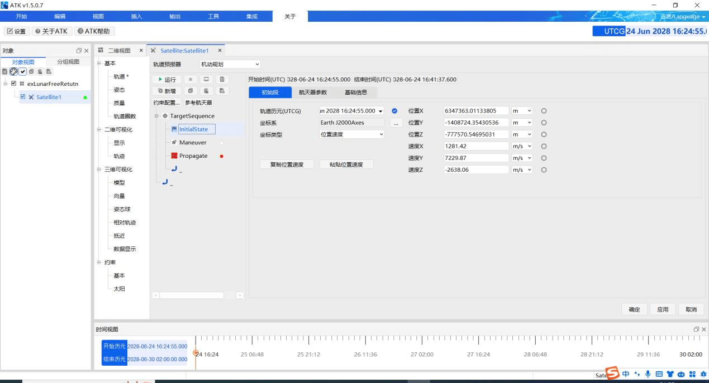
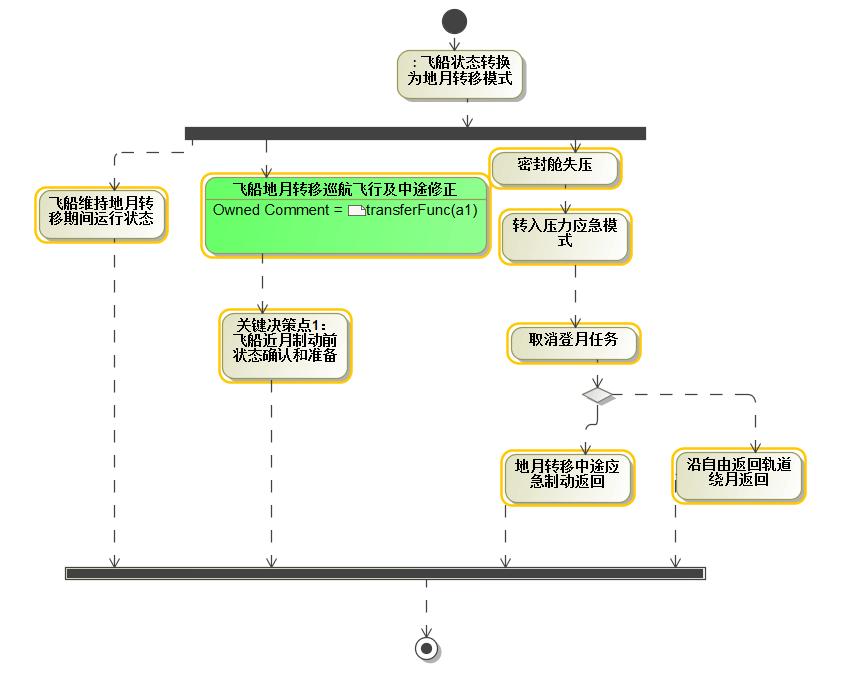
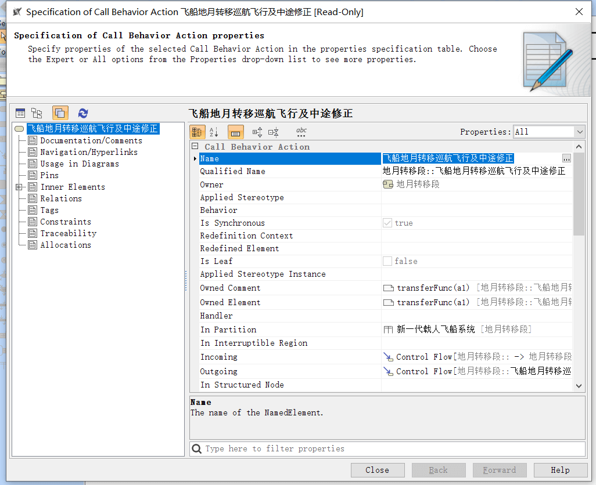
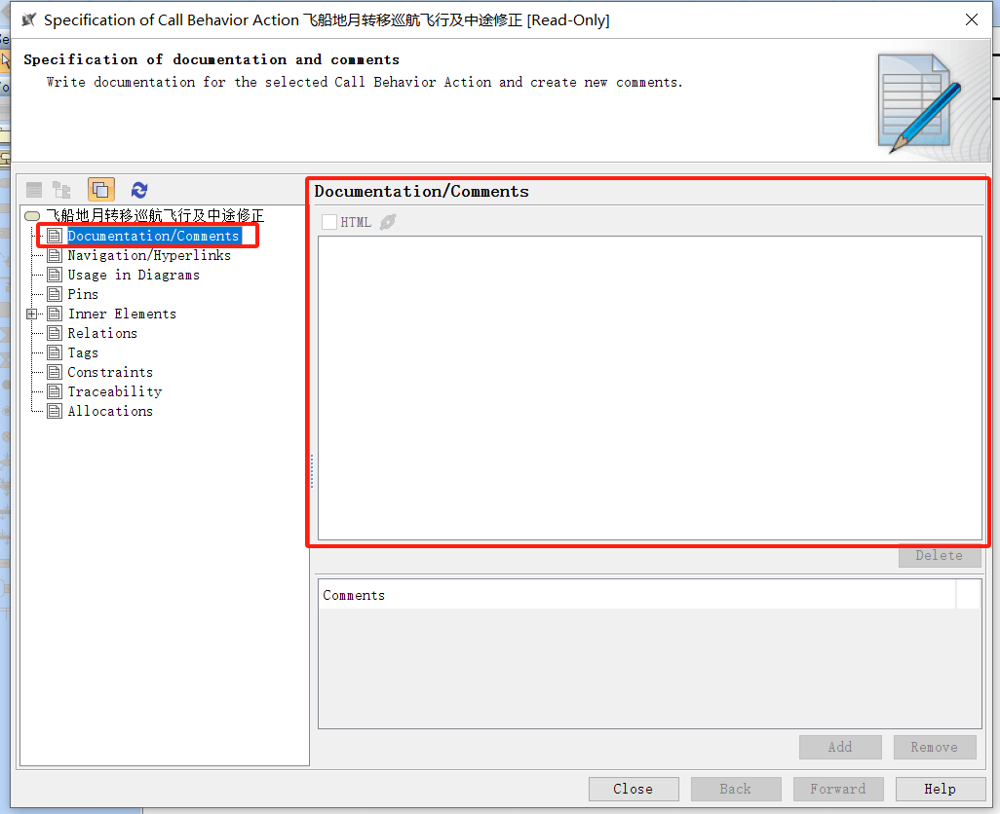

# 载人航天任务仿真过程

完成模型、脚本、值属性构建后，开始联合仿真。右键状态机选择Simulation-Run，打开仿真界面，如下图所示：

点击开始仿真按钮 MagicDraw 与 ATK 开始联合仿真，如下图所示

开始仿真后，MagicDraw 将输入参数发送至 ATK 中，如下图所示：

使用活动图与 ATK 联合仿真方式类似，首先构建活动图，如下图所示：

右键 Action 模型元素，选中 Specification，打开属性面板，如下图所示：

在 `Documentation/Comments` 属性内填下 ATK 脚本，实现联合仿真，如下图所示：

