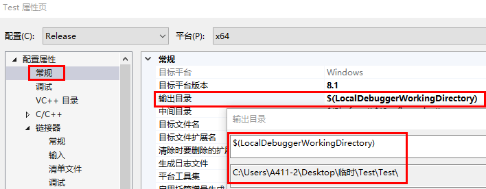
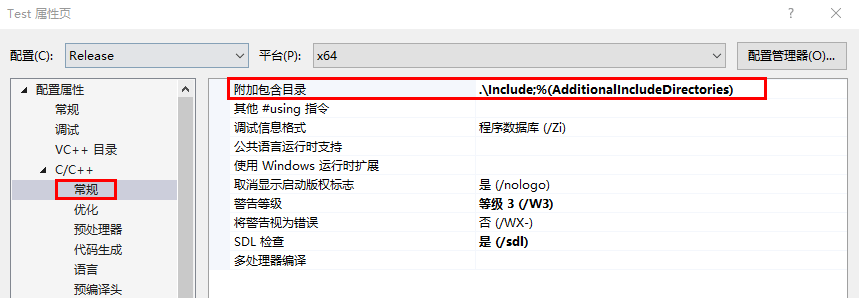
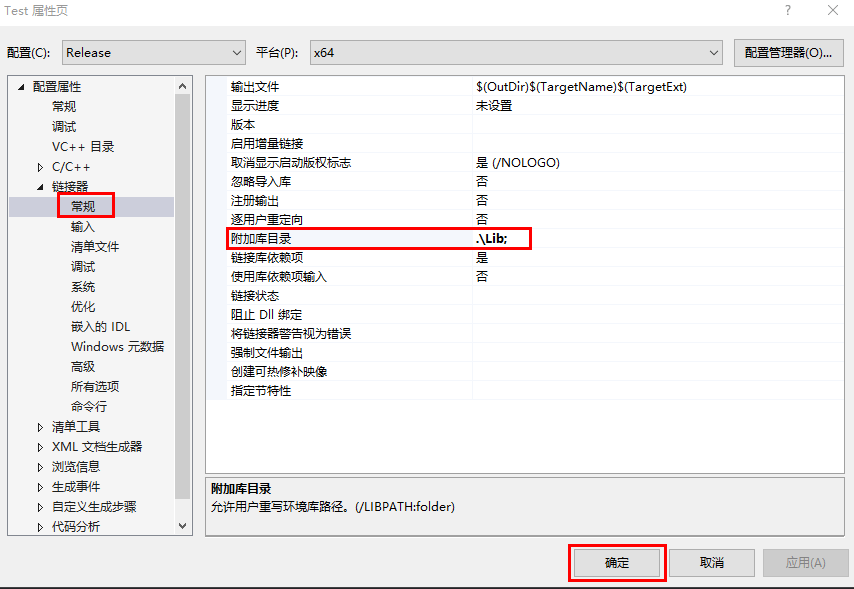
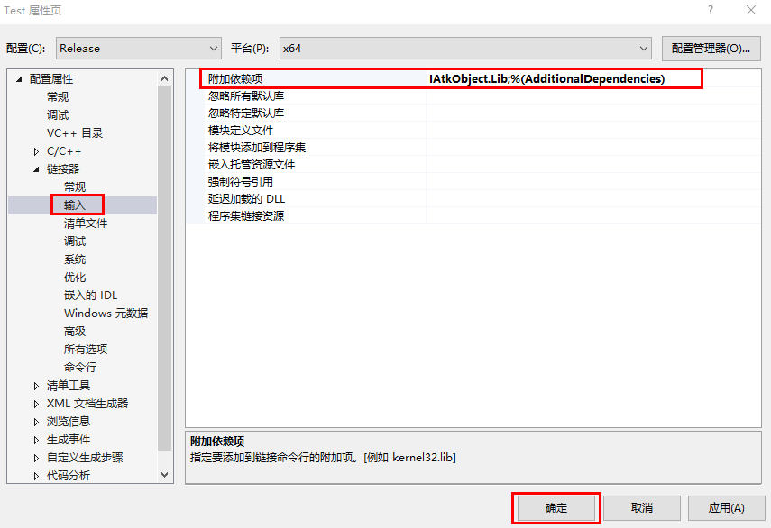

# Release属性配置

打开项目右键->属性。

配置平台改为 Release，x64 模式，点击常规->输出目录，将输出目录修改为项目目录。

点击 C/C++->常规->附加包含目录，将头文件目录添加至附加包含目录。

链接器->常规->附加库目录，将 lib 文件夹添加至附加库目录，点击确定。

链接器->输入->附加依赖项，将 lib 库全称添加至附加依赖项，点击确定。

