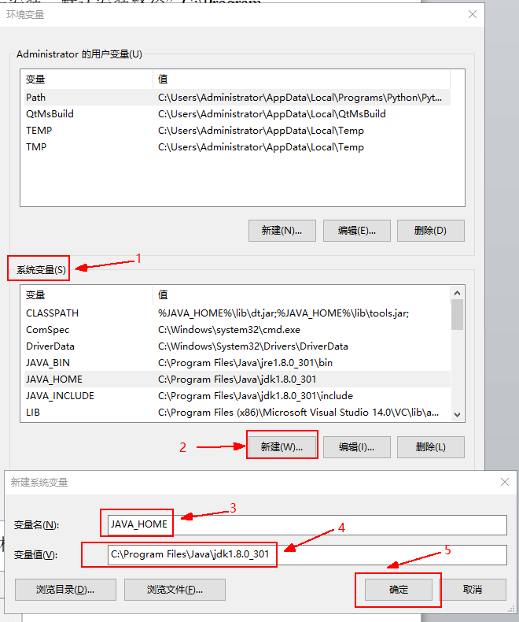
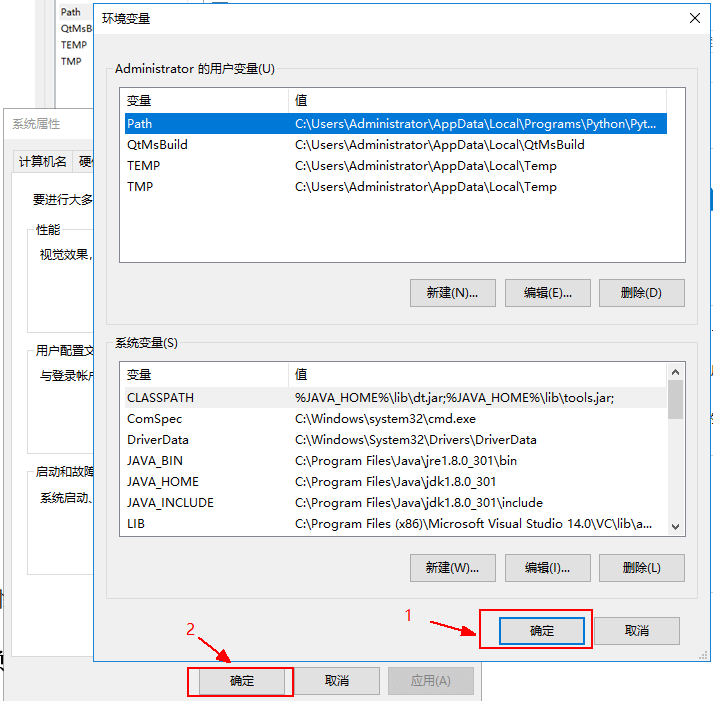

# Java安装与环境配置

下载并安装 JDK(Java Development Kit)，官网 https://www.oracle.com/java/technologies/download

本章以 1.8.0_301 版本安装包 jdk-8u301-windows-x64.exe 为例

直接双击安装，默认安装路径`C:\Program Files\Java\jdk1.8.0_301`。

## 配置 Java 路径到系统环境变量

安装完 JDK 后，需要将 Java 路径配置到系统环境变量中。

JAVA_HOME 设置路径：`C:\Program Files\Java\jdk1.8.0_301`

Path 添加路径：`%JAVA_HOME%\bin`

Path 添加路径：`%JAVA_HOME%\jre\bin`

CLASSPATH 添加路径：`.;%JAVA_HOME%\lib;%JAVA_HOME%\lib\tools.jar;`

## 系统环境变量配置过程（以 JAVA_HOME 为例）

1. 右键点击此电脑，再点击弹出框属性。

    

2. 点击控制面板框下系统高级设置，再点击系统属性框高级选项下的环境变量。

    

3. 在弹出的环境变量框系统变量中新建（已存在则点击编辑）并输入变量名 JAVA_HOME 与 JAVA 路径，最后点击确定。

    

4. 新建完变量 `JAVA_HOME` 后，再依此点击环境变量框最下方确定，以及系统属性框最下方的确定，至此，新建环境变量 `JAVA_HOME` 保存成功

