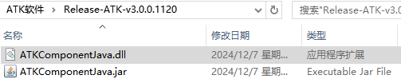

# 依赖文件

## ATKComponentJava.jar

ATKComponent模式接口类封装包，提供Component模式下所有公用类对象与函数的接口封装。

## ATKComponent模式依赖动态库

包括AstroLib.dll，AtObjExt.dll，AtVGT.dll，AtObjVGT.dll，AstroObj.dll，IAtkObject.dll，ATKComponentJava.dll，供Java案例脚本加载导入。版本不同，依赖动态库可能有所变动。

## ATKComponentJavaTest.java

java案例脚本，需要设置包名，本案例包名为com.atk.test，对应文件创建目录为ATK根目录下com/atk/test。具体内容参考下文案例实现里的代码，包含一个轨道快速转移案例的具体实现过程。该脚本需要通过Java环境先编译再执行，如果脚本包含中文需要先设置文件为UTF-8无BOM编码格式，再输入编辑案例代码。

