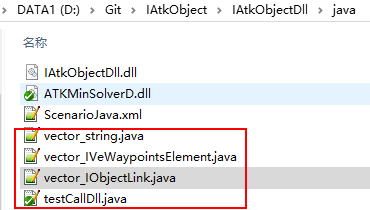
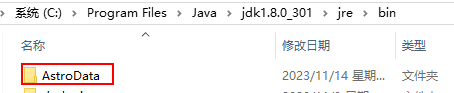

# 依赖文件

## IAtkObjectDll.Dll

用途：提供 ATK 功能接口调用支持。

来源：由二次开发 Compoent 接口项目编译生成。

位置：放在 java 执行目录。

## ATKMinSolverD.dll

用途：提供 ATK 功能接口调用支持。

来源：由二次开发 Compoent 接口项目编译生成。

位置：放在 java 执行目录。

## C++类型 Java 封装文件（.java）

用途：帮助 Java 能支持 C++接口项目中的各种数据结构与自定义类。

来源：编译 SWIG 接口文件后自动生成。比如接口文件中声明有 c++类文件 Ianimation.h，经由 SWIG 编译会生成 Ianimation.java 类封装文件。

位置：放在 java 执行目录。

## ATK 默认配置文件 AstroData

用途：用来配置 ATK 对象的默认值

来源：由 ATK 安装包提供，位置 `D:\Release-ATK-v1.8.0.1-20231227\`

位置：放在 java 安装目录 `C:\Program Files\Java\jdk1.8.0_301\jre\bin\`

