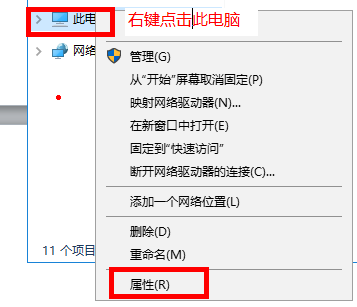
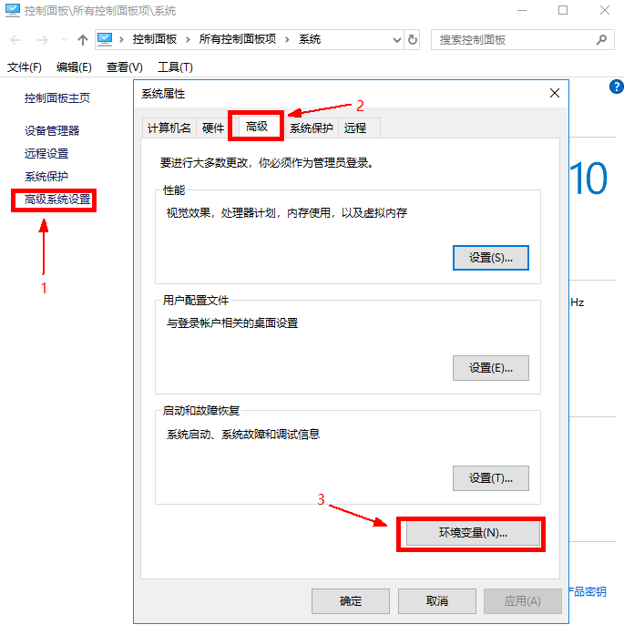
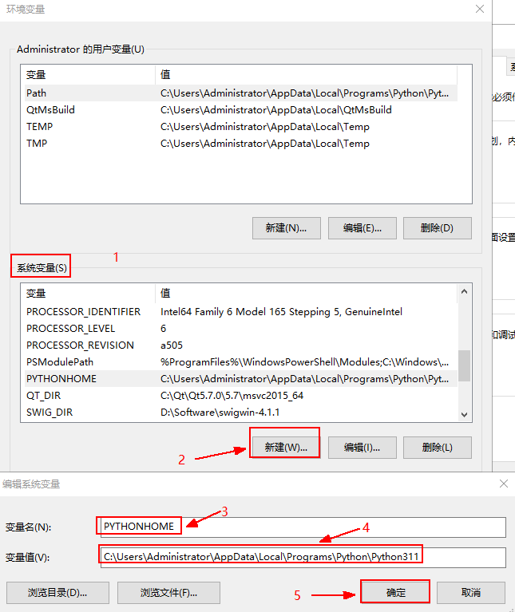
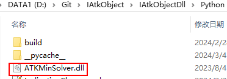

# Python安装与环境配置

下载并安装 Python（以 Python3.11.0 为例）

## 配置 Python 路径到系统环境变量

安装完 Python 后，需要将 Python 路径配置到系统环境变量中。

PYTHONHOME 设置路径：

`C:\Users\Administrator\AppData\Local\Programs\Python\Python311`

Path 添加路径：

`C:\Users\Administrator\AppData\Local\Programs\Python\Python311`

Path 添加路径：

`C:\Users\Administrator\AppData\Local\Programs\Python\Python311\Scripts`

## 系统环境变量配置过程（以 PYTHONHOME 为例）

1. 右键点击此电脑，再点击弹出框属性。

    

2. 点击控制面板框下系统高级设置，再点击系统属性框高级选项下的环境变量。

    

3. 在弹出的环境变量框系统变量中新建（已存在则点击编辑）并输入变量名 PYTHONHOME 与 Python 路径，最后点击确定。

    

4. 新建完变量 PYTHONHOME 后，再依此点击环境变量框最下方确定，以及系统属性框最下方的确定，至此，新建环境变量 PYTHONHOME 保存成功

    

## 配置项目依赖默认数据库

将保存项目对象默认数值的文件夹 AstroData，整体复制到 Python 安装目录：C:\Users\Administrator\AppData\Local\Programs\Python\Python311

## 配置项目依赖动态库

将项目依赖动态库 `ATKMinSolver.dll`，复制到 Python 代码运行目录：
`D:\Git\IAtkObject\IAtkObjectDll\Python`

注意，通过 cmd 执行 Python 测试代码时，依赖动态库的调试版本和系统版
本，必须和编译环境一致。

