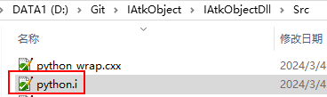

# 编写SWIG接口文件



```swig
//Python.i
//Python 模块名
%module python
%{
//包含需要调用的 C++声明文件，以本接口文件位置为基础
#include "../IAtkObj.h"
#include "../Include/AsObjManage.h"
#include "Common.h"
#include "IAnimation.h"
#include "IAtkObject.h"
#include "IAtkObjectCollection.h"
#include "IAtkObjectRoot.h"
#include "ICEnum.h"
#include "IScenario.h"
#include "IGreatArcVehicle.h"
//#include "ICObjectFunction.h"
#include "AccessConstraints/IAccessConstraint.h"
#include "AccessConstraints/IAccessCnstrAngle.h"
#include "AccessConstraints/IAccessCnstrMinMax.h"
#include "AccessConstraints/IAccessConstraintCollection.h"
#include "Aircraft/IAircraft.h"
#include "Satellite/Propagator/IVePropagator.h"
#include "Aircraft/IVePropagatorGreatArc.h"
#include "Aircraft/IVeWaypointsCollection.h"
#include "Aircraft/IVeWaypointsElement.h"
#include "Chain/IChain.h"
#include "Chain/IObjectLinkCollection.h"
#include "Chain/IObjectLink.h"
#include "CoverageDefinition/ICoverageDefinition.h"
#include "CoverageDefinition/ICvGrid.h"
#include "CoverageDefinition/ICvBounds.h"
#include "CoverageDefinition/ICvBoundsGlobal.h"
#include "CoverageDefinition/ICvBoundsLat.h"
#include "CoverageDefinition/ICvBoundsLatLine.h"
#include "CoverageDefinition/ICvBoundsLatLonRegion.h"
#include "CoverageDefinition/ICvBoundsLonLine.h"
#include "CoverageDefinition/ICvResolution.h"
#include "CoverageDefinition/ICvResolutionArea.h"
#include "CoverageDefinition/ICvResolutionDistance.h"
#include "CoverageDefinition/ICvResolutionLatLon.h"
#include "Facility/IFacility.h"
#include "Sensor/ILocationData.h"
#include "Facility/IPosition.h"
//#include "Facility/ICartesian.h"
//#include "Facility/IGeodetic.h"
#include "Graphics/ISnGraphics.h"
#include "Graphics/ISnProjection.h"
#include "Graphics/IDisplayDistance.h"
#include "Graphics/ISnProjConstantAlt.h"
#include "Graphics/ISnProjObjectAlt.h"
#include "GroundVehicle/IGroundVehicle.h"
#include "Planet/IPlanet.h"
#include "Planet/IPlCommonTasks.h"
#include "Planet/IPositionSourceData.h"
#include "Planet/IPlPosCentralBody.h"
#include "Receiver/IReceiver.h"
#include "Receiver/IReceiverModel.h"
#include "Receiver/IReceiverModelSimple.h"
#include "Receiver/IPolarization.h"
#include "Receiver/IPolarizationNone.h"
#include "Receiver/IPolarizationLinear.h"
#include "Receiver/IPolarizationCircular.h"
#include "Receiver/IPolarizationVertical.h"
#include "Receiver/IPolarizationHorizontal.h"
#include "Receiver/IPolarizationElliptical.h"
#include "Receiver/ILinkMargin.h"
#include "Receiver/IDemodulatorModel.h"
//#include "Receiver/IDemodulatorModelBpsk.h"
//#include "Receiver/IDemodulatorModelQpsk.h"
#include "Receiver/IReceiverModelMedium.h"
#include "Sensor/ISensor.h"
#include "Sensor/ISnCommonTasks.h"
#include "Sensor/ISnPattern.h"
#include "Sensor/ISnRectangularPattern.h"
#include "Sensor/ISnSimpleConicPattern.h"
#include "Sensor/ILocationData.h"
#include "Sensor/ISnPointing.h"
#include "Sensor/ISnPtFixed.h"
#include "Sensor/IOrientation.h"
#include "Sensor/IOrientationEulerAngles.h"
#include "Sensor/IOrientationQuaternion.h"
#include "Ship/IShip.h"
#include "Star/IStar.h"
#include "Submarine/ISubmarine.h"
#include "Transmitter/ITransmitter.h"
#include "Transmitter/ITransmitterModel.h"
#include "Transmitter/ITransmitterModelSimple.h"
#include "Transmitter/ITransmitterModelMedium.h"
#include "Transmitter/IModulatorModel.h"
#include "Transmitter/IModulatorModelBpsk.h"
#include "Transmitter/IModulatorModelQpsk.h"
#include "Satellite/ISatellite.h"
#include "Satellite/Astrogator/IComponentInfo.h"
#include "Satellite/Astrogator/IVAMCSSegment.h"
#include "Satellite/Astrogator/EndSegment/IVAMCSEnd.h"
#include "Satellite/Astrogator/HoldSegment/IVAMCSHold.h"
#include "Satellite/Astrogator/InitialStateSegment/IVAMCSInitialState.h"
#include "Satellite/Astrogator/InitialStateSegment/IVAElement.h"
#include "Satellite/Astrogator/InitialStateSegment/IVAElementCartesian.h"
#include "Satellite/Astrogator/InitialStateSegment/IVAElementKeplerian.h"
#include "Satellite/Astrogator/InitialStateSegment/IVAFuelTank.h"
#include "Satellite/Astrogator/InitialStateSegment/IVASpacecraftParameters.h"
#include "Satellite/Astrogator/ManeuverSegment/IVAMCSManeuver.h"
#include "Satellite/Astrogator/ManeuverSegment/IVAManeuver.h"
#include "Satellite/Astrogator/ManeuverSegment/IVAManeuverFinite.h"
#include "Satellite/Astrogator/ManeuverSegment/IVAManeuverImpulsive.h"
#include "Satellite/Astrogator/ManeuverSegment/IDirection.h"
#include "Satellite/Astrogator/ManeuverSegment/IDirectionRADec.h"
#include "Satellite/Astrogator/ManeuverSegment/IDirectionXYZ.h"
#include "Satellite/Astrogator/ManeuverSegment/IVAAttitudeControl.h"
#include "Satellite/Astrogator/ManeuverSegment/IVAAttitudeControlFinite.h"
#include "Satellite/Astrogator/ManeuverSegment/IVAAttitudeControlFiniteThrustVector.h"
#include "Satellite/Astrogator/ManeuverSegment/IVAAttitudeControlImpulsive.h"
#include "Satellite/Astrogator/ManeuverSegment/IVAAttitudeControlImpulsiveThrustVector.h"
#include "Satellite/Astrogator/ManeuverSegment/IVAManeuverFinitePropagator.h"
#include "Satellite/Astrogator/PropagateSegment/IVAMCSPropagate.h"
#include "Satellite/Astrogator/PropagateSegment/IVAStoppingConditionComponent.h"
#include "Satellite/Astrogator/PropagateSegment/IVAStoppingCondition.h"
#include "Satellite/Astrogator/PropagateSegment/IVAStoppingConditionCollection.h"
#include "Satellite/Astrogator/PropagateSegment/IVAStoppingConditionElement.h"
#include "Satellite/Astrogator/Results/IVACalcObjectCollection.h"
#include "Satellite/Astrogator/Results/IVAStateCalcAltOfApoapsis.h"
#include "Satellite/Astrogator/Results/IVAStateCalcAltOfPeriapsis.h"
#include "Satellite/Astrogator/Results/IVAStateCalcArgOfLat.h"
#include "Satellite/Astrogator/Results/IVAStateCalcArgOfPeriapsis.h"
#include "Satellite/Astrogator/Results/IVAStateCalcBetaAngle.h"
#include "Satellite/Astrogator/Results/IVAStateCalcCartesianElem.h"
#include "Satellite/Astrogator/Results/IVAStateCalcCosOfVerticalFPA.h"
#include "Satellite/Astrogator/Results/IVAStateCalcDec.h"
#include "Satellite/Astrogator/Results/IVAStateCalcDeltaDec.h"
#include "Satellite/Astrogator/Results/IVAStateCalcDeltaFromMaster.h"
#include "Satellite/Astrogator/Results/IVAStateCalcDeltaRA.h"
#include "Satellite/Astrogator/Results/IVAStateCalcDeltaV.h"
#include "Satellite/Astrogator/Results/IVAStateCalcEccAnomaly.h"
#include "Satellite/Astrogator/Results/IVAStateCalcEccentricity.h"
#include "Satellite/Astrogator/Results/IVAStateCalcEquinoctialElem.h"
#include "Satellite/Astrogator/Results/IVAStateCalcFPA.h"
#include "Satellite/Astrogator/Results/IVAStateCalcGeodeticElem.h"
#include "Satellite/Astrogator/Results/IVAStateCalcInclination.h"
#include "Satellite/Astrogator/Results/IVAStateCalcLonDriftRate.h"
#include "Satellite/Astrogator/Results/IVAStateCalcMeanAnomaly.h"
#include "Satellite/Astrogator/Results/IVAStateCalcMeanEarthLon.h"
#include "Satellite/Astrogator/Results/IVAStateCalcOrbitPeriod.h"
#include "Satellite/Astrogator/Results/IVAStateCalcPosDifferenceOtherSegment.h"
#include "Satellite/Astrogator/Results/IVAStateCalcPosVelDifferenceOtherSegment.h"
#include "Satellite/Astrogator/Results/IVAStateCalcRA.h"
#include "Satellite/Astrogator/Results/IVAStateCalcRAAN.h"
#include "Satellite/Astrogator/Results/IVAStateCalcRadOfApoapsis.h"
#include "Satellite/Astrogator/Results/IVAStateCalcRadOfPeriapsis.h"
#include "Satellite/Astrogator/Results/IVAStateCalcRMag.h"
#include "Satellite/Astrogator/Results/IVAStateCalcSegEpochDifference.h"
#include "Satellite/Astrogator/Results/IVAStateCalcSegStateCalcDifference.h"
#include "Satellite/Astrogator/Results/IVAStateCalcSemiMajorAxis.h"
#include "Satellite/Astrogator/Results/IVAStateCalcSphRMag.h"
#include "Satellite/Astrogator/Results/IVAStateCalcSphVMag.h"
#include "Satellite/Astrogator/Results/IVAStateCalcSunlight.h"
#include "Satellite/Astrogator/Results/IVAStateCalcTrueAnomaly.h"
#include "Satellite/Astrogator/Results/IVAStateCalcTrueLon.h"
#include "Satellite/Astrogator/Results/IVAStateCalcVelAz.h"
#include "Satellite/Astrogator/Results/IVAStateCalcVelDifferenceOtherSegment.h"
#include "Satellite/Astrogator/Results/IVAStateCalcVMag.h"
#include "Satellite/Astrogator/ReturnSegment/IVAMCSReturn.h"
#include "Satellite/Astrogator/SequenceSegment/IVAMCSSequence.h"
#include "Satellite/Astrogator/SequenceSegment/IVAMCSBackwardSequence.h"
#include "Satellite/Astrogator/StopSegment/IVAMCSStop.h"
#include "Satellite/Astrogator/TargetSequenceSegment/IVAMCSTargetSequence.h"
#include "Satellite/Astrogator/TargetSequenceSegment/IVADCControl.h"
#include "Satellite/Astrogator/TargetSequenceSegment/IVADCControlCollection.h"
#include "Satellite/Astrogator/TargetSequenceSegment/IVADCResult.h"
#include "Satellite/Astrogator/TargetSequenceSegment/IVADCResultCollection.h"
#include "Satellite/Astrogator/TargetSequenceSegment/IVAProfile.h"
#include "Satellite/Astrogator/TargetSequenceSegment/IVAProfileCollection.h"
#include "Satellite/Astrogator/TargetSequenceSegment/IVAProfileDifferentialCorrector1.h"
#include "Satellite/Astrogator/TargetSequenceSegment/IVAProfileDifferentialCorrector2.h"
#include "Satellite/Astrogator/UpdateSegement/IVAMCSUpdate.h"
#include "Satellite/Astrogator/IVAMCSSegmentCollection.h"
#include "Satellite/Astrogator/IComponentInfo.h"
#include "Satellite/Astrogator/IVAMCSSegment.h"
#include "Satellite/Astrogator/IVAMCSSegmentProperties.h"
#include "Satellite/Astrogator/IVAState.h"
#include "Satellite/Attitude/IVeAttitude.h"
#include "Satellite/Attitude/IVeAttitudeStandard.h"
#include "Satellite/Attitude/IVeAttProfile.h"
#include "Satellite/Attitude/IVeOrbitAttitudeStandard.h"
#include "Satellite/Attitude/IVeStandardBasic.h"
#include "Satellite/HPOP/ISRPModelBase.h"
#include "Satellite/HPOP/ISRPModelSpherical.h"
#include "Satellite/HPOP/IVeHPOPCentralBodyGravity.h"
#include "Satellite/HPOP/IVeHPOPDragModel.h"
#include "Satellite/HPOP/IVeHPOPDragModelSpherical.h"
#include "Satellite/HPOP/IVeHPOPForceModel.h"
#include "Satellite/HPOP/IVeHPOPForceModelDrag.h"
#include "Satellite/HPOP/IVeHPOPSolarRadiationPressure.h"
#include "Satellite/HPOP/IVeHPOPSRPModel.h"
#include "Satellite/HPOP/IVeInitialState.h"
#include "Satellite/HPOP/IVeIntegrator.h"
#include "Satellite/HPOP/IVeSolarFluxGeoMag.h"
#include "Satellite/HPOP/IVeSolarFluxGeoMagEnterManually.h"
#include "Satellite/HPOP/IVeStepSizeControl.h"
#include "Satellite/HPOP/IVeThirdBodyGravityCollection.h"
#include "Satellite/HPOP/IVeThirdBodyGravityElement.h"
#include "Satellite/Mass/IVeInertia.h"
#include "Satellite/Mass/IVeMassProperties.h"
#include "Satellite/OrbitState/IOrbitState.h"
#include "Satellite/OrbitState/IClassicalLocation.h"
#include "Satellite/OrbitState/IClassicalLocationArgumentOfLatitude.h"
#include "Satellite/OrbitState/IClassicalLocationEccentricAnomaly.h"
#include "Satellite/OrbitState/IClassicalLocationMeanAnomaly.h"
#include "Satellite/OrbitState/IClassicalLocationTimePastAN.h"
#include "Satellite/OrbitState/IClassicalLocationTimePastPerigee.h"
#include "Satellite/OrbitState/IClassicalLocationTrueAnomaly.h"
#include "Satellite/OrbitState/IClassicalOrientation.h"
#include "Satellite/OrbitState/IClassicalSizeShape.h"
#include "Satellite/OrbitState/IClassicalSizeShapeAltitude.h"
#include "Satellite/OrbitState/IClassicalSizeShapeMeanMotion.h"
#include "Satellite/OrbitState/IClassicalSizeShapePeriod.h"
#include "Satellite/OrbitState/IClassicalSizeShapeRadius.h"
#include "Satellite/OrbitState/IClassicalSizeShapeSemimajorAxis.h"
#include "Satellite/OrbitState/IFlightPathAngle.h"
#include "Satellite/OrbitState/IOrbitStateCartesian.h"
#include "Satellite/OrbitState/IOrbitStateClassical.h"
#include "Satellite/OrbitState/IOrbitStateSpherical.h"
#include "Satellite/OrbitState/IOrientationAscNode.h"
#include "Satellite/OrbitState/IOrientationAscNodeLAN.h"
#include "Satellite/OrbitState/IOrientationAscNodeRAAN.h"
#include "Satellite/OrbitState/ISphericalFPAHorizontal.h"
#include "Satellite/PassBreak/IVePassBreak.h"
#include "Satellite/PassBreak/IVeBreakAngle.h"
#include "Satellite/PassBreak/IVeBreakAngleBreakByLatOrLon.h"
#include "Satellite/PassBreak/IVeDefinition.h"
//#include "Satellite/Propagator/IVePropagator.h"
#include "Satellite/Propagator/IVADriverMCS.h"
#include "Satellite/Propagator/IVePropagatorHPOP.h"
#include "Satellite/Propagator/IVePropagatorJ2Perturbation.h"
#include "Satellite/Propagator/IVePropagatorSGP4.h"
#include "Satellite/Propagator/IVePropagatorTwoBody.h"
#include "Satellite/SGP4/IVePropagatorSGP4CommonTasks.h"
#include "Satellite/SGP4/IVeSGP4Segment.h"
#include "Satellite/SGP4/IVeSGP4SegmentCollection.h"
%}
//要忽略的文件/类/函数/变量
%ignore CGlobalMemory::Allocate;
//swig 系统自带的常用封装类型接口
%include "std_string.i"
%include "cpointer.i"
//%pointer_functions(double, double_p);
%include "std_vector.i"
%template(vector_string)std::vector<std::string>;
%template(vector_double)std::vector<double>;
%template(vector_int)std::vector<int>;
//%template(vector_EVePropagatorType)std::vector<EVePropagatorType>;
%template(vector_IVeWaypointsElement)std::vector<IVeWaypointsElement*>;
//%template(vector_IVAStoppingConditionElement)std::vector<IVAStoppingConditionElement*>;
//%template(vector_IComponentInfoP)std::vector<IComponentInfo*>;
//%template(vector_IVADCResultP)std::vector<IVADCResult*>;
//%template(vector_IVAProfileP)std::vector<IVAProfile*>;
//%template(vector_IVAMCSSegmentP)std::vector<IVAMCSSegment*>;
//%template(vector_IVeThirdBodyGravityElementP)std::vector<IVeThirdBodyGravityElement*>;
//%template(vector_IOrbitStateP)std::vector<IOrbitState*>;
//%template(vector_IVeSGP4SegmentP)std::vector<IVeSGP4Segment*>;
//%template(vector_IAtkObjectP)std::vector<IAtkObject*>;
//%template(vector_IVeWaypointsElementP)std::vector<IVeWaypointsElement*>;
//包含需要调用的 C++声明文件，以本接口文件位置为基础
%include "../IAtkObj.h"
%include "Common.h"
%include "IAnimation.h"
%include "IAtkObject.h"
%include "IAtkObjectCollection.h"
%include "IAtkObjectRoot.h"
%include "ICEnum.h"
%include "IScenario.h"
%include "IGreatArcVehicle.h"
//%include "ICObjectFunction.h"
%include "AccessConstraints/IAccessConstraint.h"
%include "AccessConstraints/IAccessCnstrAngle.h"
%include "AccessConstraints/IAccessCnstrMinMax.h"
%include "AccessConstraints/IAccessConstraintCollection.h"
%include "Aircraft/IAircraft.h"
%include "Satellite/Propagator/IVePropagator.h"
%include "Aircraft/IVePropagatorGreatArc.h"
%include "Aircraft/IVeWaypointsCollection.h"
%include "Aircraft/IVeWaypointsElement.h"
%include "Chain/IChain.h"
%include "Chain/IObjectLinkCollection.h"
%include "Chain/IObjectLink.h"
%include "CoverageDefinition/ICoverageDefinition.h"
%include "CoverageDefinition/ICvGrid.h"
%include "CoverageDefinition/ICvBounds.h"
%include "CoverageDefinition/ICvBoundsGlobal.h"
%include "CoverageDefinition/ICvBoundsLat.h"
%include "CoverageDefinition/ICvBoundsLatLine.h"
%include "CoverageDefinition/ICvBoundsLatLonRegion.h"
%include "CoverageDefinition/ICvBoundsLonLine.h"
%include "CoverageDefinition/ICvResolution.h"
%include "CoverageDefinition/ICvResolutionArea.h"
%include "CoverageDefinition/ICvResolutionDistance.h"
%include "CoverageDefinition/ICvResolutionLatLon.h"
%include "Facility/IFacility.h"
%include "Sensor/ILocationData.h"
%include "Facility/IPosition.h"
//%include "Facility/ICartesian.h"
//%include "Facility/IGeodetic.h"
%include "Graphics/ISnGraphics.h"
%include "Graphics/ISnProjection.h"
%include "Graphics/IDisplayDistance.h"
%include "Graphics/ISnProjConstantAlt.h"
%include "Graphics/ISnProjObjectAlt.h"
%include "GroundVehicle/IGroundVehicle.h"
%include "Planet/IPlanet.h"
%include "Planet/IPlCommonTasks.h"
%include "Planet/IPositionSourceData.h"
%include "Planet/IPlPosCentralBody.h"
%include "Receiver/IReceiver.h"
%include "Receiver/IReceiverModel.h"
%include "Receiver/IReceiverModelSimple.h"
%include "Receiver/IPolarization.h"
%include "Receiver/IPolarizationNone.h"
%include "Receiver/IPolarizationLinear.h"
%include "Receiver/IPolarizationCircular.h"
%include "Receiver/IPolarizationVertical.h"
%include "Receiver/IPolarizationHorizontal.h"
%include "Receiver/IPolarizationElliptical.h"
%include "Receiver/ILinkMargin.h"
%include "Receiver/IDemodulatorModel.h"
//%include "Receiver/IDemodulatorModelBpsk.h"
//%include "Receiver/IDemodulatorModelQpsk.h"
%include "Receiver/IReceiverModelMedium.h"
%include "Sensor/ISensor.h"
%include "Sensor/ISnCommonTasks.h"
%include "Sensor/ISnPattern.h"
%include "Sensor/ISnRectangularPattern.h"
%include "Sensor/ISnSimpleConicPattern.h"
%include "Sensor/ILocationData.h"
%include "Sensor/ISnPointing.h"
%include "Sensor/ISnPtFixed.h"
%include "Sensor/IOrientation.h"
%include "Sensor/IOrientationEulerAngles.h"
%include "Sensor/IOrientationQuaternion.h"
%include "Ship/IShip.h"
%include "Star/IStar.h"
%include "Submarine/ISubmarine.h"
%include "Transmitter/ITransmitter.h"
%include "Transmitter/ITransmitterModel.h"
%include "Transmitter/ITransmitterModelSimple.h"
%include "Transmitter/ITransmitterModelMedium.h"
%include "Transmitter/IModulatorModel.h"
%include "Transmitter/IModulatorModelBpsk.h"
%include "Transmitter/IModulatorModelQpsk.h"
%include "Satellite/ISatellite.h"
%include "Satellite/Astrogator/IComponentInfo.h"
%include "Satellite/Astrogator/IVAMCSSegment.h"
%include "Satellite/Astrogator/EndSegment/IVAMCSEnd.h"
%include "Satellite/Astrogator/HoldSegment/IVAMCSHold.h"
%include "Satellite/Astrogator/InitialStateSegment/IVAMCSInitialState.h"
%include "Satellite/Astrogator/InitialStateSegment/IVAElement.h"
%include "Satellite/Astrogator/InitialStateSegment/IVAElementCartesian.h"
%include "Satellite/Astrogator/InitialStateSegment/IVAElementKeplerian.h"
%include "Satellite/Astrogator/InitialStateSegment/IVAFuelTank.h"
%include "Satellite/Astrogator/InitialStateSegment/IVASpacecraftParameters.h"
%include "Satellite/Astrogator/ManeuverSegment/IVAMCSManeuver.h"
%include "Satellite/Astrogator/ManeuverSegment/IVAManeuver.h"
%include "Satellite/Astrogator/ManeuverSegment/IVAManeuverFinite.h"
%include "Satellite/Astrogator/ManeuverSegment/IVAManeuverImpulsive.h"
%include "Satellite/Astrogator/ManeuverSegment/IDirection.h"
%include "Satellite/Astrogator/ManeuverSegment/IDirectionRADec.h"
%include "Satellite/Astrogator/ManeuverSegment/IDirectionXYZ.h"
%include "Satellite/Astrogator/ManeuverSegment/IVAAttitudeControl.h"
%include "Satellite/Astrogator/ManeuverSegment/IVAAttitudeControlFinite.h"
%include "Satellite/Astrogator/ManeuverSegment/IVAAttitudeControlFiniteThrustVector.h"
%include "Satellite/Astrogator/ManeuverSegment/IVAAttitudeControlImpulsive.h"
%include "Satellite/Astrogator/ManeuverSegment/IVAAttitudeControlImpulsiveThrustVector.h"
%include "Satellite/Astrogator/ManeuverSegment/IVAManeuverFinitePropagator.h"
%include "Satellite/Astrogator/PropagateSegment/IVAMCSPropagate.h"
%include "Satellite/Astrogator/PropagateSegment/IVAStoppingConditionComponent.h"
%include "Satellite/Astrogator/PropagateSegment/IVAStoppingCondition.h"
%include "Satellite/Astrogator/PropagateSegment/IVAStoppingConditionCollection.h"
%include "Satellite/Astrogator/PropagateSegment/IVAStoppingConditionElement.h"
%include "Satellite/Astrogator/Results/IVACalcObjectCollection.h"
%include "Satellite/Astrogator/Results/IVAStateCalcAltOfApoapsis.h"
%include "Satellite/Astrogator/Results/IVAStateCalcAltOfPeriapsis.h"
%include "Satellite/Astrogator/Results/IVAStateCalcArgOfLat.h"
%include "Satellite/Astrogator/Results/IVAStateCalcArgOfPeriapsis.h"
%include "Satellite/Astrogator/Results/IVAStateCalcBetaAngle.h"
%include "Satellite/Astrogator/Results/IVAStateCalcCartesianElem.h"
%include "Satellite/Astrogator/Results/IVAStateCalcCosOfVerticalFPA.h"
%include "Satellite/Astrogator/Results/IVAStateCalcDec.h"
%include "Satellite/Astrogator/Results/IVAStateCalcDeltaDec.h"
%include "Satellite/Astrogator/Results/IVAStateCalcDeltaFromMaster.h"
%include "Satellite/Astrogator/Results/IVAStateCalcDeltaRA.h"
%include "Satellite/Astrogator/Results/IVAStateCalcDeltaV.h"
%include "Satellite/Astrogator/Results/IVAStateCalcEccAnomaly.h"
%include "Satellite/Astrogator/Results/IVAStateCalcEccentricity.h"
%include "Satellite/Astrogator/Results/IVAStateCalcEquinoctialElem.h"
%include "Satellite/Astrogator/Results/IVAStateCalcFPA.h"
%include "Satellite/Astrogator/Results/IVAStateCalcGeodeticElem.h"
%include "Satellite/Astrogator/Results/IVAStateCalcInclination.h"
%include "Satellite/Astrogator/Results/IVAStateCalcLonDriftRate.h"
%include "Satellite/Astrogator/Results/IVAStateCalcMeanAnomaly.h"
%include "Satellite/Astrogator/Results/IVAStateCalcMeanEarthLon.h"
%include "Satellite/Astrogator/Results/IVAStateCalcOrbitPeriod.h"
%include "Satellite/Astrogator/Results/IVAStateCalcPosDifferenceOtherSegment.h"
%include "Satellite/Astrogator/Results/IVAStateCalcPosVelDifferenceOtherSegment.h"
%include "Satellite/Astrogator/Results/IVAStateCalcRA.h"
%include "Satellite/Astrogator/Results/IVAStateCalcRAAN.h"
%include "Satellite/Astrogator/Results/IVAStateCalcRadOfApoapsis.h"
%include "Satellite/Astrogator/Results/IVAStateCalcRadOfPeriapsis.h"
%include "Satellite/Astrogator/Results/IVAStateCalcRMag.h"
%include "Satellite/Astrogator/Results/IVAStateCalcSegEpochDifference.h"
%include "Satellite/Astrogator/Results/IVAStateCalcSegStateCalcDifference.h"
%include "Satellite/Astrogator/Results/IVAStateCalcSemiMajorAxis.h"
%include "Satellite/Astrogator/Results/IVAStateCalcSphRMag.h"
%include "Satellite/Astrogator/Results/IVAStateCalcSphVMag.h"
%include "Satellite/Astrogator/Results/IVAStateCalcSunlight.h"
%include "Satellite/Astrogator/Results/IVAStateCalcTrueAnomaly.h"
%include "Satellite/Astrogator/Results/IVAStateCalcTrueLon.h"
%include "Satellite/Astrogator/Results/IVAStateCalcVelAz.h"
%include "Satellite/Astrogator/Results/IVAStateCalcVelDifferenceOtherSegment.h"
%include "Satellite/Astrogator/Results/IVAStateCalcVMag.h"
%include "Satellite/Astrogator/ReturnSegment/IVAMCSReturn.h"
%include "Satellite/Astrogator/SequenceSegment/IVAMCSSequence.h"
%include "Satellite/Astrogator/SequenceSegment/IVAMCSBackwardSequence.h"
%include "Satellite/Astrogator/StopSegment/IVAMCSStop.h"
%include "Satellite/Astrogator/TargetSequenceSegment/IVAMCSTargetSequence.h"
%include "Satellite/Astrogator/TargetSequenceSegment/IVADCControl.h"
%include "Satellite/Astrogator/TargetSequenceSegment/IVADCControlCollection.h"
%include "Satellite/Astrogator/TargetSequenceSegment/IVADCResult.h"
%include "Satellite/Astrogator/TargetSequenceSegment/IVADCResultCollection.h"
%include "Satellite/Astrogator/TargetSequenceSegment/IVAProfile.h"
%include "Satellite/Astrogator/TargetSequenceSegment/IVAProfileCollection.h"
%include "Satellite/Astrogator/TargetSequenceSegment/IVAProfileDifferentialCorrector1.h"
%include "Satellite/Astrogator/TargetSequenceSegment/IVAProfileDifferentialCorrector2.h"
%include "Satellite/Astrogator/UpdateSegement/IVAMCSUpdate.h"
%include "Satellite/Astrogator/IVAMCSSegmentCollection.h"
%include "Satellite/Astrogator/IComponentInfo.h"
%include "Satellite/Astrogator/IVAMCSSegment.h"
%include "Satellite/Astrogator/IVAMCSSegmentProperties.h"
%include "Satellite/Astrogator/IVAState.h"
%include "Satellite/Attitude/IVeAttitude.h"
%include "Satellite/Attitude/IVeAttitudeStandard.h"
%include "Satellite/Attitude/IVeAttProfile.h"
%include "Satellite/Attitude/IVeOrbitAttitudeStandard.h"
%include "Satellite/Attitude/IVeStandardBasic.h"
%include "Satellite/HPOP/ISRPModelBase.h"
%include "Satellite/HPOP/ISRPModelSpherical.h"
%include "Satellite/HPOP/IVeHPOPCentralBodyGravity.h"
%include "Satellite/HPOP/IVeHPOPDragModel.h"
%include "Satellite/HPOP/IVeHPOPDragModelSpherical.h"
%include "Satellite/HPOP/IVeHPOPForceModel.h"
%include "Satellite/HPOP/IVeHPOPForceModelDrag.h"
%include "Satellite/HPOP/IVeHPOPSolarRadiationPressure.h"
%include "Satellite/HPOP/IVeHPOPSRPModel.h"
%include "Satellite/HPOP/IVeInitialState.h"
%include "Satellite/HPOP/IVeIntegrator.h"
%include "Satellite/HPOP/IVeSolarFluxGeoMag.h"
%include "Satellite/HPOP/IVeSolarFluxGeoMagEnterManually.h"
%include "Satellite/HPOP/IVeStepSizeControl.h"
%include "Satellite/HPOP/IVeThirdBodyGravityCollection.h"
%include "Satellite/HPOP/IVeThirdBodyGravityElement.h"
%include "Satellite/Mass/IVeInertia.h"
%include "Satellite/Mass/IVeMassProperties.h"
%include "Satellite/OrbitState/IOrbitState.h"
%include "Satellite/OrbitState/IClassicalLocation.h"
%include "Satellite/OrbitState/IClassicalLocationArgumentOfLatitude.h"
%include "Satellite/OrbitState/IClassicalLocationEccentricAnomaly.h"
%include "Satellite/OrbitState/IClassicalLocationMeanAnomaly.h"
%include "Satellite/OrbitState/IClassicalLocationTimePastAN.h"
%include "Satellite/OrbitState/IClassicalLocationTimePastPerigee.h"
%include "Satellite/OrbitState/IClassicalLocationTrueAnomaly.h"
%include "Satellite/OrbitState/IClassicalOrientation.h"
%include "Satellite/OrbitState/IClassicalSizeShape.h"
%include "Satellite/OrbitState/IClassicalSizeShapeAltitude.h"
%include "Satellite/OrbitState/IClassicalSizeShapeMeanMotion.h"
%include "Satellite/OrbitState/IClassicalSizeShapePeriod.h"
%include "Satellite/OrbitState/IClassicalSizeShapeRadius.h"
%include "Satellite/OrbitState/IClassicalSizeShapeSemimajorAxis.h"
%include "Satellite/OrbitState/IFlightPathAngle.h"
%include "Satellite/OrbitState/IOrbitStateCartesian.h"
%include "Satellite/OrbitState/IOrbitStateClassical.h"
%include "Satellite/OrbitState/IOrbitStateSpherical.h"
%include "Satellite/OrbitState/IOrientationAscNode.h"
%include "Satellite/OrbitState/IOrientationAscNodeLAN.h"
%include "Satellite/OrbitState/IOrientationAscNodeRAAN.h"
%include "Satellite/OrbitState/ISphericalFPAHorizontal.h"
%include "Satellite/PassBreak/IVePassBreak.h"
%include "Satellite/PassBreak/IVeBreakAngle.h"
%include "Satellite/PassBreak/IVeBreakAngleBreakByLatOrLon.h"
%include "Satellite/PassBreak/IVeDefinition.h"
//%include "Satellite/Propagator/IVePropagator.h"
%include "Satellite/Propagator/IVADriverMCS.h"
%include "Satellite/Propagator/IVePropagatorHPOP.h"
%include "Satellite/Propagator/IVePropagatorJ2Perturbation.h"
%include "Satellite/Propagator/IVePropagatorSGP4.h"
%include "Satellite/Propagator/IVePropagatorTwoBody.h"
%include "Satellite/SGP4/IVePropagatorSGP4CommonTasks.h"
%include "Satellite/SGP4/IVeSGP4Segment.h"
%include "Satellite/SGP4/IVeSGP4SegmentCollection.h"
```