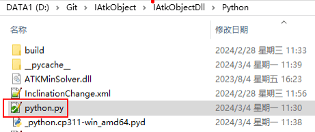
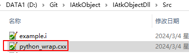

# 编译SWIG接口文件

## cmd 编译 SWIG 接口文件

跳转命令：`cd: D:\Software\swigwin-4.1.1`

SWIG 命令：
```
swig -c++ -python -v -outdir D:/Git/IAtkObject/IAtkObjectDll/Python D:/Git/IAtkObject/IAtkObjectDll/Src/python.i
```

SWIG 命令格式（空格分开）：

```
swig -源语言 -目标语言 -v(输出编译信息) 
–outdir Python 接口文件生成目录 SWIG 接口文件全路径
```

命令详见swig命令帮助`swig -help`，或者[swig官网](http://www.swig.org/tutorial.html)

## 编译生成文件


### Python 接口模块 `python.py`

Python 接口模块 `python.py`，可被 Python 代码直接导入调用，包含所有C++声明文件中类与函数的对外接口封装，以及对内 Python 共享库`_python.cp311-win_amd64.pyd` 的调用实现。



### C++接口封装库 `python_wrap.cxx`

C++接口封装库 `python_wrap.cxx`，可直接调用 C++源码，用于和类定义文件.cpp 一起编译生成 Python 共享库`_python.cp311-win_amd64.pyd`，共享库相当于 C++动态库。



