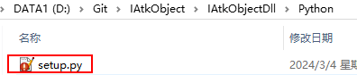

# 编写SWIG编译文件



```setup.py
# setup.py
#!/usr/bin/env python
from distutils.core import setup, Extension
#定义 C++扩展模块
python_module = Extension(
'_python',
sources = [
'../Src/Common.cpp',
'../Src/IAnimation.cpp',
'../Src/IAtkObject.cpp',
'../Src/IAtkObjectCollection.cpp',
'../Src/IAtkObjectRoot.cpp',
'../Src/IScenario.cpp',
'../Src/IGreatArcVehicle.cpp',
'../Src/ICObjectFunction.cpp',
'../Src/AccessConstraints/IAccessConstraint.cpp',
'../Src/AccessConstraints/IAccessCnstrAngle.cpp',
'../Src/AccessConstraints/IAccessCnstrMinMax.cpp',
'../Src/AccessConstraints/IAccessConstraintCollection.cpp',
'../Src/Aircraft/IAircraft.cpp',
'../Src/Satellite/Propagator/IVePropagator.cpp',
'../Src/Aircraft/IVePropagatorGreatArc.cpp',
'../Src/Aircraft/IVeWaypointsCollection.cpp',
'../Src/Aircraft/IVeWaypointsElement.cpp',
'../Src/Chain/IChain.cpp',
'../Src/Chain/IObjectLinkCollection.cpp',
'../Src/Chain/IObjectLink.cpp',
'../Src/CoverageDefinition/ICoverageDefinition.cpp',
'../Src/CoverageDefinition/ICvGrid.cpp',
'../Src/CoverageDefinition/ICvBounds.cpp',
'../Src/CoverageDefinition/ICvBoundsGlobal.cpp',
'../Src/CoverageDefinition/ICvBoundsLat.cpp',
'../Src/CoverageDefinition/ICvBoundsLatLine.cpp',
'../Src/CoverageDefinition/ICvBoundsLatLonRegion.cpp',
'../Src/CoverageDefinition/ICvBoundsLonLine.cpp',
'../Src/CoverageDefinition/ICvResolution.cpp',
'../Src/CoverageDefinition/ICvResolutionArea.cpp',
'../Src/CoverageDefinition/ICvResolutionDistance.cpp',
'../Src/CoverageDefinition/ICvResolutionLatLon.cpp',
'../Src/Facility/IFacility.cpp',
'../Src/Sensor/ILocationData.cpp',
'../Src/Facility/IPosition.cpp',
'../Src/Facility/ICartesian.cpp',
'../Src/Facility/IGeodetic.cpp',
'../Src/Graphics/ISnGraphics.cpp',
'../Src/Graphics/ISnProjection.cpp',
'../Src/Graphics/IDisplayDistance.cpp',
'../Src/Graphics/ISnProjConstantAlt.cpp',
'../Src/Graphics/ISnProjObjectAlt.cpp',
'../Src/GroundVehicle/IGroundVehicle.cpp',
'../Src/Planet/IPlanet.cpp',
'../Src/Planet/IPlCommonTasks.cpp',
'../Src/Planet/IPositionSourceData.cpp',
'../Src/Planet/IPlPosCentralBody.cpp',
'../Src/Receiver/IReceiver.cpp',
'../Src/Receiver/IReceiverModel.cpp',
'../Src/Receiver/IReceiverModelSimple.cpp',
'../Src/Receiver/IPolarization.cpp',
'../Src/Receiver/IPolarizationNone.cpp',
'../Src/Receiver/IPolarizationLinear.cpp',
'../Src/Receiver/IPolarizationCircular.cpp',
'../Src/Receiver/IPolarizationVertical.cpp',
'../Src/Receiver/IPolarizationHorizontal.cpp',
'../Src/Receiver/IPolarizationElliptical.cpp',
'../Src/Receiver/ILinkMargin.cpp',
'../Src/Receiver/IDemodulatorModel.cpp',
'../Src/Receiver/IDemodulatorModelBpsk.cpp',
'../Src/Receiver/IDemodulatorModelQpsk.cpp',
'../Src/Receiver/IReceiverModelMedium.cpp',
'../Src/Sensor/ISensor.cpp',
'../Src/Sensor/ISnCommonTasks.cpp',
'../Src/Sensor/ISnPattern.cpp',
'../Src/Sensor/ISnRectangularPattern.cpp',
'../Src/Sensor/ISnSimpleConicPattern.cpp',
'../Src/Sensor/ILocationData.cpp',
'../Src/Sensor/ISnPointing.cpp',
'../Src/Sensor/ISnPtFixed.cpp',
'../Src/Sensor/IOrientation.cpp',
'../Src/Sensor/IOrientationEulerAngles.cpp',
'../Src/Sensor/IOrientationQuaternion.cpp',
'../Src/Ship/IShip.cpp',
'../Src/Star/IStar.cpp',
'../Src/Submarine/ISubmarine.cpp',
'../Src/Transmitter/ITransmitter.cpp',
'../Src/Transmitter/ITransmitterModel.cpp',
'../Src/Transmitter/ITransmitterModelSimple.cpp',
'../Src/Transmitter/ITransmitterModelMedium.cpp',
'../Src/Transmitter/IModulatorModel.cpp',
'../Src/Transmitter/IModulatorModelBpsk.cpp',
'../Src/Transmitter/IModulatorModelQpsk.cpp',
'../Src/Satellite/ISatellite.cpp',
'../Src/Satellite/Astrogator/IComponentInfo.cpp',
'../Src/Satellite/Astrogator/IVAMCSSegment.cpp',
'../Src/Satellite/Astrogator/EndSegment/IVAMCSEnd.cpp',
'../Src/Satellite/Astrogator/HoldSegment/IVAMCSHold.cpp',
'../Src/Satellite/Astrogator/InitialStateSegment/IVAMCSInitialState.cpp',
'../Src/Satellite/Astrogator/InitialStateSegment/IVAElement.cpp',
'../Src/Satellite/Astrogator/InitialStateSegment/IVAElementCartesian.cpp',
'../Src/Satellite/Astrogator/InitialStateSegment/IVAElementKeplerian.cpp',
'../Src/Satellite/Astrogator/InitialStateSegment/IVAFuelTank.cpp',
'../Src/Satellite/Astrogator/InitialStateSegment/IVASpacecraftParameters.cpp',
'../Src/Satellite/Astrogator/ManeuverSegment/IVAMCSManeuver.cpp',
'../Src/Satellite/Astrogator/ManeuverSegment/IVAManeuver.cpp',
'../Src/Satellite/Astrogator/ManeuverSegment/IVAManeuverFinite.cpp',
'../Src/Satellite/Astrogator/ManeuverSegment/IVAManeuverImpulsive.cpp',
'../Src/Satellite/Astrogator/ManeuverSegment/IDirection.cpp',
'../Src/Satellite/Astrogator/ManeuverSegment/IDirectionRADec.cpp',
'../Src/Satellite/Astrogator/ManeuverSegment/IDirectionXYZ.cpp',
'../Src/Satellite/Astrogator/ManeuverSegment/IVAAttitudeControl.cpp',
'../Src/Satellite/Astrogator/ManeuverSegment/IVAAttitudeControlFinite.cpp',
'../Src/Satellite/Astrogator/ManeuverSegment/IVAAttitudeControlFiniteThrustVector.cpp',
'../Src/Satellite/Astrogator/ManeuverSegment/IVAAttitudeControlImpulsive.cpp',
'../Src/Satellite/Astrogator/ManeuverSegment/IVAAttitudeControlImpulsiveThrustVector.cpp',
'../Src/Satellite/Astrogator/ManeuverSegment/IVAManeuverFinitePropagator.cpp',
'../Src/Satellite/Astrogator/PropagateSegment/IVAMCSPropagate.cpp',
'../Src/Satellite/Astrogator/PropagateSegment/IVAStoppingConditionComponent.cpp',
'../Src/Satellite/Astrogator/PropagateSegment/IVAStoppingCondition.cpp',
'../Src/Satellite/Astrogator/PropagateSegment/IVAStoppingConditionCollection.cpp',
'../Src/Satellite/Astrogator/PropagateSegment/IVAStoppingConditionElement.cpp',
'../Src/Satellite/Astrogator/Results/IVACalcObjectCollection.cpp',
'../Src/Satellite/Astrogator/Results/IVAStateCalcAltOfApoapsis.cpp',
'../Src/Satellite/Astrogator/Results/IVAStateCalcAltOfPeriapsis.cpp',
'../Src/Satellite/Astrogator/Results/IVAStateCalcArgOfLat.cpp',
'../Src/Satellite/Astrogator/Results/IVAStateCalcArgOfPeriapsis.cpp',
'../Src/Satellite/Astrogator/Results/IVAStateCalcBetaAngle.cpp',
'../Src/Satellite/Astrogator/Results/IVAStateCalcCartesianElem.cpp',
'../Src/Satellite/Astrogator/Results/IVAStateCalcCosOfVerticalFPA.cpp',
'../Src/Satellite/Astrogator/Results/IVAStateCalcDec.cpp',
../Src/Satellite/Astrogator/Results/IVAStateCalcDeltaDec.cpp',
'../Src/Satellite/Astrogator/Results/IVAStateCalcDeltaFromMaster.cpp',
'../Src/Satellite/Astrogator/Results/IVAStateCalcDeltaRA.cpp',
'../Src/Satellite/Astrogator/Results/IVAStateCalcDeltaV.cpp',
'../Src/Satellite/Astrogator/Results/IVAStateCalcEccAnomaly.cpp',
'../Src/Satellite/Astrogator/Results/IVAStateCalcEccentricity.cpp',
'../Src/Satellite/Astrogator/Results/IVAStateCalcEquinoctialElem.cpp',
'../Src/Satellite/Astrogator/Results/IVAStateCalcFPA.cpp',
'../Src/Satellite/Astrogator/Results/IVAStateCalcGeodeticElem.cpp',
'../Src/Satellite/Astrogator/Results/IVAStateCalcInclination.cpp',
'../Src/Satellite/Astrogator/Results/IVAStateCalcLonDriftRate.cpp',
'../Src/Satellite/Astrogator/Results/IVAStateCalcMeanAnomaly.cpp',
'../Src/Satellite/Astrogator/Results/IVAStateCalcMeanEarthLon.cpp',
'../Src/Satellite/Astrogator/Results/IVAStateCalcOrbitPeriod.cpp',
'../Src/Satellite/Astrogator/Results/IVAStateCalcPosDifferenceOtherSegment.cpp',
'../Src/Satellite/Astrogator/Results/IVAStateCalcPosVelDifferenceOtherSegment.cpp',
'../Src/Satellite/Astrogator/Results/IVAStateCalcRA.cpp',
'../Src/Satellite/Astrogator/Results/IVAStateCalcRAAN.cpp',
'../Src/Satellite/Astrogator/Results/IVAStateCalcRadOfApoapsis.cpp',
'../Src/Satellite/Astrogator/Results/IVAStateCalcRadOfPeriapsis.cpp',
'../Src/Satellite/Astrogator/Results/IVAStateCalcRMag.cpp',
'../Src/Satellite/Astrogator/Results/IVAStateCalcSegEpochDifference.cpp',
'../Src/Satellite/Astrogator/Results/IVAStateCalcSegStateCalcDifference.cpp',
'../Src/Satellite/Astrogator/Results/IVAStateCalcSemiMajorAxis.cpp',
'../Src/Satellite/Astrogator/Results/IVAStateCalcSphRMag.cpp',
'../Src/Satellite/Astrogator/Results/IVAStateCalcSphVMag.cpp',
'../Src/Satellite/Astrogator/Results/IVAStateCalcSunlight.cpp',
'../Src/Satellite/Astrogator/Results/IVAStateCalcTrueAnomaly.cpp',
'../Src/Satellite/Astrogator/Results/IVAStateCalcTrueLon.cpp',
'../Src/Satellite/Astrogator/Results/IVAStateCalcVelAz.cpp',
'../Src/Satellite/Astrogator/Results/IVAStateCalcVelDifferenceOtherSegment.cpp',
'../Src/Satellite/Astrogator/Results/IVAStateCalcVMag.cpp',
'../Src/Satellite/Astrogator/ReturnSegment/IVAMCSReturn.cpp',
'../Src/Satellite/Astrogator/SequenceSegment/IVAMCSSequence.cpp',
'../Src/Satellite/Astrogator/SequenceSegment/IVAMCSBackwardSequence.cpp',
'../Src/Satellite/Astrogator/StopSegment/IVAMCSStop.cpp',
'../Src/Satellite/Astrogator/TargetSequenceSegment/IVAMCSTargetSequence.cpp',
'../Src/Satellite/Astrogator/TargetSequenceSegment/IVADCControl.cpp',
'../Src/Satellite/Astrogator/TargetSequenceSegment/IVADCControlCollection.cpp',
'../Src/Satellite/Astrogator/TargetSequenceSegment/IVADCResult.cpp',
'../Src/Satellite/Astrogator/TargetSequenceSegment/IVADCResultCollection.cpp',
'../Src/Satellite/Astrogator/TargetSequenceSegment/IVAProfile.cpp',
'../Src/Satellite/Astrogator/TargetSequenceSegment/IVAProfileCollection.cpp',
'../Src/Satellite/Astrogator/TargetSequenceSegment/IVAProfileDifferentialCorrector1.cpp',
'../Src/Satellite/Astrogator/TargetSequenceSegment/IVAProfileDifferentialCorrector2.cpp',
'../Src/Satellite/Astrogator/UpdateSegement/IVAMCSUpdate.cpp',
'../Src/Satellite/Astrogator/IVAMCSSegmentCollection.cpp',
'../Src/Satellite/Astrogator/IComponentInfo.cpp',
'../Src/Satellite/Astrogator/IVAMCSSegment.cpp',
'../Src/Satellite/Astrogator/IVAMCSSegmentProperties.cpp',
'../Src/Satellite/Astrogator/IVAState.cpp',
'../Src/Satellite/Attitude/IVeAttitude.cpp',
'../Src/Satellite/Attitude/IVeAttitudeStandard.cpp',
'../Src/Satellite/Attitude/IVeAttProfile.cpp',
'../Src/Satellite/Attitude/IVeOrbitAttitudeStandard.cpp',
'../Src/Satellite/Attitude/IVeStandardBasic.cpp',
'../Src/Satellite/HPOP/ISRPModelBase.cpp',
'../Src/Satellite/HPOP/ISRPModelSpherical.cpp',
'../Src/Satellite/HPOP/IVeHPOPCentralBodyGravity.cpp',
'../Src/Satellite/HPOP/IVeHPOPDragModel.cpp',
'../Src/Satellite/HPOP/IVeHPOPDragModelSpherical.cpp',
'../Src/Satellite/HPOP/IVeHPOPForceModel.cpp',
'../Src/Satellite/HPOP/IVeHPOPForceModelDrag.cpp',
'../Src/Satellite/HPOP/IVeHPOPSolarRadiationPressure.cpp',
'../Src/Satellite/HPOP/IVeHPOPSRPModel.cpp',
'../Src/Satellite/HPOP/IVeInitialState.cpp',
'../Src/Satellite/HPOP/IVeIntegrator.cpp',
'../Src/Satellite/HPOP/IVeSolarFluxGeoMag.cpp',
'../Src/Satellite/HPOP/IVeSolarFluxGeoMagEnterManually.cpp',
'../Src/Satellite/HPOP/IVeStepSizeControl.cpp',
'../Src/Satellite/HPOP/IVeThirdBodyGravityCollection.cpp',
'../Src/Satellite/HPOP/IVeThirdBodyGravityElement.cpp',
'../Src/Satellite/Mass/IVeInertia.cpp',
'../Src/Satellite/Mass/IVeMassProperties.cpp',
'../Src/Satellite/OrbitState/IOrbitState.cpp',
'../Src/Satellite/OrbitState/IClassicalLocation.cpp',
'../Src/Satellite/OrbitState/IClassicalLocationArgumentOfLatitude.cpp',
'../Src/Satellite/OrbitState/IClassicalLocationEccentricAnomaly.cpp',
'../Src/Satellite/OrbitState/IClassicalLocationMeanAnomaly.cpp',
'../Src/Satellite/OrbitState/IClassicalLocationTimePastAN.cpp',
'../Src/Satellite/OrbitState/IClassicalLocationTimePastPerigee.cpp',
'../Src/Satellite/OrbitState/IClassicalLocationTrueAnomaly.cpp',
'../Src/Satellite/OrbitState/IClassicalOrientation.cpp',
'../Src/Satellite/OrbitState/IClassicalSizeShape.cpp',
'../Src/Satellite/OrbitState/IClassicalSizeShapeAltitude.cpp',
'../Src/Satellite/OrbitState/IClassicalSizeShapeMeanMotion.cpp',
'../Src/Satellite/OrbitState/IClassicalSizeShapePeriod.cpp',
'../Src/Satellite/OrbitState/IClassicalSizeShapeRadius.cpp',
'../Src/Satellite/OrbitState/IClassicalSizeShapeSemimajorAxis.cpp',
'../Src/Satellite/OrbitState/IFlightPathAngle.cpp',
'../Src/Satellite/OrbitState/IOrbitStateCartesian.cpp',
'../Src/Satellite/OrbitState/IOrbitStateClassical.cpp',
'../Src/Satellite/OrbitState/IOrbitStateSpherical.cpp',
'../Src/Satellite/OrbitState/IOrientationAscNode.cpp',
'../Src/Satellite/OrbitState/IOrientationAscNodeLAN.cpp',
'../Src/Satellite/OrbitState/IOrientationAscNodeRAAN.cpp',
'../Src/Satellite/OrbitState/ISphericalFPAHorizontal.cpp',
'../Src/Satellite/PassBreak/IVePassBreak.cpp',
'../Src/Satellite/PassBreak/IVeBreakAngle.cpp',
'../Src/Satellite/PassBreak/IVeBreakAngleBreakByLatOrLon.cpp',
'../Src/Satellite/PassBreak/IVeDefinition.cpp',
# '../Src/Satellite/Propagator/IVePropagator.cpp',
'../Src/Satellite/Propagator/IVADriverMCS.cpp',
'../Src/Satellite/Propagator/IVePropagatorHPOP.cpp',
'../Src/Satellite/Propagator/IVePropagatorJ2Perturbation.cpp',
'../Src/Satellite/Propagator/IVePropagatorSGP4.cpp',
'../Src/Satellite/Propagator/IVePropagatorTwoBody.cpp',
'../Src/Satellite/SGP4/IVePropagatorSGP4CommonTasks.cpp',
'../Src/Satellite/SGP4/IVeSGP4Segment.cpp',
'../Src/Satellite/SGP4/IVeSGP4SegmentCollection.cpp',
'../Src/python_wrap.cxx'
],
include_dirs=[
    '../',
'../Include',
'../Include/AstroObj',
'../Include/APlanning',
'../Include/APlanning/Include',
'../Include/APlanning/Include/Base',
'../Src',
'../Src/AccessConstraints',
'../Src/Aircraft',
'../Src/Chain',
'../Src/CoverageDefinition',
'../Src/Facility',
'../Src/Graphics',
'../Src/GroundVehicle',
'../Src/Planet',
'../Src/Receiver',
'../Src/Satellite',
'../Src/Satellite/Attitude',
'../Src/Satellite/HPOP',
'../Src/Satellite/Mass',
'../Src/Satellite/SGP4',
'../Src/Satellite/OrbitState',
'../Src/Satellite/PassBreak',
'../Src/Satellite/Propagator',
'../Src/Satellite/Astrogator',
'../Src/Satellite/Astrogator/EndSegment',
'../Src/Satellite/Astrogator/InitialStateSegment',
'../Src/Satellite/Astrogator/ManeuverSegment',
'../Src/Satellite/Astrogator/PropagateSegment',
'../Src/Satellite/Astrogator/Results',
'../Src/Satellite/Astrogator/TargetSequenceSegment',
'../Src/Satellite/Astrogator/SequenceSegment',
'../Src/Satellite/Astrogator/UpdateSegement',
'../Src/Satellite/Astrogator/StopSegment',
'../Src/Satellite/Astrogator/ReturnSegment',
'../Src/Satellite/Astrogator/HoldSegment',
'../Src/Sensor',
'../Src/Ship',
'../Src/Star',
'../Src/Submarine',
'../Src/Transmitter'
],
library_dirs=[
'D://Git//IAtkObject//IAtkObjectDll//',
'D://Git//IAtkObject//IAtkObjectDll//Lib//',
'C://Program Files (x86)//Windows Kits//8.1//Lib//winv6.3//um//x64//'
],
libraries=[
'AdvAPI32',
# 'AstroLib',
# 'AstroLibD',
# 'AstroLib64',
# 'AstroLibD64',
# 'AstroObj',
# 'AstroObjD',
'AstroObj64',
# 'AstroObjD64',
# 'ATKMinSolver',
# 'ATKMinSolverD',
# 'APlanning64',
# 'APlanningD64',
]
)
#配置 setup 函数
setup (
name = 'python',
version = '0.1',
author = 'SWIG-Python',
description = 'SWIG : c++ conver to Python',
ext_modules = [python_module],
py_modules = ["python"])
```