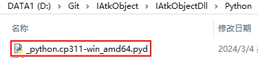

# 编译SWIG编译文件

## cmd 编译 C++接口库和 C++源码

Python 编译命令：`python setup.py build_ext –inplace`

Python 编译命令格式（空格分开）：
```
目标语言 SWIG 编译文件名 build_ext(distutils 扩展) –inplace(扩展库存放当前目录)
```

## 编译生成文件

### Python 共享库`_python.cp311-win_amd64.pyd`

Python 共享库_python.cp311-win_amd64.pyd，可被 Python 接口模块导入，支持所有接口调用，包含所含类与函数的实现源码。




