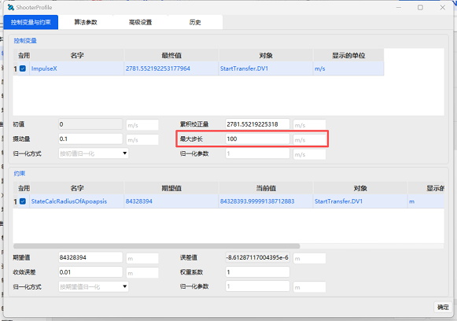

# 常见问题回复

## 下载安装运行

### 怎么在银河麒麟系统上安装并运行ATK

1. 根据您电脑的CPU芯片架构下载相应的ATK版本，例如 `x86_64`, `arm64`，软件架构与CPU架构不一致是无法运行的

2. 若您下载的是deb安装包（文件后缀为`.deb`），可以先尝试直接双击deb安装包进行安装
   
   如果操作系统无法识别并自动安装deb安装包，则需要打开命令行终端，运行安装命令：`dpkg -i <deb文件路径>`

   如果提示权限不够，需要在命令前加上`sudo`前缀使用管理员权限进行安装，例如：`sudo dpkg -i <deb文件路径>`

   ATK的deb安装包会将ATK软件安装在银河麒麟系统的`/opt/ATK` 目录下，并在桌面上新建快捷方式

   点击桌面上的ATK快捷方式即可运行ATK
   
   若没有生成快捷方式，或快捷方式无效，需要进入`/opt/ATK` 目录，通过命令行运行ATK（请参考压缩包格式的运行方式）
   
   注意：为了支持多版本ATK的共存，不同版本号的ATK不会互相覆盖，需要手动删除

3. 若您下载的是压缩包（文件后缀为`tar.gz`、`zip`、`rar`等），需要手动解压到一个目录

   然后打开命令行终端，使用`cd`命令进入解压后的ATK目录，运行`./ATK.sh`文件即可运行ATK

   如果提示该文件没有运行权限，需要在终端中执行 `chmod +x ./ATK` 与 `chmod +x ./ATK.sh`

   如果提示权限不够，需要在命令前加上`sudo`前缀，例如：`sudo chmod +x ./ATK` 与 `chmod +x ./ATK.sh`
   

## 机动规划

### 为什么LEO到GEO的快速转移案例无法收敛

1. 参考案例教程，检查轨道段配置、控制变量配置、约束条件配置

2. 检查求解器配置，例如可能是因为求解器中的`最大步长`设置较小，导致无法对参数进行大范围的修正

   可参考下图将最大步长设置为较大的值，例如`100`

## 可视化

### 高清地图使用方法

ATK 4.0 及以前版本，需将高清地图资源包 `ATK_Earth` 放置于路径 `AstroData\3DDataBase\Planets` 下，即可正常使用高清地图功能。

ATK 4.0 及以后版本，新增第三方影像、高程数据的界面化添加功能，用户可直接通过软件界面导入并使用第三方数据，详细操作方法可参考 ATK 帮助文档，具体步骤如下：

1. 打开 ATK 帮助文档，在目录中找到「基础使用指南」，点击进入后选择「三维可视化」章节；
2. 在「三维可视化」页面中，向下滑动至「三维地形全局管理」标题处，即可查看详细的图文操作教程。

## 轨道预报

### 卫星J2摄动与J4摄动原理

J2、J4 预报器仅考虑轨道根数的长期项，具体可参考文献：Vallado D A. *Fundamentals of Astrodynamics and Applications, 4th ed.* 第9.6节「Linearized Perturbations and Effects」（线性摄动及影响）中，带谐项摄动对轨道根数长期项的表达式。
